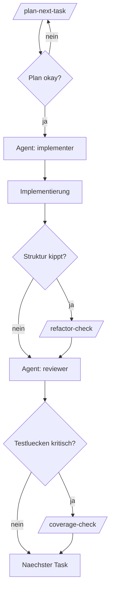

# Agent Workflow

Kurze Referenz fuer den taeglichen Copilot-Ablauf in diesem Repo.

## Standardablauf

1. `/plan-next-task` ausfuehren
2. Plan kurz pruefen
3. Agent auf `implementer` umstellen
4. Freigegebenen Task implementieren lassen
5. Agent auf `reviewer` umstellen
6. Aenderung reviewen lassen

## Konkrete Reihenfolge

### 1. Planung

```text
/plan-next-task

Bitte waehle die naechste kleine, reviewbare Aufgabe aus docs/TODO.md.
Beruecksichtige docs/REQUIREMENTS.md, docs/DECISIONS.md und docs/ARCHITECTURE.md.
Wenn die naechste Aufgabe zu gross ist, zerlege sie in die kleinste sinnvolle Teilaufgabe.
Liefere:
- Ziel der Session
- Akzeptanzkriterien
- betroffene Dateien
- kurze Risiken
Warte danach auf mein Go.
```

### 2. Implementierung

Im Chat den Agent auf `implementer` stellen und dann:

```text
Implementiere jetzt genau den freigegebenen Plan von oben.
Halte den Scope klein.
Wenn die Struktur kippt oder ein Refactor vorher sinnvoll waere, stoppe und markiere das klar.
```

### 3. Review

Im Chat den Agent auf `reviewer` stellen und dann:

```text
Reviewe die aktuellen Aenderungen strikt.
Fokussiere auf Bugs, Verhaltensregressionen, fehlende Tests, Architekturverletzungen und Refactor-Signale.
Bitte Findings zuerst, nach Schwere sortiert.
```

## Optionale Skills

### Refactor-Check

Nutzen, wenn eine Datei spuerbar zu gross oder zu gemischt wird.

```text
/refactor-check

Pruefe die gerade geaenderten Dateien auf Refactor-Bedarf.
Liefere:
- Decision
- Why
- Smallest useful next extraction
- Risks of postponing the refactor
```

### Coverage-Check

Nutzen, wenn du nach der Implementierung die naechsten wichtigsten Tests ableiten willst.

```text
/coverage-check apps/worker pubsub-listener
```

Oder allgemein:

```text
/coverage-check buy flow
```

## Wann welcher Zusatz sinnvoll ist

- Nur `implementer` + `reviewer`: fuer normale kleine Tasks
- Zusaetzlich `refactor-check`: wenn die Struktur kippt
- Zusaetzlich `coverage-check`: wenn der Flow kritisch ist oder Tests fehlen

## Merksatz

Planen ist ein Skill. Implementieren und Review sind Agents. Refactor und Coverage sind gezielte Zusatz-Skills.

## Ablaufbild


