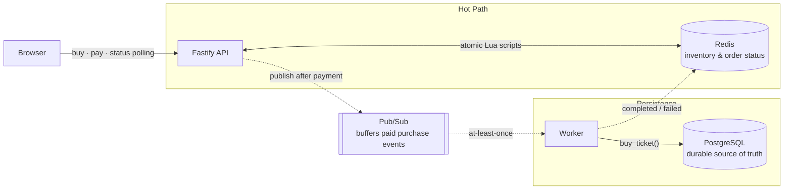

# High-Frequency Ticket System


A production-grade learning and reference system for highly concentrated
ticket sales. It combines a Next.js shop with Fastify, Redis, Google Cloud
Pub/Sub, PostgreSQL, load tests, and observability in a single pnpm Turborepo.

## What the project demonstrates

The checkout separates reservation, simulated payment, and durable
finalization. Pub/Sub acts as a buffer between the synchronous sales path and
the database:


```mermaid
flowchart LR
    Browser["Browser"]

    subgraph hot["Hot Path"]
        API["Fastify API"]
        Redis[("Redis<br/>inventory & order status")]
    end

    PubSub[["Pub/Sub<br/>buffers paid purchase events"]]

    subgraph persist["Persistence"]
        Worker["Worker"]
        PG[("PostgreSQL<br/>durable source of truth")]
    end

    Browser -->|"buy · pay · status polling"| API
    API <-->|"atomic Lua scripts"| Redis
    API -.->|"publish after payment"| PubSub
    PubSub -.->|"at-least-once"| Worker
    Worker -->|"buy_ticket()"| PG
    Worker -.->|"completed / failed"| Redis
```

The browser gets all of its responses from Redis; PostgreSQL is never on the
request path. Paid purchase events land in the Pub/Sub buffer instead, the
worker persists them asynchronously at its own pace and writes the final
status back to Redis. A load spike therefore only hits Redis and the queue,
not the database. The system also ships reproducible k6 runs,
Prometheus/Grafana dashboards, and an automated report pipeline.

Three Grafana panels from a k6 spike run demonstrate this — all panels with
explanations are available under
[`docs/reports/grafana-panels-2026-08-03`](docs/reports/grafana-panels-2026-08-03/PANEL-GUIDE-2026-08-03.md):


_Peak of **8.1K req/s** on the API — availability and order status come
exclusively from Redis, PostgreSQL is never on the request path._


_The buffer in action: the worker processes up to **4K orders/s** from
Pub/Sub and keeps up exactly with the publish rate — with **0 redeliveries
and 0 duplicates**._


_**0 % server errors** over the entire run. The yellow line marks the
sell-out: from that point on, the API responds in a controlled way with
`409 Sold Out` instead of failing._

The authoritative current data flow is documented in
[`docs/ARCHITECTURE.md`](docs/ARCHITECTURE.md).

## Quickstart

Prerequisites: Node.js ≥ 22 (CI tests 22 and 24), pnpm 10, and Docker with
Compose.

```bash
pnpm install
docker compose up -d
export HFTS_ENV=dev
pnpm seed
pnpm dev
```

Configuration comes entirely from `packages/env/profiles/<profile>.env`; there is no
`.env` and there are no defaults. `HFTS_ENV` selects the file — if it
is missing, nothing starts and the error message lists the available profiles
(`dev`, `test`, `ci`, `browse-and-buy-full-speed`, `browse-and-buy-human-pace`,
`buy-only-full-speed`).
Rationale: [ADR-034](docs/decisions/ADR-034-ein-profil-ist-eine-datei-keine-impliziten-defaults.md).
Load runs require a load-test profile, e.g.
`HFTS_ENV=browse-and-buy-full-speed pnpm spike`.

After that, the main interfaces are reachable at:

- Web: [http://localhost:10001](http://localhost:10001)
- API: [http://localhost:10002](http://localhost:10002)
- Grafana: [http://localhost:10008](http://localhost:10008)

The full startup order, default ports, and known pitfalls are documented in
[`docs/RUNBOOK.md`](docs/RUNBOOK.md).

## Common commands

| Goal                          | Command               |
| ----------------------------- | --------------------- |
| reset local state             | `pnpm seed`           |
| start the development stack   | `pnpm dev`            |
| quick verification            | `pnpm verify:quick`   |
| full verification             | `pnpm verify:all`     |
| load test with report         | `pnpm spike:report`   |
| check documentation structure | `pnpm run debug:docs` |

`pnpm test`, `pnpm dev`, and live checks require the running containers
`hfts-postgres`, `hfts-redis`, and `hfts-pubsub`.

## Repository

```text
apps/          web, API, and worker
packages/      database, environment variables, contracts, and UI
load-tests/    k6 scenarios and helper logic
scripts/       local workflows, diagnostics, and report automation
docs/          requirements, architecture, decisions, plans, and runbook
monitoring/    Prometheus and Grafana configuration
tests/         cross-service end-to-end tests
```

Local usage notes live in the `README.md` of each respective directory.

## Documentation

[`docs/DOCS.md`](docs/DOCS.md) defines the documentation architecture and
which source to read when.

| Question                              | Source                                         |
| ------------------------------------- | ---------------------------------------------- |
| What should the system do?            | [`docs/REQUIREMENTS.md`](docs/REQUIREMENTS.md) |
| How does it currently work?           | [`docs/ARCHITECTURE.md`](docs/ARCHITECTURE.md) |
| Why was something decided this way?   | [`docs/DECISIONS.md`](docs/DECISIONS.md)       |
| What is done or up next?              | [`docs/TODO.md`](docs/TODO.md)                 |
| How do I start, test, or diagnose it? | [`docs/RUNBOOK.md`](docs/RUNBOOK.md)           |

## License

Private repository / showcase project.
