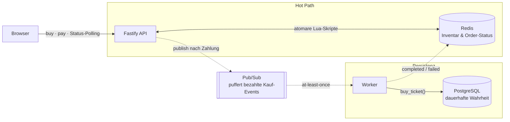
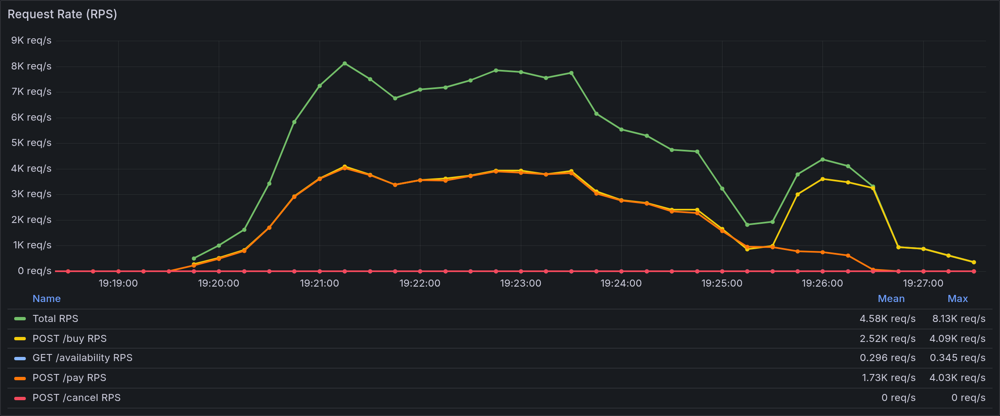
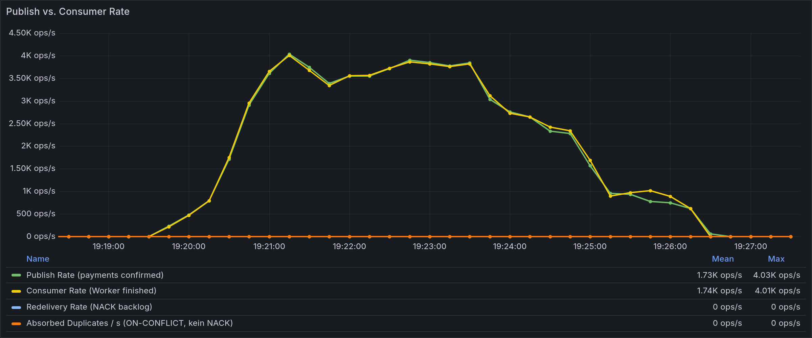
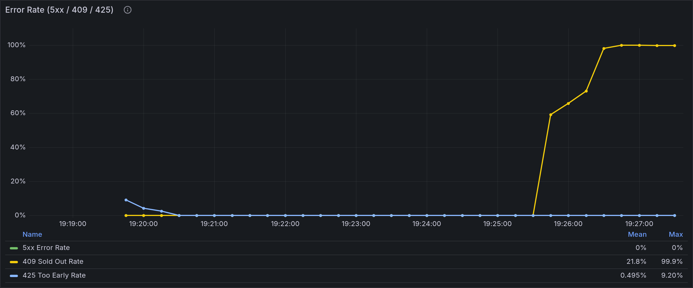

# High-Frequency Ticket System


Ein produktionsnahes Lern- und Referenzsystem für stark konzentrierte
Ticketverkäufe. Es verbindet einen Next.js-Shop mit Fastify, Redis, Google
Cloud Pub/Sub, PostgreSQL, Lasttests und Observability in einem
pnpm-Turborepo.

## Was das Projekt zeigt

Der Checkout trennt Reservierung, simulierte Zahlung und dauerhafte
Finalisierung. Pub/Sub sitzt dabei als Puffer zwischen dem synchronen
Verkaufspfad und der Datenbank:


```mermaid
flowchart LR
    Browser["Browser"]

    subgraph hot["Hot Path"]
        API["Fastify API"]
        Redis[("Redis<br/>Inventar & Order-Status")]
    end

    PubSub[["Pub/Sub<br/>puffert bezahlte Kauf-Events"]]

    subgraph persist["Persistenz"]
        Worker["Worker"]
        PG[("PostgreSQL<br/>dauerhafte Wahrheit")]
    end

    Browser -->|"buy · pay · Status-Polling"| API
    API <-->|"atomare Lua-Skripte"| Redis
    API -.->|"publish nach Zahlung"| PubSub
    PubSub -.->|"at-least-once"| Worker
    Worker -->|"buy_ticket()"| PG
    Worker -.->|"completed / failed"| Redis
```

Der Browser bekommt seine Antworten vollständig aus Redis; PostgreSQL steht
nie im Request-Pfad. Bezahlte Kauf-Events landen stattdessen im
Pub/Sub-Puffer, der Worker persistiert sie asynchron in seinem eigenen Tempo
und schreibt den finalen Status zurück nach Redis. Ein Lastspike trifft damit
nur Redis und die Queue, nicht die Datenbank. Das System enthält außerdem
reproduzierbare k6-Läufe, Prometheus/Grafana-Dashboards und eine
automatisierte Report-Pipeline.

Drei Grafana-Panels aus einem k6-Spike-Lauf belegen das — alle Panels samt
Erklärung liegen unter
[`docs/reports/grafana-panels-2026-08-03`](docs/reports/grafana-panels-2026-08-03/PANEL-GUIDE-2026-08-03.md):



_Peak von **8.1K req/s** auf der API — Verfügbarkeit und Order-Status kommen
ausschließlich aus Redis, PostgreSQL steht nie im Request-Pfad._



_Der Puffer in Aktion: Der Worker verarbeitet bis zu **4K Orders/s** aus
Pub/Sub und hält mit der Publish-Rate exakt mit — bei **0 Redeliveries und
0 Duplikaten**._



_**0 % Server-Fehler** über den gesamten Lauf. Die gelbe Linie markiert den
Ausverkauf: ab da antwortet die API kontrolliert mit `409 Sold Out` statt zu
versagen._

Der verbindliche Ist-Datenfluss steht in
[`docs/ARCHITECTURE.md`](docs/ARCHITECTURE.md).

## Quickstart

Voraussetzungen: Node.js ≥ 22 (CI prüft 22 und 24), pnpm 10 sowie Docker mit
Compose.

```bash
pnpm install
docker compose up -d
pnpm seed
pnpm dev
pnpm spike
```

Danach sind die wichtigsten Oberflächen erreichbar:

- Web: [http://localhost:10001](http://localhost:10001)
- API: [http://localhost:10002](http://localhost:10002)
- Grafana: [http://localhost:10008](http://localhost:10008)

Die vollständige Startreihenfolge, Standardports und bekannte Fallen stehen im
[`docs/RUNBOOK.md`](docs/RUNBOOK.md).

## Häufige Befehle

| Ziel                          | Befehl                |
| ----------------------------- | --------------------- |
| lokalen Zustand neu aufsetzen | `pnpm seed`           |
| Entwicklungsstack starten     | `pnpm dev`            |
| schnelle Verifikation         | `pnpm verify:quick`   |
| vollständige Verifikation     | `pnpm verify:all`     |
| Lasttest mit Report           | `pnpm spike:report`   |
| Doku-Struktur prüfen          | `pnpm run debug:docs` |

`pnpm test`, `pnpm dev` und Live-Checks benötigen die laufenden Container
`hts-postgres`, `hts-redis` und `hts-pubsub`.

## Repository

```text
apps/          Web, API und Worker
packages/      Datenbank, Umgebungsvariablen, Verträge und UI
load-tests/    k6-Szenarien und Hilfslogik
scripts/       lokale Abläufe, Diagnose und Report-Automation
docs/          Anforderungen, Architektur, Entscheidungen, Pläne und Runbook
monitoring/    Prometheus- und Grafana-Konfiguration
tests/         serviceübergreifende End-to-End-Tests
```

Lokale Bedienhinweise liegen jeweils in der `README.md` des betroffenen
Verzeichnisses.

## Dokumentation

[`docs/DOCS.md`](docs/DOCS.md) definiert die Dokumentationsarchitektur und
welche Quelle wann gelesen wird.

| Frage                                         | Quelle                                         |
| --------------------------------------------- | ---------------------------------------------- |
| Was soll das System leisten?                  | [`docs/REQUIREMENTS.md`](docs/REQUIREMENTS.md) |
| Wie funktioniert es aktuell?                  | [`docs/ARCHITECTURE.md`](docs/ARCHITECTURE.md) |
| Warum wurde etwas so entschieden?             | [`docs/DECISIONS.md`](docs/DECISIONS.md)       |
| Was ist erledigt oder als Nächstes dran?      | [`docs/TODO.md`](docs/TODO.md)                 |
| Wie starte, teste oder diagnostiziere ich es? | [`docs/RUNBOOK.md`](docs/RUNBOOK.md)           |

## Lizenz

Private repository / showcase project.
