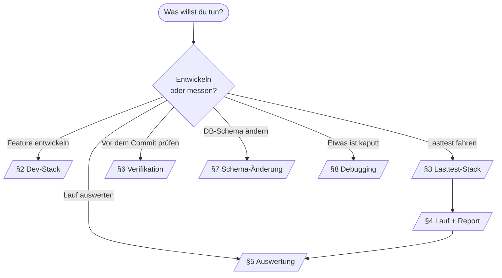
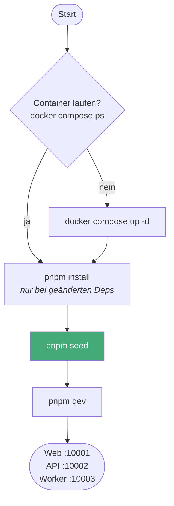
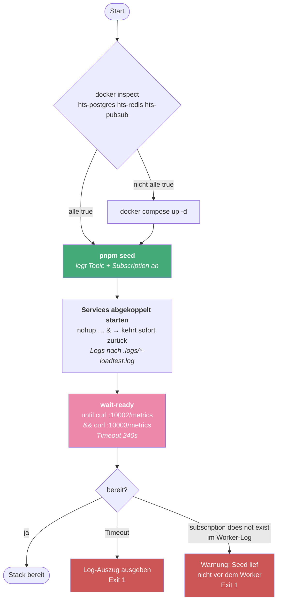
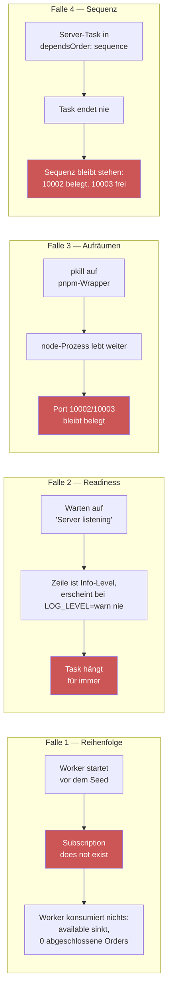
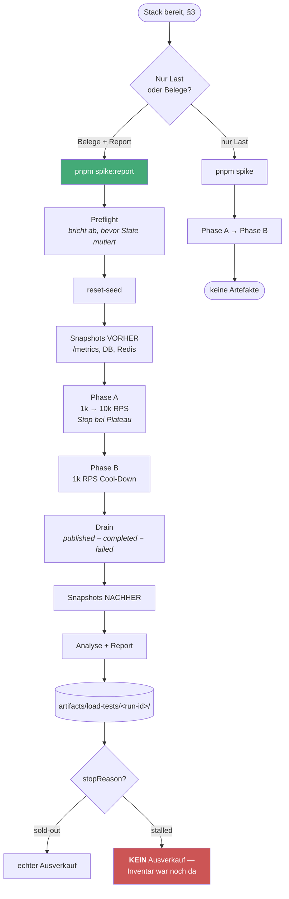
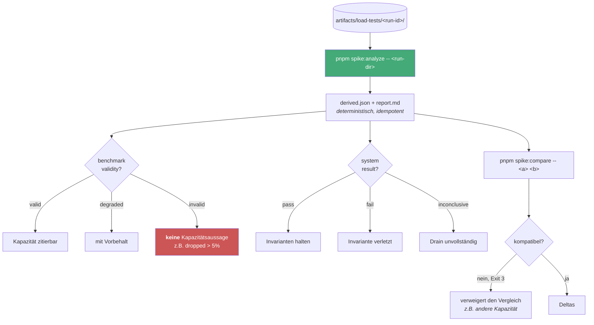
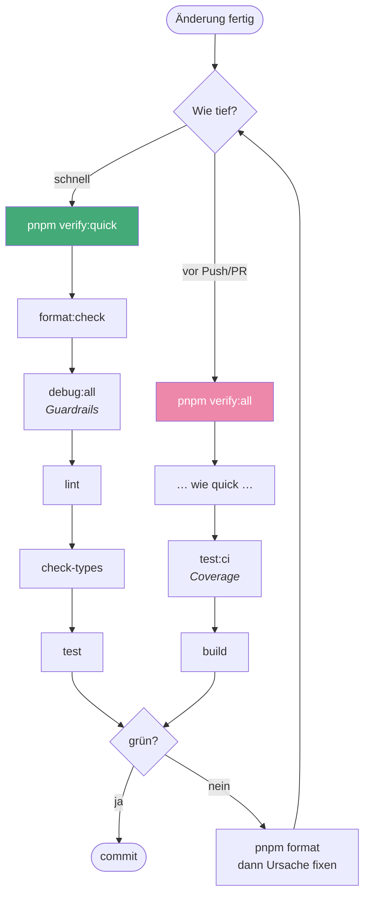
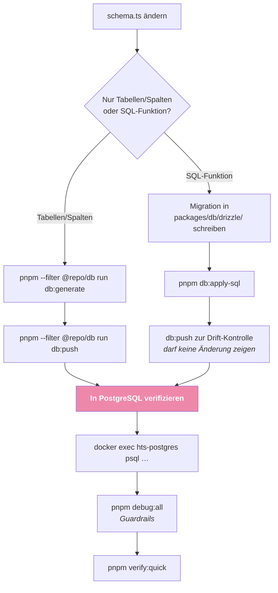
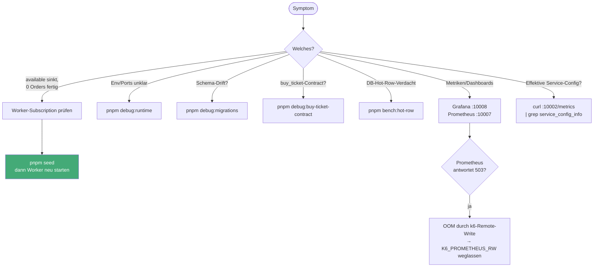
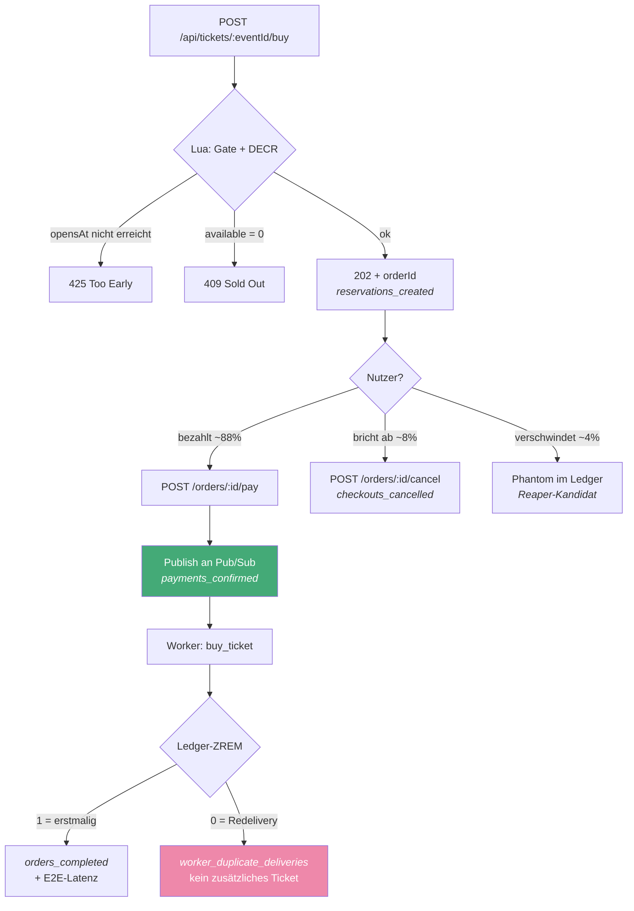

# Runbook — welcher Befehl, in welcher Reihenfolge

Nachschlagewerk für die wiederkehrenden Abläufe. Jeder Abschnitt hat ein Diagramm und darunter die Befehle zum Kopieren.

Fast alles hat auch einen VS-Code-Task (`.vscode/tasks.json`) und einen Button in der Statusleiste (`.vscode/settings.json` → `actionButtons`). Task-Namen stehen unter jedem Diagramm.

**Ports** (Block `10001`–`10009`, Quelle der Wahrheit: `docs/ARCHITECTURE.md`):

| 10001 | 10002 | 10003  | 10004 | 10005   | 10006    | 10007      | 10008   | 10009          |
| ----- | ----- | ------ | ----- | ------- | -------- | ---------- | ------- | -------------- |
| Web   | API   | Worker | Redis | Pub/Sub | Postgres | Prometheus | Grafana | Redis-Exporter |

---

## 1. Überblick: welcher Flow ist gemeint?



---

## 2. Dev-Stack (Feature-Entwicklung)

Der Alltagsfall. `pnpm dev` fährt Web, API und Worker parallel mit Hot-Reload.

**Wichtig:** Der Seed muss vor dem Worker laufen — Details in §3, die Falle ist dieselbe.



```bash
docker compose up -d          # Infrastruktur (postgres, redis, pubsub, prometheus, grafana)
pnpm seed                     # Schema + Test-Event + Redis-Counter + Pub/Sub-Ressourcen
pnpm dev                      # Web + API + Worker parallel (Turbo)
```

> `pnpm dev` fährt `fastify start -P` (pino-pretty) plus `tsc-watch`. Für Lasttests ist das **ungeeignet** — siehe §3.

**Task:** `dev:stack up` · **Button:** `Dev Stack`

---

## 3. Lasttest-Stack hochfahren (gebauter Stand)

Für belastbare Messungen dürfen API und Worker **nicht** im Dev-Modus laufen: `-P` schaltet pino-pretty ein (synchroner, Event-Loop-blockierender Log-Transform), und der `tsc-watch`-Watcher konkurriert um dieselben Cores wie k6, Postgres und Redis. Ein FS-Event mitten im Lauf triggert sogar einen Rebuild.

`start:loadtest` baut einmal und startet `fastify start` ohne `-P`, mit `NODE_ENV=production`, `LOG_LEVEL=warn` und `DISABLE_REQUEST_LOGGING=true`.



```bash
pnpm seed                                    # ZUERST — sonst scheitert der Worker
mkdir -p .logs
( nohup pnpm --filter api    run start:loadtest >> .logs/api-loadtest.log    2>&1 & )
( nohup pnpm --filter worker run start:loadtest >> .logs/worker-loadtest.log 2>&1 & )
until curl -sf -o /dev/null localhost:10002/metrics \
   && curl -sf -o /dev/null localhost:10003/metrics; do sleep 2; done
```

**Task:** `loadtest:stack up` · **Button:** `LT Stack` · Logs live: Task `loadtest:logs`

### Warum die Services abgekoppelt starten (Falle 4)

Das ist keine Kosmetik, sondern Voraussetzung dafür, dass der Ablauf überhaupt durchläuft:

- `dependsOrder: "sequence"` wartet, bis jeder Task **beendet** ist. Ein Server endet nie — die Sequenz bliebe beim ersten Service stehen, und Worker sowie Readiness-Check würden nie starten. Symptom: Port 10002 belegt, 10003 frei.
- `isBackground: true` allein hilft **nicht**. Damit VS Code einen Hintergrund-Task als „fertig genug" ansieht, braucht es einen `problemMatcher` mit `background.endsPattern` — also eine Logzeile, die Bereitschaft signalisiert. Genau die gibt es hier nicht (Falle 2: `LOG_LEVEL=warn` unterdrückt sie).

Deshalb startet `loadtest:services` beide Prozesse via `( nohup … & )`, kehrt sofort zurück und schreibt in `.logs/`. Verifiziert: der Launcher-Shell endet, die Prozesse laufen weiter und antworten. Preis: keine Live-Ausgabe im Task-Terminal — dafür gibt es `loadtest:logs` (`tail -f` über beide Logs), und die Logs sind persistent, was für Lasttests eher ein Vorteil ist.

Wer ein Live-Terminal für **einen** Service will, nimmt `loadtest:api (blockierend)` bzw. `loadtest:worker (blockierend)` — die sind bewusst so benannt und dürfen in keiner Sequenz stehen.

### Drei Fallen, die hier real aufgetreten sind



1. **Seed vor dem Worker.** Der Pub/Sub-Emulator verliert Topic und Subscription beim Container-Neustart, und die Plugins sind seit #9/ADR-028 reine Runtime-Clients — der Worker scheitert hart mit `Subscription does not exist (resource=buy-ticket-worker)`. Reseed _im Betrieb_ ist inzwischen idempotent (Todo #242), die Boot-Reihenfolge bleibt trotzdem Pflicht.
2. **Readiness per HTTP-Poll, nicht per Log-Pattern.** Ein `problemMatcher.background.endsPattern` auf „Server listening" greift nicht: die Zeile ist Info-Level und erscheint bei `LOG_LEVEL=warn` gar nicht.
3. **Beim Aufräumen den Port killen, nicht das Prozessmuster.** `pkill` auf das pnpm-Wrapper-Pattern beendet nur den Wrapper; der `node`-Prozess hält den Port weiter. Und: **einmal killen genügt nicht** — es können mehrere Listener bzw. ein Wrapper mit Kind auf demselben Port hängen. Deshalb alle PIDs, mit Wiederholung, `SIGKILL`-Eskalation und Endkontrolle.
4. **Kein blockierender Task in einer Sequenz** — siehe Abschnitt oben.

### Herunterfahren

```bash
for p in 10002 10003; do
  for attempt in 1 2 3; do
    PIDS=$(lsof -nP -tiTCP:$p -sTCP:LISTEN 2>/dev/null)
    [ -z "$PIDS" ] && break
    kill $PIDS 2>/dev/null; sleep 2
  done
  PIDS=$(lsof -nP -tiTCP:$p -sTCP:LISTEN 2>/dev/null)
  [ -n "$PIDS" ] && kill -9 $PIDS 2>/dev/null      # Eskalation
  lsof -nP -iTCP:$p -sTCP:LISTEN >/dev/null 2>&1 \
    && echo "Port $p NOCH belegt" || echo "Port $p frei"
done
```

**Task:** `loadtest:stack down` · **Button:** `LT Stop`

---

## 4. Lasttest fahren

Zwei Varianten. `spike` fährt nur die Last, `spike:report` sammelt zusätzlich alle Belege und erzeugt den Report — das ist der Standard für jede Messung, die man später zitieren will.



```bash
pnpm spike                    # nur Last (kein Report)
pnpm spike:report             # Standard: Last + alle Belege + Report

# Varianten
SALE_OPENS_IN_SECONDS=0 pnpm spike:report    # sofort offen statt 60s Vorlauf
LOAD_PROFILE=realism pnpm spike:report       # mit Denkzeit (2–8s) statt back-to-back
K6_PROMETHEUS_RW=true pnpm spike             # k6-Metriken live in Grafana (s. u.)
```

> **k6-Remote-Write ist standardmäßig aus.** Der Report liest keine k6-Serien aus Prometheus — alle Queries gehen gegen `job="api"`/`job="worker"`. Das Remote-Write diente nur dem Live-Blick, trieb Prometheus aber auf 5,5 GiB bis zum `503` und nahm dabei genau die Daten mit, die der Report braucht.

**Task:** `loadtest:run+report` · **Button:** `Spike Report`

---

## 5. Auswertung (braucht keinen laufenden Stack)

Die Pipeline trennt Erhebung und Analyse: `spike:report` schreibt Rohartefakte, `spike:analyze` ist **rein** — kein Netz, keine DB. **Die Artefakte sind die Schnittstelle, nicht der Prozess.** Ein Lauf lässt sich also auch später und von jemand anderem interpretieren, und nach einer Änderung an der Analyse-Logik jederzeit neu auswerten.



```bash
pnpm spike:analyze -- artifacts/load-tests/<run-id>          # rein, offline
pnpm spike:compare -- <baseline-dir> <candidate-dir>         # Exit 3 = unvergleichbar
pnpm spike:report:test                                       # Unit-/Golden-Tests der Pipeline
```

Bestehende Baselines: `docs/reports/baseline-a-2026-07-14/`, `docs/reports/baseline-b-2026-07-26/`

**Tasks:** `loadtest:analyze` und `loadtest:compare` (fragen nach den Verzeichnissen) · **Button:** `Analyze`

---

## 6. Verifikation vor dem Commit



```bash
pnpm verify:quick   # format:check + debug:all + lint + check-types + test
pnpm verify:all     # + test:ci (Coverage) + build
pnpm format         # Prettier schreiben (bei format:check-Fehlern)
```

> `pnpm test` braucht laufende Container (`hts-postgres`, `hts-redis`, `hts-pubsub`) — der Preflight prüft das und bricht sonst mit klarer Meldung ab.

**Tasks:** `workspace:verify:quick`, `workspace:verify:all` · **Buttons:** `Verify Quick`, `Verify All` (derzeit in `settings.json` auskommentiert)

---

## 7. DB-Schema ändern

**Regel aus `CLAUDE.md`:** Bei jeder Schema-Änderung in `packages/db` nicht nur generieren, sondern auch gegen die Ziel-DB anwenden **und** den Effekt in PostgreSQL verifizieren.



```bash
pnpm --filter @repo/db run db:generate    # Migration aus dem Drizzle-Schema
pnpm --filter @repo/db run db:push        # gegen die Ziel-DB anwenden
pnpm db:apply-sql                         # handgeschriebenes SQL (z.B. buy_ticket)

# Verifizieren
docker exec hts-postgres psql -U postgres -d high_frequency_tickets -c '\d tickets'
docker exec hts-postgres psql -U postgres -d high_frequency_tickets \
  -tAc "select prosrc from pg_proc where proname='buy_ticket'"
pnpm debug:all
```

**Task:** `db:schema apply` · **Button:** `DB Apply`

---

## 8. Debugging



```bash
pnpm debug:all                    # runtime + migrations + buy-ticket-contract
pnpm debug:runtime                # aufgelöste Env + Ports
pnpm debug:migrations             # Schema-Drift
pnpm debug:buy-ticket-contract    # Direkt-completed-Insert, kein sold_count-Increment
pnpm bench:hot-row                # Publish-Micro-Bench: Drain-Durchsatz + Lock-Wait

# Effektive Konfiguration der laufenden Services (nicht die des Terminals!)
curl -s localhost:10002/metrics | grep '^service_config_info'
curl -s localhost:10003/metrics | grep '^service_config_info'

# Live-Zustand
docker exec hts-redis redis-cli GET 'tickets:event:00000000-0000-4000-8000-000000000000:available'
docker exec hts-redis redis-cli ZCARD 'tickets:event:00000000-0000-4000-8000-000000000000:reservations'
docker exec hts-postgres psql -U postgres -d high_frequency_tickets \
  -tAc 'select count(*) from orders'
```

Weitere Hinweise: `docs/DEBUGGING.md`

**Task:** `debug:all` · **Button:** `Debug All`

---

## 9. Der Ticket-Kauf als Ablauf (zum Nachschlagen)

Seit ADR-028 ist der Kauf zwei synchrone API-Schritte: `buy` reserviert nur, `pay` published. Nützlich, um Metriken richtig zu lesen.



**Merksatz für die Auswertung:** `orders_accepted_total` zählt beim **Reserve**, `payments_confirmed_total` beim **Publish**. Nur Letzteres ist die Bezugsgröße für Drain und Invarianten — sonst erscheinen die ~12 % Abbrecher als ewiger Backlog.
