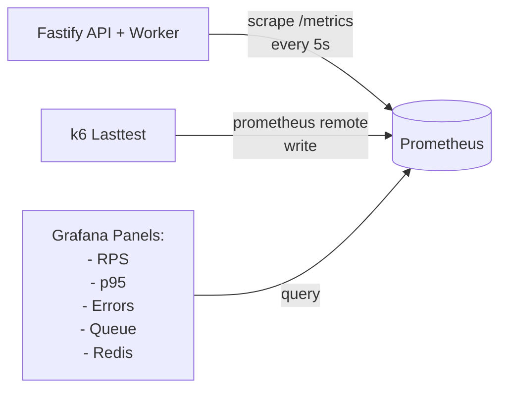

# System Architecture

## High-Level Overview

<!-- TODO: Ersetze dieses ASCII-Diagramm durch ein Draw.io-Diagramm (docs/architecture.drawio) und exportiere es als SVG -->

```mermaid
flowchart TD
    User([NUTZER / BROWSER])

    Frontend["Next.js Frontend (apps/web)<br/>Frequency Festival 20XX – Ticket-Shop]

    subgraph API["Fastify API Gateway (apps/api)"]
        API_metrics["/metrics<br/>(Prometheus)"]
        API_avail["GET /availability<br/>→ Redis Read"]
        API_buy["POST /tickets/buy<br/>→ Pub/Sub Publish"]
    end

    Prometheus["Prometheus<br/>(Scraping)"]
    Redis[("Redis Cache<br/>(Memorystore)")]
    PubSub[["Google Cloud Pub/Sub<br/>(Message Broker)"]]

    Grafana["Grafana Dashboards<br/>- RPS<br/>- Latenz<br/>- Errors<br/>- Queue"]

    Worker["Fastify Worker (apps/worker)<br/>1. Konsumiert BuyTicketEvent aus Pub/Sub<br/>2. Simuliert Payment Provider Latenz (~1s)<br/>3. INSERT in tickets & UPDATE events.sold<br/>4. (Optional) Redis Counter Reconciliation"]

    subgraph DB["PostgreSQL (Cloud SQL)"]
        events[("events<br/>- id<br/>- capacity<br/>- sold_count")]
        tickets[("tickets<br/>- id (UUID)<br/>- event_id<br/>- first_name<br/>- last_name<br/>- status")]
    end

    User --> Frontend
    Frontend -->|"HTTP POST /api/tickets/buy<br/>HTTP GET /api/tickets/availability"| API

    API_metrics --> Prometheus
    API_avail --> Redis
    API_buy --> PubSub

    Prometheus --> Grafana

    Worker -->|Cache Update| Redis
    PubSub -->|SUBSCRIBE| Worker

    Worker -->|Drizzle Transaction| DB
```

## Datenfluss: Ticket-Kauf (Happy Path)

1. Nutzer klickt "Ticket kaufen" im Frontend
2. Frontend sendet POST /api/tickets/buy { userId: "..." }
3. API Gateway prüft Redis: tickets:available > 0 ?
4. ✅ Ja → API published BuyTicketEvent an Pub/Sub → HTTP 202 Accepted
   ❌ Nein → HTTP 409 Conflict (Sold Out)
5. Worker konsumiert BuyTicketEvent aus Pub/Sub
6. Worker simuliert Payment-Processing (Sleep 1s)
7. Worker führt Transaktion aus: `INSERT INTO tickets` (generiert UUID) und `UPDATE events SET sold_count = sold_count + 1`
8. Nutzer pollt GET /api/orders/{orderId} für finalen Status

## Datenfluss: Verfügbarkeits-Check

1. Frontend sendet GET /api/tickets/availability
2. API liest Redis Key tickets:available
3. API antwortet HTTP 200 { available: 843291, total: 1000000 }
   → Kein DB-Zugriff, Sub-Millisekunden Antwortzeit

## Load-Test Szenario (k6 Lastkurve)

```
  RPS
50k ┤                  ┌─────────────────────┐
    │                  │    Sale Opening     │
    │                  │    + Sustained      │
    │                  │                     │
20k ┤                  │                     └──────┐
    │                  │                            │ Sold Out
10k ┤         ┌────────┘                            │
    │         │ Pre-Sale                            │
 1k ┤─────────┘ Hype                                └───-───┐
    │ Warm-Up                                        Cool   │
  0 ┼─────────┬────────┬──────────────────────┬──────┬──────┬──
    0        2min     4min                   12min  14min  15min
```

**1M Tickets** werden über ca. 8 Minuten Peak-Last verkauft.
Das Szenario zeigt: Autoscaling-Verhalten, Sold-Out-Transition (HTTP 202 → 409), Queue-Backpressure und Cache-Performance.

## Monitoring & Observability



### Grafana-Dashboards (geplant)

| Dashboard       | Metriken                                      | Quelle                   |
| --------------- | --------------------------------------------- | ------------------------ |
| API Performance | RPS, Latenz (p50/p95/p99), Error Rate         | `prom-client` in Fastify |
| Redis Cache     | Hit/Miss Ratio, Key Count, Memory Usage       | Redis Exporter           |
| Message Queue   | Queue Depth, Processing Rate, Consumer Lag    | Pub/Sub Metrics          |
| k6 Lasttest     | Virtual Users, Request Duration, Failure Rate | k6 → Prometheus          |

## Workspace-Struktur

```
high-frequency-ticket-system/
├── apps/
│   ├── api/          # Fastify API Gateway (HTTP → Redis + Pub/Sub)
│   ├── web/          # Next.js Frontend (Tailwind CSS)
│   └── worker/       # Fastify Worker (Pub/Sub → PostgreSQL + Redis)
├── packages/
│   ├── db/           # Drizzle ORM Schema, Migrations, DB Client
│   ├── types/        # Shared Zod Schemas & TypeScript Types
│   ├── eslint-config/# Shared ESLint Configuration
│   ├── typescript-config/ # Shared tsconfig
│   └── ui/           # Shared UI Components (optional)
├── load-tests/       # k6 Lasttest-Skripte
├── infra/            # Terraform + Kubernetes Manifeste
├── docs/             # Architektur, ADRs, Requirements
│   ├── ARCHITECTURE.md
│   ├── DECISIONS.md
│   ├── REQUIREMENTS.md
│   └── TODO.md
└── docker-compose.yml  # Lokales Dev-Setup (PostgreSQL, Redis, Pub/Sub, Grafana)
```
