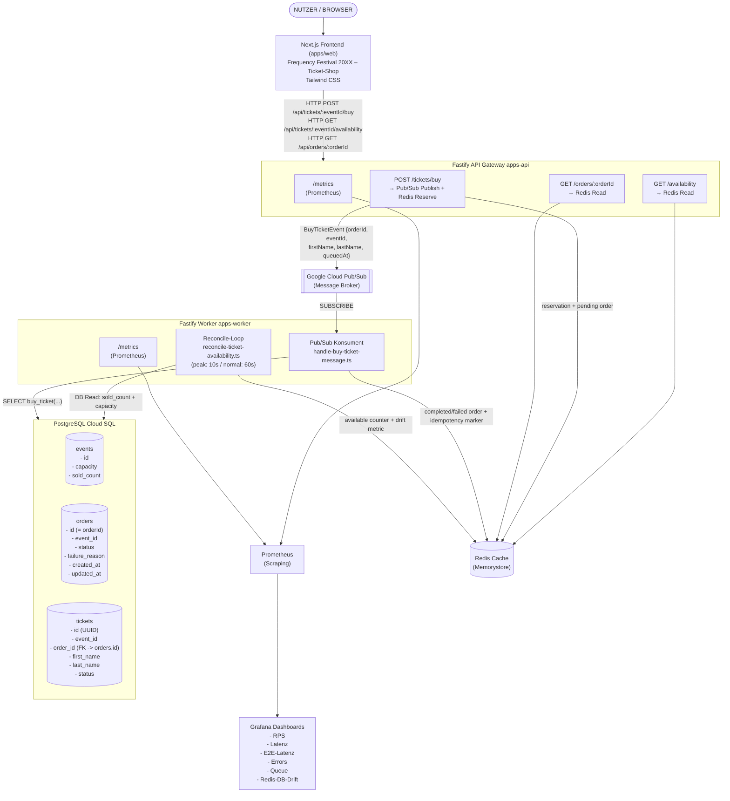
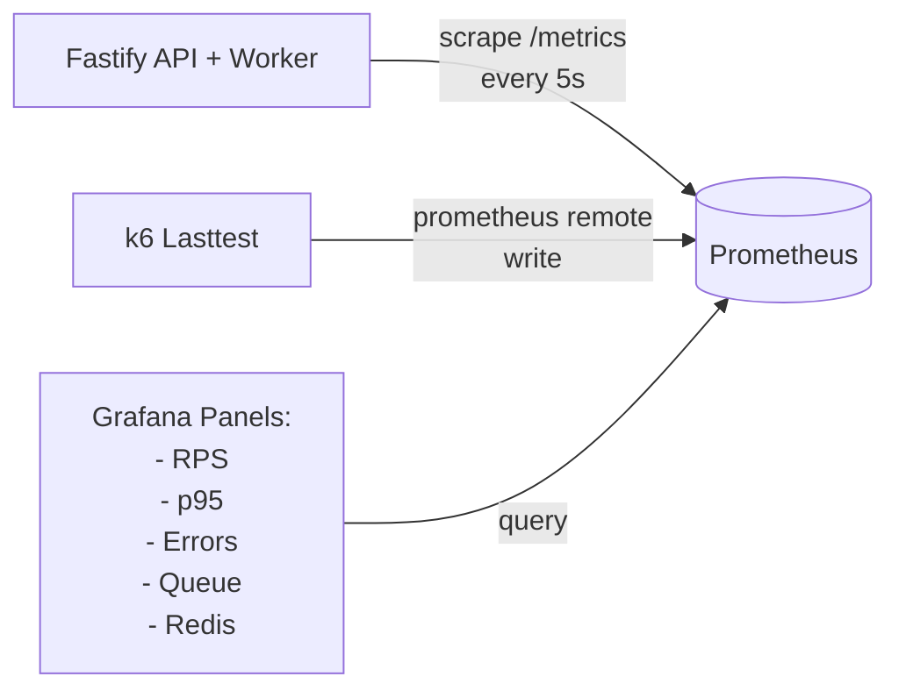

# System Architecture

## High-Level Overview

Build- und Typecheck-Jobs im Monorepo laufen in der CLI standardmaessig ueber `tsgo` (TypeScript Native Preview). Das reduziert die Laufzeit fuer Full-Builds und `check-types`; Watch-/Restart-Workflows mit `tsc-watch` werden in einem Folge-Schritt migriert. Eine temporaere Ausnahme bleibt in `apps/web` fuer `check-types` auf `tsc`, weil Side-Effect-CSS-Imports im aktuellen Preview-Stand noch nicht voll kompatibel sind. Shared-Runtime-Pakete fuer Backend-Services (`@repo/env`, `@repo/types`, `@repo/db`) folgen demselben Export-Muster: `types` fuer Editor/Typechecking, `source` fuer source-basierte Tests und `default` fuer gebaute `dist`-Artefakte. Direkte Service-Builds von API und Worker bauen diese Runtime-Abhaengigkeiten vor dem eigenen `tsgo`-Build mit, damit `dist`-Starts nicht implizit auf Workspace-`.ts`-Exporte angewiesen bleiben. Backend-Testlaeufe fuer API, Worker und `@repo/db` laufen paketlokal direkt ueber `node:test` gegen native `.ts`-Quellen mit `--conditions=source`, ohne Shared Runner oder `tsx` im Test-Hot-Path. API- und Worker-Coverage nutzen den nativen Node-Test-Coverage-Pfad, waehrend `@repo/db` fuer Coverage beim stabileren `c8`-Pfad bleibt. Das lokale Root-Kommando `pnpm test` orchestriert diese Paketskripte ueber Turborepo im Stream-Modus mit `--concurrency=1`, weil parallele oder CI-aehnliche Runner-Umgebungen wiederholt 15-Sekunden-Teardown-Ausreisser erzeugten.


```mermaid
flowchart TD
    User([NUTZER / BROWSER])

    Frontend["Next.js Frontend (apps/web)<br/>Frequency Festival 20XX – Ticket-Shop<br/>Tailwind CSS"]

    subgraph API [Fastify API Gateway apps-api]
        API_metrics["/metrics<br/>(Prometheus)"]
        API_avail["GET /availability<br/>→ Redis Read"]
        API_buy["POST /tickets/buy<br/>→ Pub/Sub Publish + Redis Reserve"]
        API_orders["GET /orders/:orderId<br/>→ Redis Read"]
    end

    Prometheus["Prometheus<br/>(Scraping)"]
    Redis[("Redis Cache<br/>(Memorystore)")]
    PubSub[["Google Cloud Pub/Sub<br/>(Message Broker)"]]

    Grafana["Grafana Dashboards<br/>- RPS<br/>- Latenz<br/>- E2E-Latenz<br/>- Errors<br/>- Queue<br/>- Redis-DB-Drift"]

    subgraph Worker [Fastify Worker apps-worker]
        W_consumer["Pub/Sub Konsument<br/>handle-buy-ticket-message.ts"]
        W_reconcile["Reconcile-Loop<br/>reconcile-ticket-availability.ts<br/>(peak: 10s / normal: 60s)"]
        W_metrics["/metrics<br/>(Prometheus)"]
    end

    subgraph DB [PostgreSQL Cloud SQL]
        events[("events<br/>- id<br/>- capacity<br/>- sold_count")]
        orders[("orders<br/>- id (= orderId)<br/>- event_id<br/>- status<br/>- failure_reason<br/>- created_at<br/>- updated_at")]
        tickets[("tickets<br/>- id (UUID)<br/>- event_id<br/>- order_id (FK -> orders.id)<br/>- first_name<br/>- last_name<br/>- status")]
    end

    User --> Frontend
    Frontend -->|"HTTP POST /api/tickets/:eventId/buy<br/>HTTP GET /api/tickets/:eventId/availability<br/>HTTP GET /api/orders/:orderId"| API

    API_metrics --> Prometheus
    API_avail --> Redis
    API_buy -->|"BuyTicketEvent {orderId, eventId,<br/>firstName, lastName, queuedAt}"| PubSub
    API_buy -->|"reservation + pending order"| Redis
    API_orders --> Redis

    W_metrics --> Prometheus
    Prometheus --> Grafana

    W_consumer -->|"completed/failed order + idempotency marker"| Redis
    PubSub -->|SUBSCRIBE| W_consumer
    W_reconcile -->|"available counter + drift metric"| Redis
    W_reconcile -->|"DB Read: sold_count + capacity"| DB

    W_consumer -->|"SELECT buy_ticket(...)"| DB
```

## Standardports

Alle lokalen Services (Docker Compose + native `pnpm dev`-Prozesse) nutzen einen zusammenhaengenden Port-Block `10001`–`10008`, um Kollisionen mit anderen lokalen Projekten zu vermeiden und die Zuordnung auf einen Blick lesbar zu halten. Quelle der Wahrheit fuer alle Konfigurationsdateien (`docker-compose.yml`, `.env`, `.env.test`, CI, k6, Debug-Skripte).

| Service          | Host-Port | Container-/Prozess-Port   | Betrieben von                     |
| ---------------- | --------- | ------------------------- | --------------------------------- |
| Web (Next.js)    | `10001`   | `10001` (nativer Prozess) | `pnpm --filter web dev`           |
| API (Fastify)    | `10002`   | `10002` (nativer Prozess) | `pnpm --filter api dev`           |
| Worker (Fastify) | `10003`   | `10003` (nativer Prozess) | `pnpm --filter worker dev`        |
| Redis            | `10004`   | `6379`                    | Docker Compose (`hts-redis`)      |
| Pub/Sub Emulator | `10005`   | `8085`                    | Docker Compose (`hts-pubsub`)     |
| PostgreSQL       | `10006`   | `5432`                    | Docker Compose (`hts-postgres`)   |
| Prometheus       | `10007`   | `9090`                    | Docker Compose (`hts-prometheus`) |
| Grafana          | `10008`   | `3000`                    | Docker Compose (`hts-grafana`)    |

Wichtig fuer Docker-interne Kommunikation (Container-zu-Container, z.B. Grafana → Prometheus): Es gilt immer der **Container-Port** (rechte Spalte), nicht der Host-Port. Der Grafana-Datasource-Provisioning-Eintrag (`monitoring/grafana/provisioning/datasources/prometheus.yml`) zeigt deshalb auf `http://prometheus:9090`, waehrend Prometheus selbst die App-Metriken von API/Worker ueber `host.docker.internal:10002` bzw. `host.docker.internal:10003` scraped (Host-Ports, da API/Worker als native Prozesse ausserhalb von Docker laufen).

## Datenfluss: Ticket-Kauf (Happy Path)

1. Nutzer klickt "Ticket kaufen" im Frontend
2. Frontend sendet POST /api/tickets/{eventId}/buy { ...personalisierungsdaten }
3. API reserviert atomar in **einem** Redis-Roundtrip via Lua-Script (registriert per ioredis `defineCommand`, ausgefuehrt als `EVALSHA`; Quelle: `apps/api/src/lib/redis-scripts.ts`):
   - Check `tickets:event:{eventId}:available > 0` — bei Sold-Out bricht das Script ohne jeden Schreibzugriff ab
   - `DECR available`
   - Reservation-Key `tickets:event:{eventId}:reservation:{orderId}` mit TTL
   - Pending-Status `orders:{orderId}` mit eigener Pending-TTL
4. ✅ Reserviert → API published BuyTicketEvent an Pub/Sub → HTTP 202 Accepted.
   ❌ Sold Out bei Schritt 3 → HTTP 409 Conflict (Sold Out), es wurden keine Keys geschrieben.
   ❌ Publish-Fehler → ein atomares Gegen-Script gibt die Reservation frei: `DEL reservation`, `INCR available` nur wenn die Reservation tatsaechlich noch existierte (idempotent, kein Double-Increment), `DEL` Pending-Status. Partielle Rollback-Zustaende sind damit unmoeglich.
5. Worker konsumiert BuyTicketEvent aus Pub/Sub
6. Worker simuliert Payment-Processing (Sleep 1s)
7. Worker ruft SQL-Function auf: `buy_ticket(event_id, order_id, first_name, last_name)` (persistiert `orderId` in `orders` und `tickets.order_id`, macht Ticket-INSERT + sold_count Update und setzt `orders.status` auf `completed`)
   - Vor dem DB-Write prueft der Worker Idempotenz ueber Redis (`processed`-Marker) und setzt einen kurzlebigen `processing`-Lock pro `orderId`.
   - Bei bereits verarbeiteter `orderId` wird sofort ACK gesendet (kein zweiter DB-Write).
   - Nach erfolgreichem oder terminal fehlgeschlagenem Processing ueberschreibt der Worker denselben Redis-Order-Key mit dem finalen Status inkl. Ticket-Referenz bzw. `failure_reason` und einer laengeren Final-Status-TTL fuer den spaeteren API-Read.
   - Bei terminalem Business-Fehler kompensiert der Worker die Reservation in Redis atomar (Reservation `DEL` + `available` `INCR`), setzt vorhandene Orders auf `failed` inkl. `failure_reason`, aktualisiert das Redis-Read-Model und ACKt die Nachricht.
8. Nutzer pollt GET /api/orders/{orderId} für finalen Status; die API liest dabei ausschließlich den Redis-Status pro `orderId` (`pending` aus der API, `completed|failed` aus dem Worker) aus `orders:{orderId}` und spricht nicht direkt mit PostgreSQL.

## Redis-Key-Lifecycle

Alle Redis-Keys, die im Ticket-Kauf-Flow entstehen und wieder verschwinden:

| Key-Muster                                      | Zweck                                                  | TTL (Default)                     | Erstellt von                                                               | Gelesen / Gelöscht von                                                           |
| ----------------------------------------------- | ------------------------------------------------------ | --------------------------------- | -------------------------------------------------------------------------- | -------------------------------------------------------------------------------- |
| `tickets:event:{eventId}:total`                 | Kapazitäts-Snapshot                                    | unbegrenzt                        | Worker (Reconcile)                                                         | API (`GET /availability`)                                                        |
| `tickets:event:{eventId}:available`             | Aktuelle Verfügbarkeit                                 | unbegrenzt                        | API (`POST /reset`, Lua-Init), Worker (Reconcile)                          | API (Lua-DECR bei Reservation), Worker (INCR bei Kompensation)                   |
| `tickets:event:{eventId}:reservation:{orderId}` | Temporärer Reservation-Marker                          | 120 s                             | API (`POST /buy`)                                                          | Worker (DEL bei Kompensation), Reconcile-Loop (SCAN → zählt aktive Reservations) |
| `tickets:event:{eventId}:processing:{orderId}`  | Distributed Lock (verhindert parallele Verarbeitung)   | 60 s                              | Worker                                                                     | Worker (DEL nach Verarbeitung)                                                   |
| `tickets:event:{eventId}:processed:{orderId}`   | Idempotenz-Marker (verhindert Redelivery-Doppel-Write) | 86 400 s                          | Worker                                                                     | Worker (Idempotenz-Check bei jeder Nachricht)                                    |
| `orders:{orderId}`                              | Order-Cache-Eintrag (`pending` → `completed`/`failed`) | 900 s (pending), 86 400 s (final) | API (pending-Status nach Reservation), Worker (final-Status nach DB-Write) | API (`GET /api/orders/:orderId`)                                                 |

Quelle der Key-Definitionen: `packages/types/src/redis-keys.ts`

## E2E-Latenz-Messung

Der End-to-End-Zeitstempel wird vollständig entkoppelt via Payload transportiert:

1. **API** setzt `queuedAt: Date.now()` beim Erstellen des `BuyTicketEvent` und published es mit dem Ticket-Kauf-Request an Pub/Sub.
2. **Worker** empfängt `queuedAt` als Teil des Payloads und berechnet nach Abschluss der Verarbeitung: `duration = (Date.now() - queuedAt) / 1000`.
3. Ergebnis wird als Prometheus-Histogram erfasst:
   - Metrik: `order_e2e_latency_seconds`
   - Labels: `event_id`, `status` (`completed` | `failed`)
   - Sourcedatei: `apps/worker/src/lib/handle-buy-ticket-message.ts`

Diese Methode erfordert keinen gemeinsamen State zwischen API und Worker — der Zeitstempel reist im Pub/Sub-Payload mit.

## Redis-DB-Drift-Metrik

Nach jedem Reconcile-Lauf schreibt der Worker den aktuellen Konsistenzstand als Prometheus-Gauge:

- **Metrik:** `redis_db_drift_tickets` (Gauge, Label: `event_id`)
- **Berechnung:** `redis_available − (total_capacity − sold_count − active_reservations)`
- **Wert 0** = perfekte Konsistenz zwischen Redis und PostgreSQL
- **Positiver Wert** = Redis zählt mehr verfügbare Tickets als PostgreSQL → häufig nach TTL-Ablauf von Reservations ohne Kompensation
- **Negativer Wert** = Redis zählt weniger → seltener, z. B. nach Worker-Restart vor Reconcile
- Sourcedateien: `apps/worker/src/lib/reconcile-ticket-availability.ts` (Messung), `apps/worker/src/lib/metrics.ts` (Gauge), `apps/worker/src/routes/pubsub-listener.ts` (Verdrahtung)

Der Reconcile-Loop liefert diese Messung ohnehin als Nebenprodukt seiner Arbeit, ohne zusätzliche DB-Scans. Die Korrektur selbst erfolgt als **Delta** (`INCRBY` um die gemessene Drift) statt als absolutes Überschreiben — Reservierungen, die zwischen Messung und Korrektur passieren, gehen dadurch nicht verloren.

## Worker ACK/NACK-Regeln (Stand 2026-03-21)

Der Worker behandelt Pub/Sub-Nachrichten mit folgenden Regeln:

| Fall                                                                                               | Verhalten | Begründung                                                                                                                         |
| -------------------------------------------------------------------------------------------------- | --------- | ---------------------------------------------------------------------------------------------------------------------------------- |
| Erfolgreiche Verarbeitung (`buy_ticket(...)` erfolgreich)                                          | ACK       | Nachricht ist final verarbeitet, keine Redelivery nötig                                                                            |
| Nachricht fuer bereits verarbeitete `orderId` (`processed`-Marker vorhanden)                       | ACK       | Idempotenter Kurzschluss ohne erneuten DB-Write                                                                                    |
| Ungültiges JSON im Payload                                                                         | NACK      | Technischer Fehler im Message-Format, Retry/Redelivery möglich                                                                     |
| Payload verletzt Zod-Schema                                                                        | NACK      | Nachricht ist im aktuellen Flow nicht verarbeitbar; aktuell als Retry klassifiziert                                                |
| Processing-Lock fuer dieselbe `orderId` bereits gesetzt                                            | NACK      | Eine parallele Zustellung verarbeitet bereits; spaetere Redelivery wird erneut geprueft                                            |
| Technischer Fehler beim DB-Write                                                                   | NACK      | Transienter Infrastrukturfehler, Redelivery soll erneut versuchen                                                                  |
| Business-Fehler `P0001` (Event nicht gefunden) + Kompensation erfolgreich/optional bereits erfolgt | ACK       | Terminaler Fachfehler; Reservation wurde freigegeben oder war bereits freigegeben, Order wird wenn vorhanden als `failed` markiert |
| Business-Fehler `P0001` (Event nicht gefunden) + Kompensation fehlgeschlagen                       | NACK      | Reservation konnte nicht sicher freigegeben werden; Retry soll Kompensation nachholen                                              |

Diese Tabelle existiert wörtlich als Code: `handleBuyTicketMessage` berechnet nur einen `BuyTicketOutcome`-Wert (kein ack/nack, keine Metriken im Handler); das Mapping Outcome → ACK/NACK + Prometheus-Counter steht als Tabelle `buyTicketOutcomePolicy` in `apps/worker/src/routes/pubsub-listener.ts`. Neue Fälle sind eine neue Tabellenzeile, kein neuer try/catch-Ast — und ack/nack wird beweisbar genau einmal pro Nachricht aufgerufen.

Abgesichert durch Tests in:

- `apps/worker/test/routes/pubsub-listener.test.ts` (Outcome pro Szenario + Policy-Tabellen-Assertion)
- `apps/worker/test/plugins/pubsub.test.ts`

## Worker-Durchsatz & Backpressure

Zwei explizite Env-Knobs bestimmen die effektive Backpressure des Workers (statt zweier impliziter Library-Defaults):

| Env-Variable                       | Default | Wirkung                                                                                                                                    |
| ---------------------------------- | ------- | ------------------------------------------------------------------------------------------------------------------------------------------ |
| `PUBSUB_FLOW_CONTROL_MAX_MESSAGES` | 500     | Max. gleichzeitig zugestellte Nachrichten pro Worker-Instanz. Mit dem 1-s-Payment-Mock ≈ **~500 Käufe/s pro Worker** als Durchsatz-Deckel. |
| `DATABASE_POOL_MAX`                | 20      | node-postgres Pool-Größe pro Prozess. Jeder Write hält die Connection nur ~5 ms → 20 Connections tragen ~4.000 Writes/s.                   |

Back-of-envelope fürs Lastziel (~2.100 abgeschlossene Käufe/s): 4–5 Worker-Instanzen mit den Defaults. Beide Werte gehören beim Skalieren gemeinsam angepasst.

## DTO-Vertrag für Code und Tests

Um wiederkehrende Testfehler durch Typ-Drift zu vermeiden, gilt projektweit:

1. Payload-Interfaces für API/Worker niemals lokal duplizieren.
2. Test-Fixtures für Request-/Event-Payloads immer aus den zentralen DTO-Typen ableiten.
3. Quelle ist ausschließlich `packages/types` (Typ-Export oder Zod-Schema).

Beispiel im Worker-Flow:

- `apps/worker/src/routes/pubsub-listener.ts` nutzt den zentralen DTO-Typ für den Handler-Contract.
- `apps/worker/test/routes/pubsub-listener.test.ts` erstellt gültige Payloads über den Shared-Type statt über lokale ad-hoc Objekte.

## Datenfluss: Verfügbarkeits-Check

1. Frontend sendet GET /api/tickets/{eventId}/availability
2. API liest Redis Key tickets:event:{eventId}:available
3. API antwortet HTTP 200 { available: 843291, total: 1000000 }
   → Kein DB-Zugriff, Sub-Millisekunden Antwortzeit

## Reconcile-Loop: Design & Betriebsmodell

Der Worker fuehrt nach dem einmaligen Startup-Reconcile einen periodischen Reconcile-Loop aus, der Redis-Counter kontinuierlich gegen PostgreSQL korrigiert (vgl. Kubernetes Controller Pattern: desired state vs. current state). Dies kompensiert Drift durch TTL-Ablauf von Reservierungen, Race Conditions und Worker-Restarts.

### Mechanismus: Self-scheduling setTimeout

```
Boot → runStartupReconcile() → scheduleNextReconcile(intervalMs)
                                       ↓
                         reconcileTicketAvailability()
                                       ↓ (nach Abschluss)
                         scheduleNextReconcile(intervalMs) → ...
```

`setInterval` wird bewusst nicht verwendet: Falls ein Reconcile-Lauf (DB-Read + Redis-Scan + Writes) laenger dauert als das konfigurierte Intervall, wuerden sich Laeufe ueberlappen und Redis/DB unter Last unnoetig belasten.

### Betriebsmodi

| Modus    | Intervall-Default | Env-Variable                               | Anwendungsfall                            |
| -------- | ----------------- | ------------------------------------------ | ----------------------------------------- |
| `peak`   | 10 s              | `WORKER_RECONCILE_INTERVAL_PEAK_SECONDS`   | Ticket-Sale-Peak, hoher Reservation-Churn |
| `normal` | 60 s              | `WORKER_RECONCILE_INTERVAL_NORMAL_SECONDS` | Normalbetrieb, geringe Drift-Rate         |

Umschaltung: `WORKER_RECONCILE_MODE=peak|normal` (Default: `normal`). Gestoppt via Fastify `onClose`-Hook.

### Deployment-Modell & Eskalationspfad

**Phase 3.5–4 – Singleton-Deployment:**
Der Worker laeuft als `replicas: 1`. Kubernetes garantiert exklusiven Reconcile-Betrieb ohne Leader-Election-Code (ADR-022).

**Phase 5 – HA-Eskalation (bei horizontaler Worker-Skalierung):**

- Option A: Leader Election via Kubernetes Lease API (`coordination.k8s.io/v1`) – dieselbe Mechanik, die `kube-controller-manager` in HA-Setups nutzt.
- Option B: Dedizierter `apps/reconciler`-Service als eigener Singleton – klarste Separation of Concerns.

---

## Load-Test Szenario (k6 Lastkurve)

```
  RPS
50k ┤                  ┌─────────────────────┐
    │                  │    Sale Opening     │
    │                  │    + Sustained      │
    │                  │                     │
20k ┤                  │                     └──────┐
    │                  │                            │ Sold Out
10k ┤         ┌────────┘                            │
    │         │ Pre-Sale                            │
 1k ┤─────────┘ Hype                                └───-───┐
    │ Warm-Up                                        Cool   │
  0 ┼─────────┬────────┬──────────────────────┬──────┬──────┬──
    0        2min     4min                   12min  14min  15min
```

**1M Tickets** werden über ca. 8 Minuten Peak-Last verkauft.
Das Szenario zeigt: Autoscaling-Verhalten, Sold-Out-Transition (HTTP 202 → 409), Queue-Backpressure und Cache-Performance.

## Monitoring & Observability


```mermaid
flowchart LR
    API["Fastify API + Worker"]
    K6["k6 Lasttest"]
    Prometheus[("Prometheus")]
    Grafana["Grafana Panels:<br/>- RPS<br/>- p95<br/>- Errors<br/>- Queue<br/>- Redis"]

    API -->|scrape /metrics<br/>every 5s| Prometheus
    K6 -->|prometheus remote<br/>write| Prometheus
    Grafana -->|query| Prometheus
```

### Grafana-Dashboards (geplant)

| Dashboard       | Metriken                                      | Quelle                   |
| --------------- | --------------------------------------------- | ------------------------ |
| API Performance | RPS, Latenz (p50/p95/p99), Error Rate         | `prom-client` in Fastify |
| Redis Cache     | Hit/Miss Ratio, Key Count, Memory Usage       | Redis Exporter           |
| Message Queue   | Queue Depth, Processing Rate, Consumer Lag    | Pub/Sub Metrics          |
| k6 Lasttest     | Virtual Users, Request Duration, Failure Rate | k6 → Prometheus          |

## Workspace-Struktur

```
high-frequency-ticket-system/
├── apps/
│   ├── api/          # Fastify API Gateway (HTTP → Redis + Pub/Sub)
│   ├── web/          # Next.js Frontend (Tailwind CSS)
│   └── worker/       # Fastify Worker (Pub/Sub → PostgreSQL + Redis)
├── packages/
│   ├── db/           # Drizzle ORM Schema, Migrations, DB Client
│   ├── types/        # Shared Zod Schemas & TypeScript Types
│   ├── eslint-config/# Shared ESLint Configuration
│   ├── typescript-config/ # Shared tsconfig
│   └── ui/           # Shared UI Components (optional)
├── load-tests/       # k6 Lasttest-Skripte
├── infra/            # Terraform + Kubernetes Manifeste
├── docs/             # Architektur, ADRs, Requirements
│   ├── ARCHITECTURE.md
│   ├── DECISIONS.md
│   ├── REQUIREMENTS.md
│   └── TODO.md
├── scripts/
│   ├── debug/        # Reproduzierbare Diagnose- und Guardrail-Skripte
│   └── local/        # Lokale Infrastruktur-Orchestrierung (Reset + Seed)
└── docker-compose.yml  # Lokales Dev-Setup (PostgreSQL, Redis, Pub/Sub, Grafana)
```
