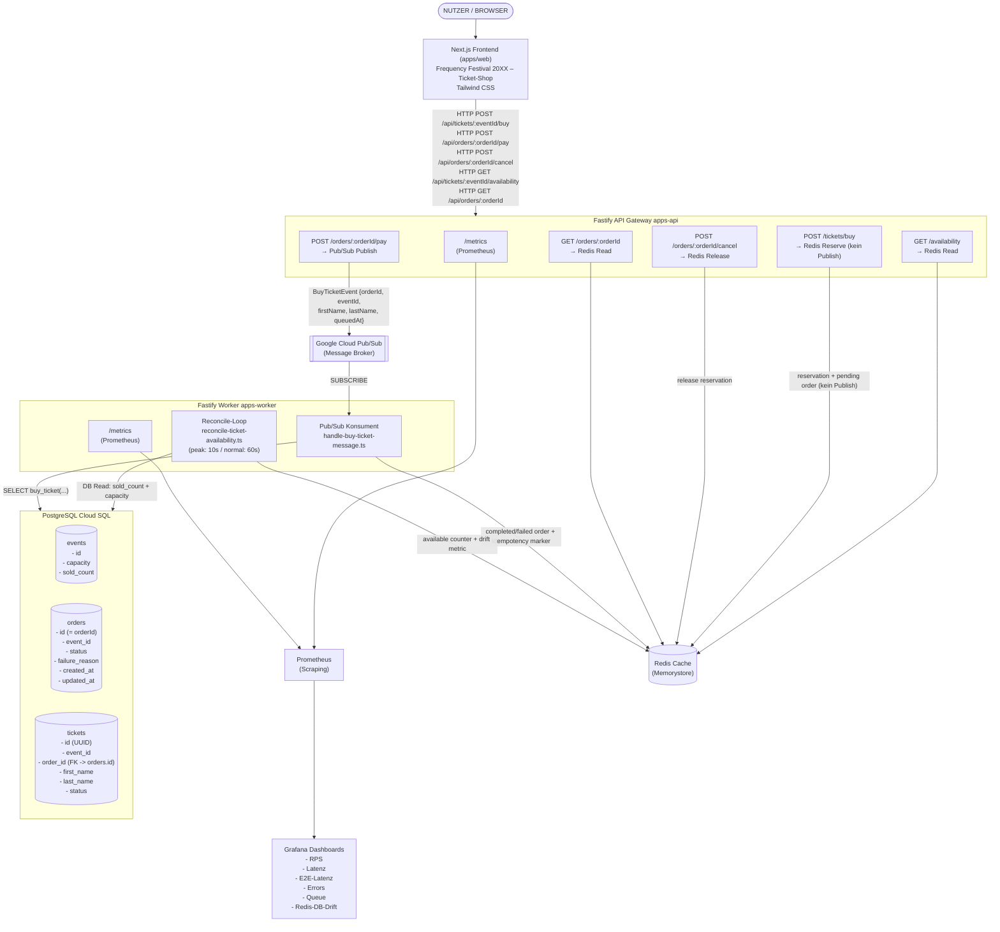
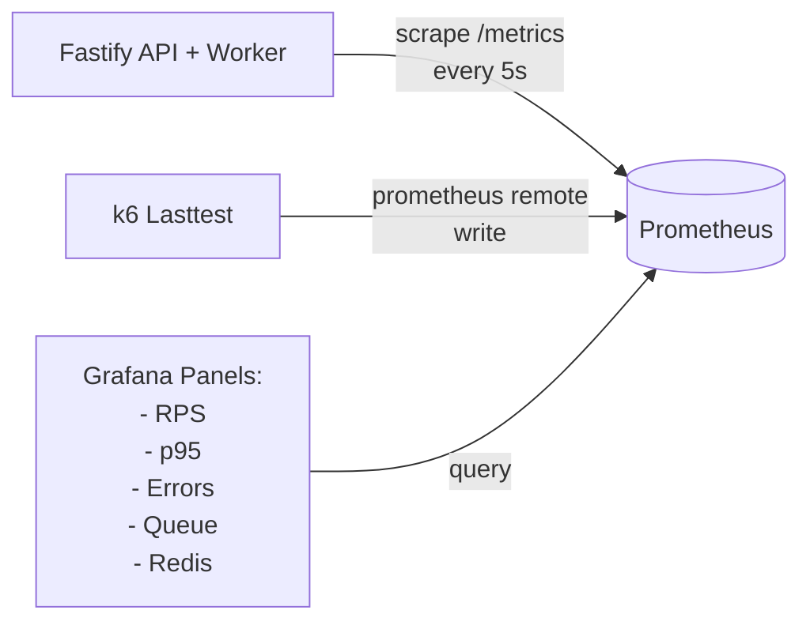

# System Architecture

## High-Level Overview

Build- und Typecheck-Jobs im Monorepo laufen in der CLI standardmaessig ueber `tsgo` (TypeScript Native Preview). Das reduziert die Laufzeit fuer Full-Builds und `check-types`; Watch-/Restart-Workflows mit `tsc-watch` werden in einem Folge-Schritt migriert. Eine temporaere Ausnahme bleibt in `apps/web` fuer `check-types` auf `tsc`, weil Side-Effect-CSS-Imports im aktuellen Preview-Stand noch nicht voll kompatibel sind. Shared-Runtime-Pakete fuer Backend-Services (`@repo/env`, `@repo/types`, `@repo/db`) folgen demselben Export-Muster: `types` fuer Editor/Typechecking, `source` fuer source-basierte Tests und `default` fuer gebaute `dist`-Artefakte. Direkte Service-Builds von API und Worker bauen diese Runtime-Abhaengigkeiten vor dem eigenen `tsgo`-Build mit, damit `dist`-Starts nicht implizit auf Workspace-`.ts`-Exporte angewiesen bleiben. Backend-Testlaeufe fuer API, Worker und `@repo/db` laufen paketlokal direkt ueber `node:test` gegen native `.ts`-Quellen mit `--conditions=source`, ohne Shared Runner oder `tsx` im Test-Hot-Path. API- und Worker-Coverage nutzen den nativen Node-Test-Coverage-Pfad, waehrend `@repo/db` fuer Coverage beim stabileren `c8`-Pfad bleibt. Das lokale Root-Kommando `pnpm test` orchestriert diese Paketskripte ueber Turborepo im Stream-Modus mit `--concurrency=1`, weil parallele oder CI-aehnliche Runner-Umgebungen wiederholt 15-Sekunden-Teardown-Ausreisser erzeugten.


```mermaid
flowchart TD
    User([NUTZER / BROWSER])

    Frontend["Next.js Frontend (apps/web)<br/>Frequency Festival 20XX – Ticket-Shop<br/>Tailwind CSS"]

    subgraph API [Fastify API Gateway apps-api]
        API_metrics["/metrics<br/>(Prometheus)"]
        API_avail["GET /availability<br/>→ Redis Read"]
        API_buy["POST /tickets/buy<br/>→ Redis Reserve (kein Publish)"]
        API_pay["POST /orders/:orderId/pay<br/>→ Pub/Sub Publish"]
        API_cancel["POST /orders/:orderId/cancel<br/>→ Redis Release"]
        API_orders["GET /orders/:orderId<br/>→ Redis Read"]
    end

    Prometheus["Prometheus<br/>(Scraping)"]
    Redis[("Redis Cache<br/>(Memorystore)")]
    PubSub[["Google Cloud Pub/Sub<br/>(Message Broker)"]]

    Grafana["Grafana Dashboards<br/>- RPS<br/>- Latenz<br/>- E2E-Latenz<br/>- Errors<br/>- Queue<br/>- Redis-DB-Drift"]

    subgraph Worker [Fastify Worker apps-worker]
        W_consumer["Pub/Sub Konsument<br/>handle-buy-ticket-message.ts"]
        W_reconcile["Reconcile-Loop<br/>reconcile-ticket-availability.ts<br/>(peak: 10s / normal: 60s)"]
        W_metrics["/metrics<br/>(Prometheus)"]
    end

    subgraph DB [PostgreSQL Cloud SQL]
        events[("events<br/>- id<br/>- capacity<br/>- sold_count")]
        orders[("orders<br/>- id (= orderId)<br/>- event_id<br/>- status<br/>- failure_reason<br/>- created_at<br/>- updated_at")]
        tickets[("tickets<br/>- id (UUID)<br/>- event_id<br/>- order_id (FK -> orders.id)<br/>- first_name<br/>- last_name<br/>- status")]
    end

    User --> Frontend
    Frontend -->|"HTTP POST /api/tickets/:eventId/buy<br/>HTTP POST /api/orders/:orderId/pay<br/>HTTP POST /api/orders/:orderId/cancel<br/>HTTP GET /api/tickets/:eventId/availability<br/>HTTP GET /api/orders/:orderId"| API

    API_metrics --> Prometheus
    API_avail --> Redis
    API_buy -->|"reservation + pending order (kein Publish)"| Redis
    API_pay -->|"BuyTicketEvent {orderId, eventId,<br/>firstName, lastName, queuedAt}"| PubSub
    API_cancel -->|"release reservation"| Redis
    API_orders --> Redis

    W_metrics --> Prometheus
    Prometheus --> Grafana

    W_consumer -->|"completed/failed order + idempotency marker"| Redis
    PubSub -->|SUBSCRIBE| W_consumer
    W_reconcile -->|"available counter + drift metric"| Redis
    W_reconcile -->|"DB Read: sold_count + capacity"| DB

    W_consumer -->|"SELECT buy_ticket(...)"| DB
```

## Standardports

Alle lokalen Services (Docker Compose + native `pnpm dev`-Prozesse) nutzen einen zusammenhaengenden Port-Block `10001`–`10009`, um Kollisionen mit anderen lokalen Projekten zu vermeiden und die Zuordnung auf einen Blick lesbar zu halten. Quelle der Wahrheit fuer alle Konfigurationsdateien (`docker-compose.yml`, `.env`, `.env.test`, CI, k6, Debug-Skripte).

| Service          | Host-Port | Container-/Prozess-Port   | Betrieben von                         |
| ---------------- | --------- | ------------------------- | ------------------------------------- |
| Web (Next.js)    | `10001`   | `10001` (nativer Prozess) | `pnpm --filter web dev`               |
| API (Fastify)    | `10002`   | `10002` (nativer Prozess) | `pnpm --filter api dev`               |
| Worker (Fastify) | `10003`   | `10003` (nativer Prozess) | `pnpm --filter worker dev`            |
| Redis            | `10004`   | `6379`                    | Docker Compose (`hts-redis`)          |
| Pub/Sub Emulator | `10005`   | `8085`                    | Docker Compose (`hts-pubsub`)         |
| PostgreSQL       | `10006`   | `5432`                    | Docker Compose (`hts-postgres`)       |
| Prometheus       | `10007`   | `9090`                    | Docker Compose (`hts-prometheus`)     |
| Grafana          | `10008`   | `3000`                    | Docker Compose (`hts-grafana`)        |
| Redis Exporter   | `10009`   | `9121`                    | Docker Compose (`hts-redis-exporter`) |

Wichtig fuer Docker-interne Kommunikation (Container-zu-Container, z.B. Grafana → Prometheus): Es gilt immer der **Container-Port** (rechte Spalte), nicht der Host-Port. Der Grafana-Datasource-Provisioning-Eintrag (`monitoring/grafana/provisioning/datasources/prometheus.yml`) zeigt deshalb auf `http://prometheus:9090`, waehrend Prometheus selbst die App-Metriken von API/Worker ueber `host.docker.internal:10002` bzw. `host.docker.internal:10003` scraped (Host-Ports, da API/Worker als native Prozesse ausserhalb von Docker laufen). Den `redis_exporter` scraped Prometheus dagegen container-intern per Service-Name (`redis_exporter:9121`), da beide im selben Compose-Netzwerk laufen; der Host-Port `10009` dient nur dem manuellen Debugging.

## Datenfluss: Ticket-Kauf (Happy Path)

Seit dem Reserve/Pay-Split (ADR-028) ist der Kauf **zwei** synchrone API-Schritte: `buy` reserviert nur, `pay` published. Das Ticket ist waehrend der (frontend-simulierten) Zahlung ueber die Reservierung gehalten; der Worker sieht die Order erst nach bestaetigter Zahlung. Das Backend hat nirgends kuenstliche Latenz.

1. Nutzer klickt "Ticket kaufen" im Frontend
2. Frontend sendet POST /api/tickets/{eventId}/buy { ...personalisierungsdaten }
3. API reserviert atomar in **einem** Redis-Roundtrip via Lua-Script (registriert per ioredis `defineCommand`, ausgefuehrt als `EVALSHA`; Quelle: `apps/api/src/lib/redis-scripts.ts`):
   - Check `tickets:event:{eventId}:opensAt` — ist der Verkaufsstart-Zeitpunkt noch nicht erreicht, bricht das Script ohne jeden Schreibzugriff ab (Sale-Unlock-Gate, siehe ADR-024)
   - Check `tickets:event:{eventId}:available > 0` — bei Sold-Out bricht das Script ebenfalls ohne Schreibzugriff ab
   - `DECR available`
   - Ledger-Eintrag `ZADD tickets:event:{eventId}:reservations {nowMs} {orderId}` (Score = Erstellungszeit, **ohne TTL** — der Eintrag ist ein Inventar-Anspruch bis zur Finalisierung/Kompensation, ADR-026)
   - Pending-Status `orders:{orderId}` inkl. Kaeuferdaten (`firstName`/`lastName`) mit eigener Pending-TTL — die Pay-Route rekonstruiert daraus den `BuyTicketEvent`
4. ✅ Reserviert → HTTP 202 Accepted (`orderId`). **Es wird noch nichts an Pub/Sub published.**
   ❌ Zu frueh bei Schritt 3 → HTTP 425 Too Early, es wurden keine Keys geschrieben.
   ❌ Sold Out bei Schritt 3 → HTTP 409 Conflict (Sold Out), es wurden keine Keys geschrieben.
5. Frontend oeffnet das Payment-Modal (simuliertes 3DS, reines UX — kein Server-Sleep) und sendet POST /api/orders/{orderId}/pay { ...fake payment }
6. API (Pay-Route) validiert das (simulierte) Payment-DTO, liest den Reservierungs-Record, setzt `queuedAt = Date.now()` und **published** den `BuyTicketEvent` an Pub/Sub → HTTP 200, sobald der Publish bestaetigt ist (Async-Writes-Regel gewahrt: kein direkter DB-Write).
   ❌ Publish-Fehler → ein atomares Gegen-Script gibt die Reservation frei: `ZREM reservations {orderId}`, `INCR available` nur wenn der Ledger-Eintrag tatsaechlich noch existierte (idempotent, kein Double-Increment), `DEL` Pending-Status. Partielle Rollback-Zustaende sind damit unmoeglich.
   ↩︎ Bricht der Nutzer das Modal ab / laeuft 3DS aus → POST /api/orders/{orderId}/cancel gibt die Reservierung mit demselben Gegen-Script frei (idempotent).
7. Worker konsumiert BuyTicketEvent aus Pub/Sub (reiner Persist-Consumer, **kein** Payment-Sleep mehr — ADR-028)
8. Worker ruft SQL-Function auf: `buy_ticket(event_id, order_id, first_name, last_name)` (persistiert `orderId` in `orders` und `tickets.order_id`, macht Ticket-INSERT + sold_count Update und setzt `orders.status` auf `completed`)
   - Die Idempotenz-Garantie traegt die `buy_ticket`-Transaktion selbst (`INSERT … ON CONFLICT DO NOTHING` liefert bei Redelivery das existierende Ticket zurueck, siehe ADR-004). Der Redis-`processed`-Marker ist eine reine Optimierung: Bei bereits verarbeiteter `orderId` wird sofort ACK gesendet (kein zweiter DB-Roundtrip).
   - Parallele Doppel-Zustellungen derselben `orderId` laufen harmlos in den `ON CONFLICT`-Pfad der DB-Transaktion — ein separater Processing-Lock existiert nicht mehr.
   - Bei Erfolg finalisiert der Worker atomar: Redis-Order-Key mit finalem Status inkl. Ticket-Referenz + laengerer Final-TTL, `processed`-Marker **und** `ZREM reservations {orderId}` — der Anspruch geht in `sold_count` ueber und darf nicht doppelt zaehlen. `available` bleibt beim Erfolg dekrementiert (das Ticket ist verkauft).
   - Bei terminalem Business-Fehler kompensiert der Worker die Reservation in Redis atomar (`ZREM reservations {orderId}` + `INCR available`, nur wenn der Ledger-Eintrag noch existierte — idempotent), setzt vorhandene Orders auf `failed` inkl. `failure_reason`, aktualisiert das Redis-Read-Model und ACKt die Nachricht.
9. Nutzer pollt GET /api/orders/{orderId} für finalen Status; die API liest dabei ausschließlich den Redis-Status pro `orderId` (`pending` aus der API, `completed|failed` aus dem Worker) aus `orders:{orderId}` und spricht nicht direkt mit PostgreSQL.

## Redis-Key-Lifecycle

Alle Redis-Keys, die im Ticket-Kauf-Flow entstehen und wieder verschwinden:

| Key-Muster                                    | Zweck                                                                                                                                                                                                                                                                     | TTL (Default)                                                                                   | Erstellt von                                                                     | Gelesen / Gelöscht von                                                                                                                   |
| --------------------------------------------- | ------------------------------------------------------------------------------------------------------------------------------------------------------------------------------------------------------------------------------------------------------------------------- | ----------------------------------------------------------------------------------------------- | -------------------------------------------------------------------------------- | ---------------------------------------------------------------------------------------------------------------------------------------- |
| `tickets:event:{eventId}:total`               | Kapazitäts-Snapshot                                                                                                                                                                                                                                                       | unbegrenzt                                                                                      | Worker (Reconcile)                                                               | API (`GET /availability`)                                                                                                                |
| `tickets:event:{eventId}:available`           | Aktuelle Verfügbarkeit                                                                                                                                                                                                                                                    | unbegrenzt                                                                                      | API (`POST /reset`, Lua-Init), Worker (Reconcile)                                | API (Lua-DECR bei Reserve; `INCR` bei Pay-Rollback/Cancel-Release), Worker (INCR bei Kompensation)                                       |
| `tickets:event:{eventId}:opensAt`             | Sale-Unlock-Zeitpunkt (Unix-Ms); fehlt/`0` = sofort offen                                                                                                                                                                                                                 | unbegrenzt                                                                                      | Seed-Skript (`scripts/local/reset-seed.mjs`)                                     | API (Lua-Check bei Reservation, ADR-024)                                                                                                 |
| `tickets:event:{eventId}:reservations` (ZSet) | Ledger akzeptierter, noch nicht finalisierter Reservierungen (Score = Erstellungszeit, Member = `orderId`) — aktiver Inventar-Anspruch (ADR-026). Seit ADR-028 spannt der Eintrag den **gesamten Checkout** (Reserve bis Bezahlen/Abbrechen), nicht nur die Queue-Latenz. | **unbegrenzt** (kein TTL)                                                                       | API (`ZADD` bei `POST /buy`)                                                     | Worker (`ZREM` bei Finalisierung/Kompensation), API (`ZREM` bei Pay-Rollback/Cancel), Reconcile-Loop (`ZCARD` = aktiv, `ZCOUNT` = stale) |
| `tickets:event:{eventId}:processed:{orderId}` | Redelivery-Shortcut (spart DB-Roundtrip; Idempotenz-Garantie = DB-Transaktion, ADR-004)                                                                                                                                                                                   | 86 400 s                                                                                        | Worker                                                                           | Worker (Idempotenz-Check bei jeder Nachricht)                                                                                            |
| `orders:{orderId}`                            | Reservierungs-/Order-Cache-Eintrag (`pending` inkl. Kaeuferdaten → `completed`/`failed`); die Pay-Route liest ihn, um den `BuyTicketEvent` zu rekonstruieren                                                                                                              | 900 s (pending), 86 400 s (final) — die Pending-TTL muss das Zahlungsfenster abdecken (ADR-028) | API (pending-Reservierung nach `POST /buy`), Worker (final-Status nach DB-Write) | API (`GET /api/orders/:orderId`, `POST /pay`, `POST /cancel`); gelöscht bei Pay-Rollback/Cancel-Release                                  |

Quelle der Key-Definitionen: `packages/types/src/redis-keys.ts`

## E2E-Latenz-Messung

Der End-to-End-Zeitstempel wird vollständig entkoppelt via Payload transportiert:

1. **API** setzt `queuedAt: Date.now()` beim Erstellen des `BuyTicketEvent` und published es mit dem Ticket-Kauf-Request an Pub/Sub.
2. **Worker** empfängt `queuedAt` als Teil des Payloads und berechnet nach Abschluss der Verarbeitung: `duration = (Date.now() - queuedAt) / 1000`.
3. Ergebnis wird als Prometheus-Histogram erfasst:
   - Metrik: `order_e2e_latency_seconds`
   - Labels: `event_id`, `status` (`completed` | `failed`)
   - Sourcedatei: `apps/worker/src/lib/handle-buy-ticket-message.ts`

Diese Methode erfordert keinen gemeinsamen State zwischen API und Worker — der Zeitstempel reist im Pub/Sub-Payload mit.

## Redis-DB-Drift-Metrik

Nach jedem Reconcile-Lauf schreibt der Worker den aktuellen Konsistenzstand als Prometheus-Gauge:

- **Metrik:** `redis_db_drift_tickets` (Gauge, Label: `event_id`)
- **Berechnung:** `redis_available − (total_capacity − sold_count − active_reservations)`, wobei `active_reservations = ZCARD tickets:event:{eventId}:reservations`
- **Wert 0** = perfekte Konsistenz zwischen Redis und PostgreSQL
- **Positiver Wert** = Redis zählt mehr verfügbare Tickets als PostgreSQL → seltener, z. B. verlorenes Decrement zwischen Messung und Korrektur
- **Negativer Wert** = Redis zählt weniger → z. B. nach Worker-Restart vor Reconcile
- Sourcedateien: `apps/worker/src/lib/reconcile-ticket-availability.ts` (Messung), `apps/worker/src/lib/metrics.ts` (Gauge), `apps/worker/src/routes/pubsub-listener.ts` (Verdrahtung)

**Warum der Ledger die Baseline-A-Drift (-314k) beseitigt (ADR-026):** In Baseline A liefen die per-`orderId`-Reservation-Keys nach 120 s TTL ab, waehrend die Order noch ~406 s in der Queue lag. Der damalige `SCAN`-basierte Zaehler sah die abgelaufene Reservierung nicht mehr, `available` blieb aber dekrementiert → grosse negative Drift → Reconcile buchte Inventar zurueck, das noch beansprucht war → Oversell-Risiko. Der ZSet-Ledger hat **keine TTL**: Jeder akzeptierte, noch nicht finalisierte Kauf bleibt via `ZCARD` ein aktiver Anspruch, unabhaengig von der Warteschlangen-Latenz. Ablauf/Alter ist nur ein Stale-Signal (`ZCOUNT` gegen einen Schwellwert `RESERVATION_STALE_SECONDS`, Default 900 s), das der Reaper (Phase 6) auswerten kann — es loest **nie** eine automatische Rueckbuchung aus.

- **Metrik:** `reservation_ledger_active` (Gauge, Label: `event_id`) — aktive Ansprueche (`ZCARD`)
- **Metrik:** `reservation_ledger_stale` (Gauge, Label: `event_id`) — Ansprueche aelter als `RESERVATION_STALE_SECONDS` (Reaper-Kandidaten, nie automatisch zurueckgebucht)

Der Reconcile-Loop liefert diese Messung ohnehin als Nebenprodukt seiner Arbeit, ohne zusätzliche DB-Scans. Die Korrektur selbst erfolgt als **Delta** (`INCRBY` um die gemessene Drift) statt als absolutes Überschreiben — Reservierungen, die zwischen Messung und Korrektur passieren, gehen dadurch nicht verloren.

## Worker ACK/NACK-Regeln (Stand 2026-07-14)

Der Worker behandelt Pub/Sub-Nachrichten mit folgenden Regeln:

| Fall                                                                                               | Verhalten | Begründung                                                                                                                         |
| -------------------------------------------------------------------------------------------------- | --------- | ---------------------------------------------------------------------------------------------------------------------------------- |
| Erfolgreiche Verarbeitung (`buy_ticket(...)` erfolgreich)                                          | ACK       | Nachricht ist final verarbeitet, keine Redelivery nötig                                                                            |
| Nachricht fuer bereits verarbeitete `orderId` (`processed`-Marker vorhanden)                       | ACK       | Idempotenter Kurzschluss ohne erneuten DB-Write                                                                                    |
| Ungültiges JSON im Payload                                                                         | NACK      | Technischer Fehler im Message-Format, Retry/Redelivery möglich                                                                     |
| Payload verletzt Zod-Schema                                                                        | NACK      | Nachricht ist im aktuellen Flow nicht verarbeitbar; aktuell als Retry klassifiziert                                                |
| Technischer Fehler beim DB-Write                                                                   | NACK      | Transienter Infrastrukturfehler, Redelivery soll erneut versuchen                                                                  |
| Business-Fehler `P0001` (Event nicht gefunden) + Kompensation erfolgreich/optional bereits erfolgt | ACK       | Terminaler Fachfehler; Reservation wurde freigegeben oder war bereits freigegeben, Order wird wenn vorhanden als `failed` markiert |
| Business-Fehler `P0001` (Event nicht gefunden) + Kompensation fehlgeschlagen                       | NACK      | Reservation konnte nicht sicher freigegeben werden; Retry soll Kompensation nachholen                                              |

Diese Tabelle existiert wörtlich als Code: `handleBuyTicketMessage` berechnet nur einen `BuyTicketOutcome`-Wert (kein ack/nack, keine Metriken im Handler); das Mapping Outcome → ACK/NACK + Prometheus-Counter steht als Tabelle `buyTicketOutcomePolicy` in `apps/worker/src/routes/pubsub-listener.ts`. Neue Fälle sind eine neue Tabellenzeile, kein neuer try/catch-Ast — und ack/nack wird beweisbar genau einmal pro Nachricht aufgerufen.

Abgesichert durch Tests in:

- `apps/worker/test/routes/pubsub-listener.test.ts` (Outcome pro Szenario + Policy-Tabellen-Assertion)
- `apps/worker/test/plugins/pubsub.test.ts`

## Worker-Durchsatz & Backpressure

Zwei explizite Env-Knobs bestimmen die effektive Backpressure des Workers (statt zweier impliziter Library-Defaults):

| Env-Variable                       | Default | Wirkung                                                                                                                                                                                                                                                      |
| ---------------------------------- | ------- | ------------------------------------------------------------------------------------------------------------------------------------------------------------------------------------------------------------------------------------------------------------ |
| `PUBSUB_FLOW_CONTROL_MAX_MESSAGES` | 500     | Max. gleichzeitig zugestellte Nachrichten pro Worker-Instanz. Seit dem Reserve/Pay-Split (ADR-028, kein 1-s-Sleep mehr) deckelt der Wert die gleichzeitig laufenden Persist-Operationen, nicht eine kuenstliche Sleep-Rate — Backpressure gegen den DB-Pool. |
| `DATABASE_POOL_MAX`                | 20      | node-postgres Pool-Größe pro Prozess. Jeder Write hält die Connection nur ~5 ms → 20 Connections tragen ~4.000 Writes/s.                                                                                                                                     |

Back-of-envelope fürs Lastziel (~2.100 abgeschlossene Käufe/s): 4–5 Worker-Instanzen mit den Defaults. Beide Werte gehören beim Skalieren gemeinsam angepasst. Ohne den Payment-Sleep ist der Worker nun so schnell wie `buy_ticket` + Redis-Finalisierung; der reale Durchsatz-Limiter verschiebt sich damit auf den DB-Hot-Row-`UPDATE` (Backlog Stage 2).

## DTO-Vertrag für Code und Tests

Um wiederkehrende Testfehler durch Typ-Drift zu vermeiden, gilt projektweit:

1. Payload-Interfaces für API/Worker niemals lokal duplizieren.
2. Test-Fixtures für Request-/Event-Payloads immer aus den zentralen DTO-Typen ableiten.
3. Quelle ist ausschließlich `packages/types` (Typ-Export oder Zod-Schema).

Beispiel im Worker-Flow:

- `apps/worker/src/routes/pubsub-listener.ts` nutzt den zentralen DTO-Typ für den Handler-Contract.
- `apps/worker/test/routes/pubsub-listener.test.ts` erstellt gültige Payloads über den Shared-Type statt über lokale ad-hoc Objekte.

## Datenfluss: Verfügbarkeits-Check

1. Frontend sendet GET /api/tickets/{eventId}/availability
2. API liest Redis Key tickets:event:{eventId}:available
3. API antwortet HTTP 200 { available: 843291, total: 1000000 }
   → Kein DB-Zugriff, Sub-Millisekunden Antwortzeit

## Reconcile-Loop: Design & Betriebsmodell

Der Worker fuehrt nach dem einmaligen Startup-Reconcile einen periodischen Reconcile-Loop aus, der Redis-Counter kontinuierlich gegen PostgreSQL korrigiert (vgl. Kubernetes Controller Pattern: desired state vs. current state). Dies kompensiert Drift durch Race Conditions und Worker-Restarts. Aktive Reservierungen zaehlt der Loop seit ADR-026 als `ZCARD tickets:event:{eventId}:reservations` (O(1)) statt ueber einen Keyspace-`SCAN` — der Ledger-Eintrag hat keine TTL, sodass lange Warteschlangen-Latenz keine noch offene Reservierung "ablaufen" laesst und kein Inventar faelschlich zurueckgebucht wird.

### Mechanismus: Self-scheduling setTimeout

```
Boot → runStartupReconcile() → scheduleNextReconcile(intervalMs)
                                       ↓
                         reconcileTicketAvailability()
                                       ↓ (nach Abschluss)
                         scheduleNextReconcile(intervalMs) → ...
```

`setInterval` wird bewusst nicht verwendet: Falls ein Reconcile-Lauf (DB-Read + Ledger-`ZCARD`/`ZCOUNT` + Writes) laenger dauert als das konfigurierte Intervall, wuerden sich Laeufe ueberlappen und Redis/DB unter Last unnoetig belasten.

### Betriebsmodi

| Modus    | Intervall-Default | Env-Variable                               | Anwendungsfall                            |
| -------- | ----------------- | ------------------------------------------ | ----------------------------------------- |
| `peak`   | 10 s              | `WORKER_RECONCILE_INTERVAL_PEAK_SECONDS`   | Ticket-Sale-Peak, hoher Reservation-Churn |
| `normal` | 60 s              | `WORKER_RECONCILE_INTERVAL_NORMAL_SECONDS` | Normalbetrieb, geringe Drift-Rate         |

Umschaltung: `WORKER_RECONCILE_MODE=peak|normal` (Default: `normal`). Gestoppt via Fastify `onClose`-Hook.

### Deployment-Modell & Eskalationspfad

**Phase 3.5–4 – Singleton-Deployment:**
Der Worker laeuft als `replicas: 1`. Kubernetes garantiert exklusiven Reconcile-Betrieb ohne Leader-Election-Code (ADR-022).

**Phase 5 – HA-Eskalation (bei horizontaler Worker-Skalierung):**

- Option A: Leader Election via Kubernetes Lease API (`coordination.k8s.io/v1`) – dieselbe Mechanik, die `kube-controller-manager` in HA-Setups nutzt.
- Option B: Dedizierter `apps/reconciler`-Service als eigener Singleton – klarste Separation of Concerns.

---

## Load-Test Szenario (k6 Lastkurve)

Der lokale Lasttest (`pnpm spike`) bildet einen echten Ticket-Sale nach: Der Verkauf ist bis zu einem fixen Unlock-Zeitpunkt gesperrt (Sale-Unlock-Gate, ADR-024), und der Uebergang von Sale-Opening zu Sold-Out wird **reaktiv** anhand der tatsaechlichen Verfuegbarkeit erkannt statt anhand einer festen Zeitspanne (ADR-025) — die urspruengliche Version dieses Tests sold sich mitten im Peak aus, ohne dass die Lastkurve darauf reagierte.

```
  RPS
5k ┤                  ┌─────────────────────────·······┐
   │                  │   Sale Opening +               │
   │                  │   Sustained (bis Sold-Out)      │
   │                  │                                 │
1k ┤─────────┬────────┘                                 └──────┐
   │ Warm-Up │ Ramp-Up                                   Cool   │
   │(gesperrt)                                           Down   │
 0 ┼─────────┬────────┬───────────────·· (reaktiv) ··────┬──────┬──
   0        45s      1m30s      Sold-Out (variabel)      +1min
```

**Ablauf (orchestriert durch `scripts/local/run-spike.mjs`, siehe ADR-025):**

1. `pnpm seed` mit `SALE_OPENS_IN_SECONDS=60` (Default) — Redis/PostgreSQL/Pub/Sub werden zurueckgesetzt, `opensAt` wird auf `jetzt + 60s` gesetzt.
2. **Phase A** (`load-tests/spike-phase-a.js`): Warm-Up 1.000 RPS flat/45s (Sale ist noch gesperrt, Kaufversuche liefern HTTP 425) → Ramp-Up 1.000→5.000 RPS/45s (Unlock faellt typischerweise in dieses Fenster) → Sustain 5.000 RPS bis Sold-Out.
3. Die Orchestrierung pollt `GET /api/tickets/:eventId/availability` alle 3s; sobald `available` bei drei aufeinanderfolgenden Polls `0` ist, wird Phase A per `SIGINT` (graceful k6 stop) beendet.
4. **Phase B** (`load-tests/spike-phase-b.js`): Cool-Down 1.000 RPS flat/1min.

**1M Tickets**, Sold-Out-Zeitpunkt ist variabel (haengt von der tatsaechlichen Reservierungsrate ab, nicht von einem Timer). Das Szenario zeigt: Sale-Unlock-Transition (HTTP 425 → 202), Sold-Out-Transition (HTTP 202 → 409), Queue-Backpressure und Cache-Performance.

## Monitoring & Observability


```mermaid
flowchart LR
    API["Fastify API + Worker"]
    K6["k6 Lasttest"]
    Prometheus[("Prometheus")]
    Grafana["Grafana Panels:<br/>- RPS<br/>- p95<br/>- Errors<br/>- Queue<br/>- Redis"]

    API -->|scrape /metrics<br/>every 5s| Prometheus
    K6 -->|prometheus remote<br/>write| Prometheus
    Grafana -->|query| Prometheus
```

### Grafana-Dashboards (geplant)

| Dashboard       | Metriken                                                              | Quelle                                          |
| --------------- | --------------------------------------------------------------------- | ----------------------------------------------- |
| API Performance | RPS, Latenz (p50/p95/p99), Error Rate                                 | `prom-client` in Fastify                        |
| Redis Cache     | Hit/Miss Ratio, Key Count, Memory Usage                               | Redis Exporter (`hts-redis-exporter`)           |
| DB & Runtime    | Pool-Connections/-Wait, Query-Latenz, Lock-Waits, Event-Loop-Lag, CPU | `prom-client` in Worker + Node-Default-Metriken |
| Message Queue   | Queue Depth, Processing Rate, Consumer Lag                            | Pub/Sub Metrics                                 |
| k6 Lasttest     | Virtual Users, Request Duration, Failure Rate                         | k6 → Prometheus                                 |

## Workspace-Struktur

```
high-frequency-ticket-system/
├── apps/
│   ├── api/          # Fastify API Gateway (HTTP → Redis + Pub/Sub)
│   ├── web/          # Next.js Frontend (Tailwind CSS)
│   └── worker/       # Fastify Worker (Pub/Sub → PostgreSQL + Redis)
├── packages/
│   ├── db/           # Drizzle ORM Schema, Migrations, DB Client
│   ├── types/        # Shared Zod Schemas & TypeScript Types
│   ├── eslint-config/# Shared ESLint Configuration
│   ├── typescript-config/ # Shared tsconfig
│   └── ui/           # Shared UI Components (optional)
├── load-tests/       # k6 Lasttest-Skripte
├── infra/            # Terraform + Kubernetes Manifeste
├── docs/             # Architektur, ADRs, Requirements
│   ├── ARCHITECTURE.md
│   ├── DECISIONS.md
│   ├── REQUIREMENTS.md
│   └── TODO.md
├── scripts/
│   ├── debug/        # Reproduzierbare Diagnose- und Guardrail-Skripte
│   └── local/        # Lokale Infrastruktur-Orchestrierung (Reset + Seed)
└── docker-compose.yml  # Lokales Dev-Setup (PostgreSQL, Redis, Pub/Sub, Grafana)
```
