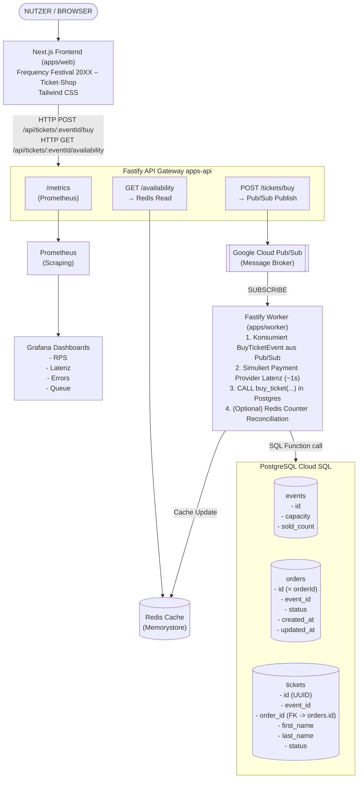
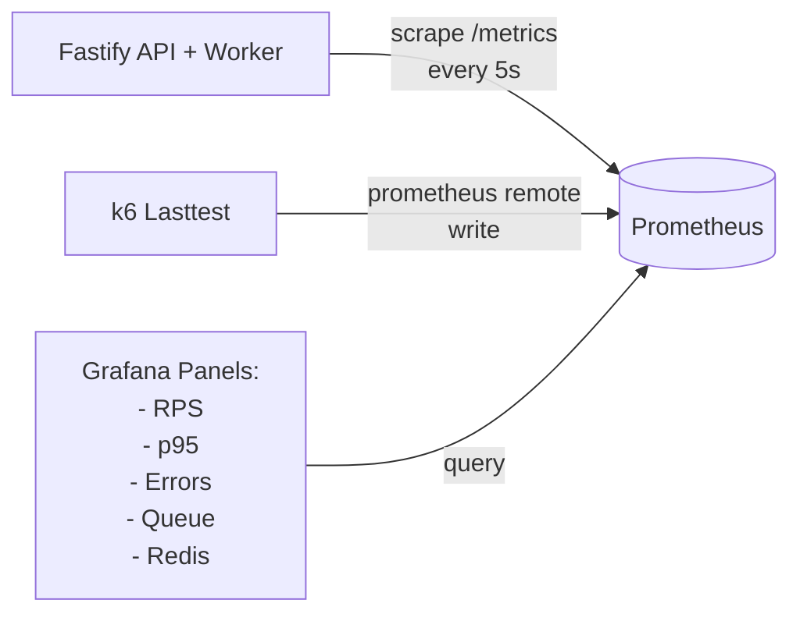

# System Architecture

## High-Level Overview

Build- und Typecheck-Jobs im Monorepo laufen in der CLI standardmaessig ueber `tsgo` (TypeScript Native Preview). Das reduziert die Laufzeit fuer Full-Builds und `check-types`; Watch-/Restart-Workflows mit `tsc-watch` werden in einem Folge-Schritt migriert. Eine temporaere Ausnahme bleibt in `apps/web` fuer `check-types` auf `tsc`, weil Side-Effect-CSS-Imports im aktuellen Preview-Stand noch nicht voll kompatibel sind.

<!-- TODO: Ersetze dieses ASCII-Diagramm durch ein Draw.io-Diagramm (docs/architecture.drawio) und exportiere es als SVG -->


```mermaid
flowchart TD
    User([NUTZER / BROWSER])

    Frontend["Next.js Frontend (apps/web)<br/>Frequency Festival 20XX – Ticket-Shop<br/>Tailwind CSS"]

    subgraph API [Fastify API Gateway apps-api]
        API_metrics["/metrics<br/>(Prometheus)"]
        API_avail["GET /availability<br/>→ Redis Read"]
        API_buy["POST /tickets/buy<br/>→ Pub/Sub Publish"]
    end

    Prometheus["Prometheus<br/>(Scraping)"]
    Redis[("Redis Cache<br/>(Memorystore)")]
    PubSub[["Google Cloud Pub/Sub<br/>(Message Broker)"]]

    Grafana["Grafana Dashboards<br/>- RPS<br/>- Latenz<br/>- Errors<br/>- Queue"]

    Worker["Fastify Worker (apps/worker)<br/>1. Konsumiert BuyTicketEvent aus Pub/Sub<br/>2. Simuliert Payment Provider Latenz (~1s)<br/>3. CALL buy_ticket(...) in Postgres<br/>4. (Optional) Redis Counter Reconciliation"]

    subgraph DB [PostgreSQL Cloud SQL]
        events[("events<br/>- id<br/>- capacity<br/>- sold_count")]
        orders[("orders<br/>- id (= orderId)<br/>- event_id<br/>- status<br/>- created_at<br/>- updated_at")]
        tickets[("tickets<br/>- id (UUID)<br/>- event_id<br/>- order_id (FK -> orders.id)<br/>- first_name<br/>- last_name<br/>- status")]
    end

    User --> Frontend
    Frontend -->|"HTTP POST /api/tickets/:eventId/buy<br/>HTTP GET /api/tickets/:eventId/availability"| API

    API_metrics --> Prometheus
    API_avail --> Redis
    API_buy --> PubSub

    Prometheus --> Grafana

    Worker -->|Cache Update| Redis
    PubSub -->|SUBSCRIBE| Worker

    Worker -->|SQL Function call| DB
```

## Datenfluss: Ticket-Kauf (Happy Path)

1. Nutzer klickt "Ticket kaufen" im Frontend
2. Frontend sendet POST /api/tickets/{eventId}/buy { ...personalisierungsdaten }
3. API Gateway prüft Redis: tickets:event:{eventId}:available > 0 ?
   - Umsetzung: atomar via Redis Lua (`EVAL`) in einem Schritt (Check + Decrement), damit nur bei `available > 0` reduziert wird.
4. ✅ Ja → API legt Reservation-Key `tickets:event:{eventId}:reservation:{orderId}` mit TTL in Redis an.
5. ✅ Reservation gesetzt → API published BuyTicketEvent an Pub/Sub → HTTP 202 Accepted.
   ❌ Sold Out bei Schritt 3 → HTTP 409 Conflict (Sold Out)
   ❌ Publish-Fehler bei Schritt 5 → API löscht Reservation-Key und rollt `available` per `INCR` zurück.
6. Worker konsumiert BuyTicketEvent aus Pub/Sub
7. Worker simuliert Payment-Processing (Sleep 1s)
8. Worker ruft SQL-Function auf: `buy_ticket(event_id, order_id, first_name, last_name)` (persistiert `orderId` in `orders` und `tickets.order_id`, macht Ticket-INSERT + sold_count Update und setzt `orders.status` auf `completed`)
   - Vor dem DB-Write prueft der Worker Idempotenz ueber Redis (`processed`-Marker) und setzt einen kurzlebigen `processing`-Lock pro `orderId`.
   - Bei bereits verarbeiteter `orderId` wird sofort ACK gesendet (kein zweiter DB-Write).
   - Bei terminalem Business-Fehler (z.B. Event nicht gefunden) kompensiert der Worker die Reservation in Redis atomar (Reservation `DEL` + `available` `INCR`) und ACKt die Nachricht.
9. Nutzer pollt GET /api/orders/{orderId} für finalen Status

## Worker ACK/NACK-Regeln (Stand 2026-03-21)

Der Worker behandelt Pub/Sub-Nachrichten mit folgenden Regeln:

| Fall                                                                                               | Verhalten | Begründung                                                                              |
| -------------------------------------------------------------------------------------------------- | --------- | --------------------------------------------------------------------------------------- |
| Erfolgreiche Verarbeitung (`buy_ticket(...)` erfolgreich)                                          | ACK       | Nachricht ist final verarbeitet, keine Redelivery nötig                                 |
| Nachricht fuer bereits verarbeitete `orderId` (`processed`-Marker vorhanden)                       | ACK       | Idempotenter Kurzschluss ohne erneuten DB-Write                                         |
| Ungültiges JSON im Payload                                                                         | NACK      | Technischer Fehler im Message-Format, Retry/Redelivery möglich                          |
| Payload verletzt Zod-Schema                                                                        | NACK      | Nachricht ist im aktuellen Flow nicht verarbeitbar; aktuell als Retry klassifiziert     |
| Processing-Lock fuer dieselbe `orderId` bereits gesetzt                                            | NACK      | Eine parallele Zustellung verarbeitet bereits; spaetere Redelivery wird erneut geprueft |
| Technischer Fehler beim DB-Write                                                                   | NACK      | Transienter Infrastrukturfehler, Redelivery soll erneut versuchen                       |
| Business-Fehler `P0001` (Event nicht gefunden) + Kompensation erfolgreich/optional bereits erfolgt | ACK       | Terminaler Fachfehler; Reservation wurde freigegeben oder war bereits freigegeben       |
| Business-Fehler `P0001` (Event nicht gefunden) + Kompensation fehlgeschlagen                       | NACK      | Reservation konnte nicht sicher freigegeben werden; Retry soll Kompensation nachholen   |

Abgesichert durch Tests in:

- `apps/worker/test/routes/pubsub-listener.test.ts`
- `apps/worker/test/plugins/pubsub.test.ts`

## DTO-Vertrag für Code und Tests

Um wiederkehrende Testfehler durch Typ-Drift zu vermeiden, gilt projektweit:

1. Payload-Interfaces für API/Worker niemals lokal duplizieren.
2. Test-Fixtures für Request-/Event-Payloads immer aus den zentralen DTO-Typen ableiten.
3. Quelle ist ausschließlich `packages/types` (Typ-Export oder Zod-Schema).

Beispiel im Worker-Flow:

- `apps/worker/src/routes/pubsub-listener.ts` nutzt den zentralen DTO-Typ für den Handler-Contract.
- `apps/worker/test/routes/pubsub-listener.test.ts` erstellt gültige Payloads über den Shared-Type statt über lokale ad-hoc Objekte.

## Datenfluss: Verfügbarkeits-Check

1. Frontend sendet GET /api/tickets/{eventId}/availability
2. API liest Redis Key tickets:event:{eventId}:available
3. API antwortet HTTP 200 { available: 843291, total: 1000000 }
   → Kein DB-Zugriff, Sub-Millisekunden Antwortzeit

## Load-Test Szenario (k6 Lastkurve)

```
  RPS
50k ┤                  ┌─────────────────────┐
    │                  │    Sale Opening     │
    │                  │    + Sustained      │
    │                  │                     │
20k ┤                  │                     └──────┐
    │                  │                            │ Sold Out
10k ┤         ┌────────┘                            │
    │         │ Pre-Sale                            │
 1k ┤─────────┘ Hype                                └───-───┐
    │ Warm-Up                                        Cool   │
  0 ┼─────────┬────────┬──────────────────────┬──────┬──────┬──
    0        2min     4min                   12min  14min  15min
```

**1M Tickets** werden über ca. 8 Minuten Peak-Last verkauft.
Das Szenario zeigt: Autoscaling-Verhalten, Sold-Out-Transition (HTTP 202 → 409), Queue-Backpressure und Cache-Performance.

## Monitoring & Observability


```mermaid
flowchart LR
    API["Fastify API + Worker"]
    K6["k6 Lasttest"]
    Prometheus[("Prometheus")]
    Grafana["Grafana Panels:<br/>- RPS<br/>- p95<br/>- Errors<br/>- Queue<br/>- Redis"]

    API -->|scrape /metrics<br/>every 5s| Prometheus
    K6 -->|prometheus remote<br/>write| Prometheus
    Grafana -->|query| Prometheus
```

### Grafana-Dashboards (geplant)

| Dashboard       | Metriken                                      | Quelle                   |
| --------------- | --------------------------------------------- | ------------------------ |
| API Performance | RPS, Latenz (p50/p95/p99), Error Rate         | `prom-client` in Fastify |
| Redis Cache     | Hit/Miss Ratio, Key Count, Memory Usage       | Redis Exporter           |
| Message Queue   | Queue Depth, Processing Rate, Consumer Lag    | Pub/Sub Metrics          |
| k6 Lasttest     | Virtual Users, Request Duration, Failure Rate | k6 → Prometheus          |

## Workspace-Struktur

```
high-frequency-ticket-system/
├── apps/
│   ├── api/          # Fastify API Gateway (HTTP → Redis + Pub/Sub)
│   ├── web/          # Next.js Frontend (Tailwind CSS)
│   └── worker/       # Fastify Worker (Pub/Sub → PostgreSQL + Redis)
├── packages/
│   ├── db/           # Drizzle ORM Schema, Migrations, DB Client
│   ├── types/        # Shared Zod Schemas & TypeScript Types
│   ├── eslint-config/# Shared ESLint Configuration
│   ├── typescript-config/ # Shared tsconfig
│   └── ui/           # Shared UI Components (optional)
├── load-tests/       # k6 Lasttest-Skripte
├── infra/            # Terraform + Kubernetes Manifeste
├── docs/             # Architektur, ADRs, Requirements
│   ├── ARCHITECTURE.md
│   ├── DECISIONS.md
│   ├── REQUIREMENTS.md
│   └── TODO.md
├── scripts/
│   ├── debug/        # Reproduzierbare Diagnose- und Guardrail-Skripte
│   └── local/        # Lokale Infrastruktur-Orchestrierung (Reset + Seed)
└── docker-compose.yml  # Lokales Dev-Setup (PostgreSQL, Redis, Pub/Sub, Grafana)
```
