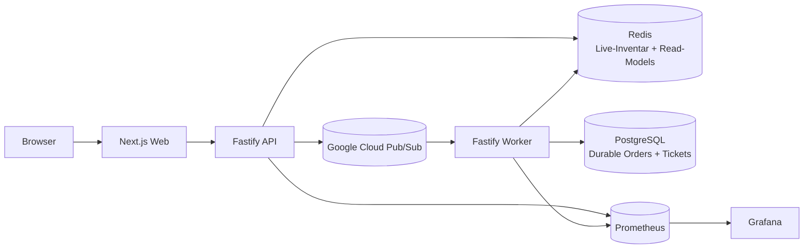
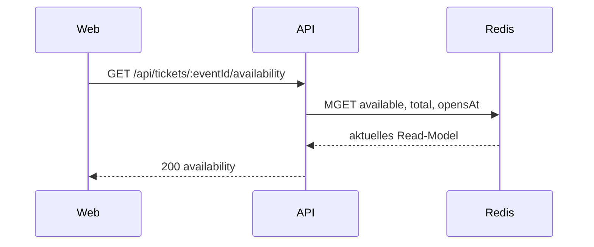
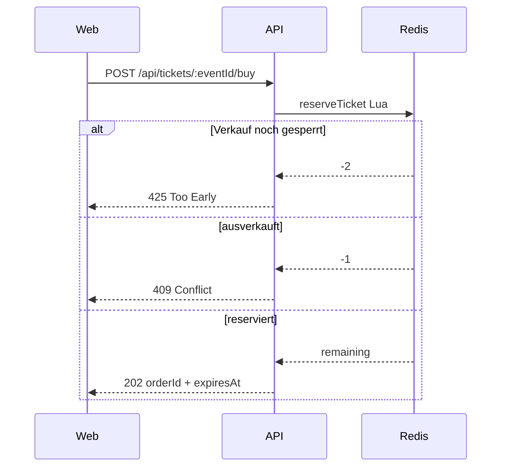
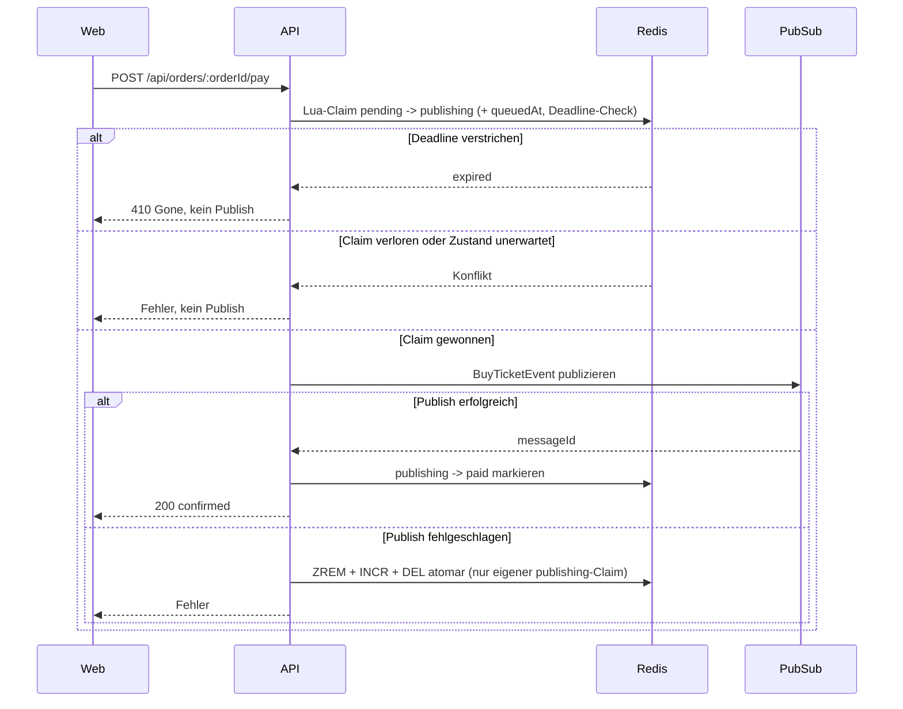
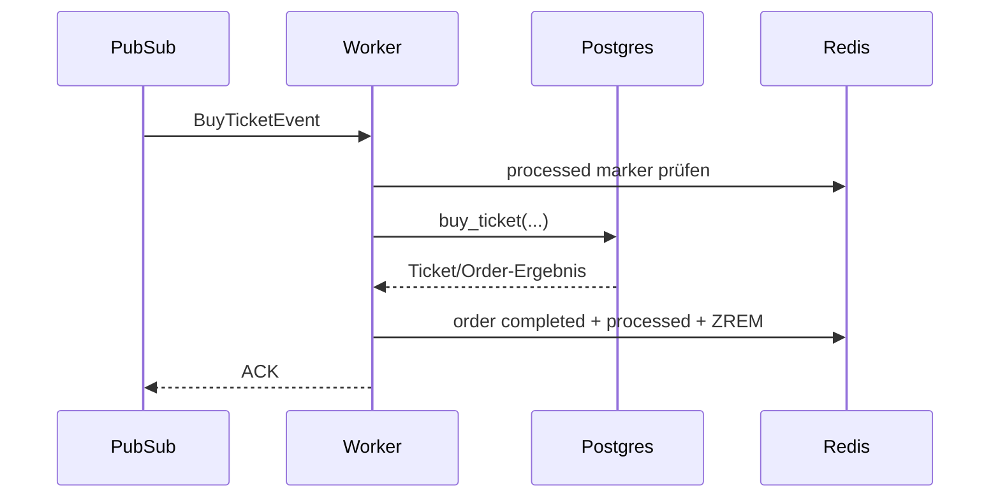

# Systemarchitektur

Diese Datei beschreibt den **aktuellen Ist-Zustand** am Repository-HEAD:
Komponenten, Datenflüsse, Zuständigkeiten, Invarianten und Skalierungsgrenzen.
Geplante Änderungen stehen in `docs/TODO.md`, Entscheidungen und historische
Begründungen im ADR-Index `docs/DECISIONS.md`.

## Systemgrenzen


```mermaid
flowchart LR
    Browser["Browser"]
    Web["Next.js Web"]
    API["Fastify API"]
    Redis[("Redis\nLive-Inventar + Read-Models")]
    PubSub[("Google Cloud Pub/Sub")]
    Worker["Fastify Worker"]
    Postgres[("PostgreSQL\nDurable Orders + Tickets")]
    Prometheus[("Prometheus")]
    Grafana["Grafana"]

    Browser --> Web
    Web --> API
    API --> Redis
    API --> PubSub
    PubSub --> Worker
    Worker --> Postgres
    Worker --> Redis
    API --> Prometheus
    Worker --> Prometheus
    Prometheus --> Grafana
```

| Komponente    | Verantwortung                                                                             | Darf nicht                                  |
| ------------- | ----------------------------------------------------------------------------------------- | ------------------------------------------- |
| `apps/web`    | Checkout-UX, simulierte 3DS-Verzögerung, Status-Polling                                   | Inventar oder Kaufstatus selbst entscheiden |
| `apps/api`    | HTTP-Verträge, Redis-Reservierung/Reads, Publish nach Pub/Sub                             | direkt PostgreSQL lesen oder schreiben      |
| Redis         | Live-Verfügbarkeit, Reservierungs-Ledger, Order-Read-Modelle, kurzlebige Idempotenzmarker | dauerhafte Ticket-Historie ersetzen         |
| Pub/Sub       | bezahlte Kauf-Intents puffern und mindestens einmal zustellen                             | fachliche Idempotenz garantieren            |
| `apps/worker` | Events validieren, DB-Write ausführen, Redis finalisieren, kompensieren, auditieren       | Live-Inventar aus DB-Summen korrigieren     |
| PostgreSQL    | dauerhafte Wahrheit für Events, Orders und verkaufte Tickets                              | den API-Read-Hot-Path bedienen              |

## Datenbesitz und Invarianten

### Live-Inventar

Während eines Verkaufs entscheidet Redis über neue Reservierungen. Das atomare
Reserve-Script verändert drei zusammengehörige Strukturen:

```text
available DECR
reservations ZADD(orderId, score = eligibilityDeadline)
orders:{orderId} = pending
```

Redis ist während eines laufenden Sales die einzige Inventarautorität. Nur die
atomaren Reserve-, Release- und Kompensationsskripte verändern `available`; kein
Beobachter leitet den Stand aus zeitversetzten PostgreSQL-Summen ab.

Nur ein erfolgreich entfernter Ledger-Anspruch darf `available` wieder erhöhen.
Cancel, Publish-Rollback, Worker-Kompensation und Reaper nutzen deshalb
idempotente Lua-Gegenskripte mit `ZREM` als Guard. Sie prüfen zusätzlich den
erwarteten Checkout-Zustand, sodass zwei konkurrierende Pfade denselben Anspruch
nie doppelt freigeben.

Der ZSet-Score ist die millisekundengenaue Eligibility Deadline. Sie macht einen
Anspruch nur reaper-fähig und gibt selbst nichts frei.

### Dauerhafter Verkauf

PostgreSQL enthält für jeden erfolgreichen Kauf genau eine Order und ein Ticket.
Die Function `buy_ticket(event_id, order_id, first_name, last_name)` kapselt den
atomaren Write. `order_id` trägt die DB-Idempotenz bei Pub/Sub-Redelivery.

`events.sold_count` ist ein periodisch materialisiertes Read-Model aus
`COUNT(tickets)`. Es liegt nicht im Kauf-Hot-Path und trägt nicht den
Oversell-Schutz.

### Read-Modelle

Die API liest Verfügbarkeit und Order-Status ausschließlich aus Redis.
PostgreSQL ist deshalb unabhängig von HTTP-Read-Spikes skalierbar. Der Worker
überschreibt das Checkout-Read-Model nach Verarbeitung mit `completed` oder
`failed`.

`orders:{orderId}` trägt intern mehr Zustände als der öffentliche Vertrag:
`pending → publishing → paid` beschreibt den laufenden Checkout, bevor der Worker
seinen finalen Zustand schreibt. Nach außen erscheinen alle drei als `pending`,
damit Clients bis `completed` oder `failed` weiterpollen. Der Unterschied
existiert für die Recovery: nur `pending` ist altersbedingt freigebbar.

## Checkout-Datenfluss

### 1. Verfügbarkeit


```mermaid
sequenceDiagram
    participant Web
    participant API
    participant Redis

    Web->>API: GET /api/tickets/:eventId/availability
    API->>Redis: MGET available, total, opensAt
    Redis-->>API: aktuelles Read-Model
    API-->>Web: 200 availability
```

Dieser Pfad berührt PostgreSQL und Pub/Sub nicht.

### 2. Reservieren


```mermaid
sequenceDiagram
    participant Web
    participant API
    participant Redis

    Web->>API: POST /api/tickets/:eventId/buy
    API->>Redis: reserveTicket Lua
    alt Verkauf noch gesperrt
        Redis-->>API: -2
        API-->>Web: 425 Too Early
    else ausverkauft
        Redis-->>API: -1
        API-->>Web: 409 Conflict
    else reserviert
        Redis-->>API: remaining
        API-->>Web: 202 orderId + expiresAt
    end
```

Das Script prüft `opensAt` und `available`, dekrementiert den Counter, trägt
`orderId` mit ihrer Eligibility Deadline in das ZSet-Ledger ein und schreibt das
Pending-Read-Model. `/buy` publiziert noch kein Event.

Die Deadline berechnet die Route, nicht das Script: derselbe Wert wird als
ZSet-Score und als `expiresAt` im Pending-Record abgelegt. Score und Record
dürfen nie auseinanderlaufen — der Score steuert die Reaper-Auswahl, der Record
macht die Deadline für Status-Reads lesbar, ohne einen zweiten Key anzufassen.
Die `202`-Antwort nennt `expiresAt` zusammen mit der Serverzeit `serverTime`,
damit ein Client seinen Countdown gegen die Serveruhr verankern kann statt gegen
die eigene.

### 3. Bezahlen und publizieren


```mermaid
sequenceDiagram
    participant Web
    participant API
    participant Redis
    participant PubSub

    Web->>API: POST /api/orders/:orderId/pay
    API->>Redis: Lua-Claim pending -> publishing (+ queuedAt, Deadline-Check)
    alt Deadline verstrichen
        Redis-->>API: expired
        API-->>Web: 410 Gone, kein Publish
    else Claim verloren oder Zustand unerwartet
        Redis-->>API: Konflikt
        API-->>Web: Fehler, kein Publish
    else Claim gewonnen
        API->>PubSub: BuyTicketEvent publizieren
        alt Publish erfolgreich
            PubSub-->>API: messageId
            API->>Redis: publishing -> paid markieren
            API-->>Web: 200 confirmed
        else Publish fehlgeschlagen
            API->>Redis: ZREM + INCR + DEL atomar (nur eigener publishing-Claim)
            API-->>Web: Fehler
        end
    end
```

Dasselbe Script setzt die Eligibility Deadline durch: ein fälliger Anspruch
wechselt nicht mehr nach `publishing`, sondern wird mit `410 Gone` abgelehnt. Die
Grenze ist identisch mit der des Reapers, damit es keinen Moment gibt, in dem
Pay noch zusagt und der Reaper schon freigeben dürfte. Die Ablehnung gibt selbst
kein Inventar frei — der Anspruch bleibt im Ledger, bis der Reaper ihn regulär
einsammelt (ADR-033).

Der Zustandsübergang `pending → publishing` ist der Serialisierungspunkt des
Checkouts: nur der Gewinner dieses atomaren Claims publiziert, und er setzt dabei
`queuedAt`. Parallele Pay-Versuche und ein gleichzeitiges Cancel sehen den
Konflikt und dürfen den publizierenden Anspruch nicht freigeben. Nach
bestätigtem Publish markiert ein zweites zustandsbewusstes Script `paid`; der
Worker ersetzt diesen Zustand später durch sein finales Read-Model.

Die simulierte Payment-/3DS-Latenz lebt im Frontend. `queuedAt` wird unmittelbar
vor dem Publish gesetzt; die E2E-Metrik misst damit Publish bis
Worker-Finalisierung und nicht die Checkout-Denkzeit.

### 4. Persistieren und finalisieren


```mermaid
sequenceDiagram
    participant PubSub
    participant Worker
    participant Postgres
    participant Redis

    PubSub->>Worker: BuyTicketEvent
    Worker->>Redis: processed marker prüfen
    Worker->>Postgres: buy_ticket(...)
    Postgres-->>Worker: Ticket/Order-Ergebnis
    Worker->>Redis: order completed + processed + ZREM
    Worker-->>PubSub: ACK
```

Bei terminalem DB-Fachfehler markiert der Worker die Order als fehlgeschlagen
und kompensiert den noch vorhandenen Ledger-Anspruch. Transiente Fehler und
fehlgeschlagene Kompensation führen zu NACK und Redelivery.

### 5. Abbrechen und Status lesen

- `POST /api/orders/:orderId/cancel` gibt ausschließlich ein Checkout im Zustand
  `pending` idempotent frei. Gewinnt Pay das Rennen, sieht Cancel den
  Zustandskonflikt und lässt den Anspruch stehen.
- `GET /api/orders/:orderId` liest `pending`, `completed`, `failed` oder
  `expired` aus `orders:{orderId}` in Redis. Ein `pending` liefert zusätzlich
  `expiresAt` aus dem Record und `serverTime` als Uhr des Reads; die internen
  Zustände `publishing` und `paid` behalten dabei ihre Deadline, bleiben nach
  außen aber `pending`. `expired` ist der Grabstein des Reapers und macht einen
  abgelaufenen Checkout von einer unbekannten `orderId` unterscheidbar.
- Das Frontend pollt bis zu einem terminalen Zustand; es gibt keinen
  WebSocket- oder SSE-Kanal.

## Redis-Schlüssel

Alle Keys sind event- oder order-spezifisch und werden zentral in
`packages/types/src/redis-keys.ts` erzeugt.

| Muster                                        | Inhalt                                      | Lebenszyklus                                                                               |
| --------------------------------------------- | ------------------------------------------- | ------------------------------------------------------------------------------------------ |
| `tickets:event:{eventId}:available`           | freie, reservierbare Tickets                | Seed/Reset; danach nur atomare Reserve-/Release-Skripte                                    |
| `tickets:event:{eventId}:total`               | Event-Kapazität                             | Seed/Reset                                                                                 |
| `tickets:event:{eventId}:opensAt`             | Sale-Unlock in Epoch-ms                     | Seed/Reset                                                                                 |
| `tickets:event:{eventId}:reservations`        | ZSet `orderId → Eligibility Deadline`       | bis Finalisierung, Kompensation oder Reaper-Freigabe; keine TTL                            |
| `tickets:event:{eventId}:processed:{orderId}` | Worker-Idempotenzmarker                     | TTL-basiertes technisches Cleanup                                                          |
| `orders:{orderId}`                            | Checkout-State, danach finales Order-Modell | aktiv ohne TTL; jeder Endzustand (`completed`/`failed`/`expired`) bekommt eine Cleanup-TTL |

Ein TTL-Ablauf ist technisches Cleanup und keine fachliche Berechtigung,
Inventar freizugeben. Ledger und aktive Checkout-Zustände haben deshalb keine
TTL: sie müssen bis zur zustandsbewussten Entscheidung lesbar bleiben.

Fehlende Inventar-Keys während eines laufenden Sales sind ein beobachtbarer
Fehler. Kein Runtime-Job legt sie an; Initialisierung passiert ausschließlich im
expliziten Reset-/Seed-Ablauf.

## Worker-Outcome-Policy

`buyTicketOutcomePolicy` in
`apps/worker/src/routes/pubsub-listener.ts` bildet die ACK/NACK-Entscheidung
exhaustiv ab:

| Outcome               | ACK/NACK | Wirkung                                                   |
| --------------------- | -------- | --------------------------------------------------------- |
| `completed`           | ACK      | Verkauf, E2E-Latenz und Abschluss zählen                  |
| `duplicate`           | ACK      | bereits verarbeitet; Idempotenz-Hit zählen                |
| `duplicate-absorbed`  | ACK      | DB absorbierte parallele Redelivery; kein zweiter Verkauf |
| `invalid-payload`     | NACK     | Nachricht bleibt sichtbar statt still verworfen           |
| `terminal-failed`     | ACK      | fachlich beendet und Reservierung kompensiert             |
| `compensation-failed` | NACK     | erneute Zustellung nötig                                  |
| `transient-error`     | NACK     | Infrastrukturfehler erneut versuchen                      |

## Inventory-Wartung

Der Worker startet den Pub/Sub-Consumer unabhängig von der Inventar-Wartung. Ein
nicht überlappender Zyklus läuft sofort nach dem Start und danach periodisch; er
teilt genau einen gruppierten `COUNT(tickets)`-Snapshot auf drei Komponenten auf:

```text
Subscriber startet (unabhängig)
COUNT(tickets)-Snapshot
    ├─ Sold-count Projector → events.sold_count
    ├─ Inventory Auditor    → nur GET/ZCARD/ZCOUNT + Metriken
    └─ Pending-Reaper       → gibt nur fälliges pending frei
```

| Komponente           | Darf                                                                                         | Darf nicht                                           |
| -------------------- | -------------------------------------------------------------------------------------------- | ---------------------------------------------------- |
| Sold-count Projector | `COUNT(tickets)` nach `events.sold_count` materialisieren                                    | nach Redis schreiben                                 |
| Inventory Auditor    | Capacity-Komponenten und signiertes Delta messen                                             | korrigieren oder fehlende Keys anlegen               |
| Pending-Reaper       | einen fälligen `pending`-Anspruch per `orderId` atomar freigeben und als `expired` markieren | `publishing`, `paid` oder terminale Orders freigeben |

Ein `setTimeout` wird erst nach Abschluss neu geplant, sodass lange DB-Scans nie
überlappen. Die drei Komponenten laufen nach dem geteilten Snapshot unabhängig
voneinander; ein Fehler in ihnen stoppt den Consumer nicht. Nicht
freigabefähige Recovery-Zustände meldet der Reaper als Skip und quarantiniert sie
aus dem fälligen Score-Bereich — im Ledger bleiben sie aktive Ansprüche.

Es gibt keinen schreibenden Cross-System-Reconcile mehr: kein Startup-Job, keine
periodische `available`-Korrektur und keine `WORKER_RECONCILE_*`-Konfiguration.
Begründung und verworfene Alternativen stehen in
[ADR-031](decisions/ADR-031-redis-authoritatives-inventory-auditor-und-reaper-statt-schreibendem-reconcile.md).

### Capacity-Invariante

Der Auditor berichtet das signierte Delta

```text
available + COUNT(tickets) + activeReservations - totalCapacity
```

Unter parallelen Redis-/DB-Übergängen ist ein Ausschlag diagnostisch, weil der
Cross-System-Snapshot nicht atomar ist. Nach abgeschlossenem Drain ist exakt `0`
eine harte Invariante; ein positiver Wert bedeutet mehr Ansprüche als Kapazität.
Der Lasttest prüft sie als eigenen Verdict-Check (REQ-C03).

Konkrete Intervalle, Batch-Größen und Deadlines leben in
`packages/env/src/index.ts`, nicht in dieser Datei.

## Skalierung und Backpressure

- **Web und API:** zustandslos; horizontal skalierbar, solange alle Instanzen
  dieselben Redis- und Pub/Sub-Ressourcen nutzen.
- **Redis:** serialisiert die kurzen Lua-Inventarübergänge atomar. Es ist der
  Admission-Hot-Path und benötigt niedrige Latenz.
- **Pub/Sub:** entkoppelt bestätigte Zahlungen von der DB-Write-Kapazität.
  Queue-Depth und E2E-Latenz zeigen Backpressure.
- **Worker:** Parallelität wird durch Subscriber-Flow-Control und
  PostgreSQL-Poolgröße begrenzt. Die DB-Function vermeidet den früheren
  `events.sold_count`-Hot-Row-Write.
- **Worker-Wartung:** Der Worker läuft aktuell als `replicas: 1`. Da Auditor und
  Projector nichts am Live-Inventar korrigieren, wäre eine zweite Instanz
  höchstens ineffizient und kein Korrektheitsproblem — Leader Election ist für
  sie nicht nötig. Der Reaper bleibt auch parallel sicher, weil er jeden Anspruch
  einzeln und zustandsbewusst per Lua freigibt.
- **PostgreSQL:** skaliert mit unabhängigen Ticket-/Order-Inserts; die
  periodische `COUNT(tickets)`-Aggregation bleibt off-Hot-Path und trägt keine
  Admission-Entscheidung.

Konkrete Defaults leben in `packages/env/src/index.ts`, nicht in dieser Datei.

## Observability

API, Worker, Redis Exporter und k6 liefern Metriken an Prometheus; Grafana
visualisiert sie. Die wichtigsten Systemsignale sind:

- Request-Rate, Status und Latenz pro Route;
- Reservation-, Payment-, Cancel- und Publish-Rollback-Counter;
- Worker-Completion, Redelivery, Idempotenz und Kompensation;
- Publish-bis-Persist-E2E-Latenz;
- Capacity-Delta samt Rohkomponenten und Ledger-Zustand;
- Auditor- und Projector-Health: Dauer, Fehler und letzter Erfolg;
- Reaper-Kandidaten, Freigaben, übersprungene Zustände und ältester fälliger
  Pending-Anspruch;
- DB-Pool-Wait, Query-Latenz, Locks, CPU und Event-Loop-Lag;
- k6 dropped iterations und Zielraten-Erfüllung.

Die Dashboards gruppieren diese Signale als `API Performance`,
`Redis Performance`, `Inventory Integrity`, `DB & Runtime`, `Pub/Sub Queue` und
`k6 Lasttest`. `Inventory Integrity` hält die signierte Cross-System-Diagnose und
die harte Final-Invariante getrennt, damit ein transienter Ausschlag nicht als
Systemfehler gelesen wird.

Lasttest-Aufbau und Bedienung stehen in `load-tests/README.md`,
`scripts/load-test/README.md` und `docs/RUNBOOK.md`. Messergebnisse gehören unter
`docs/reports/`.
