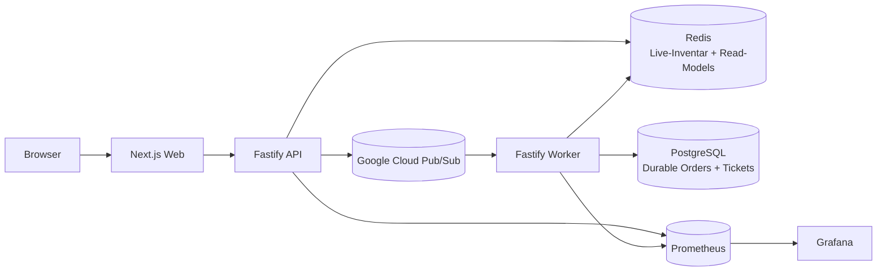
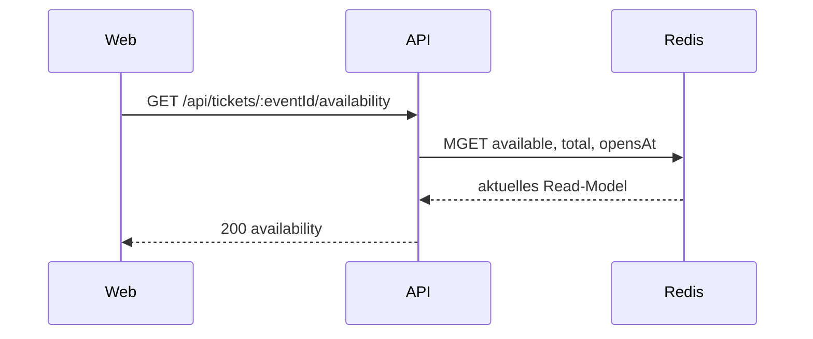
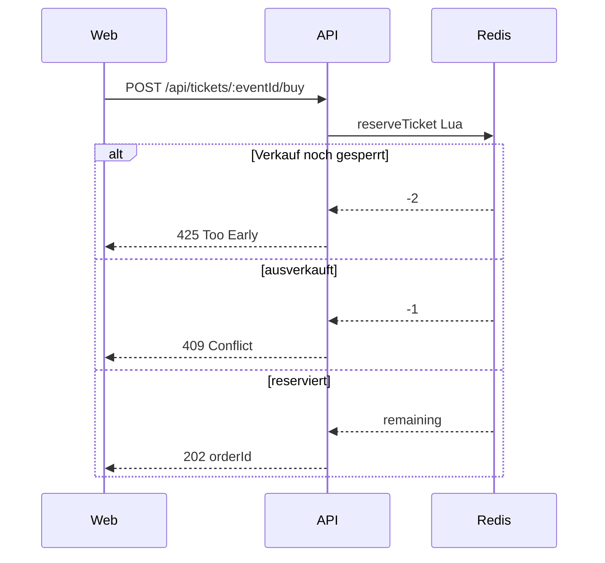
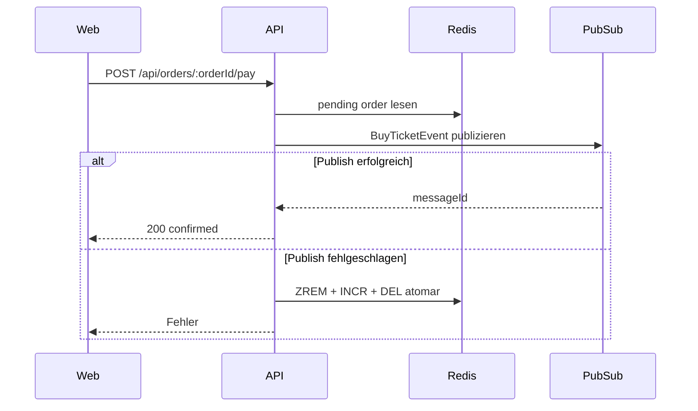
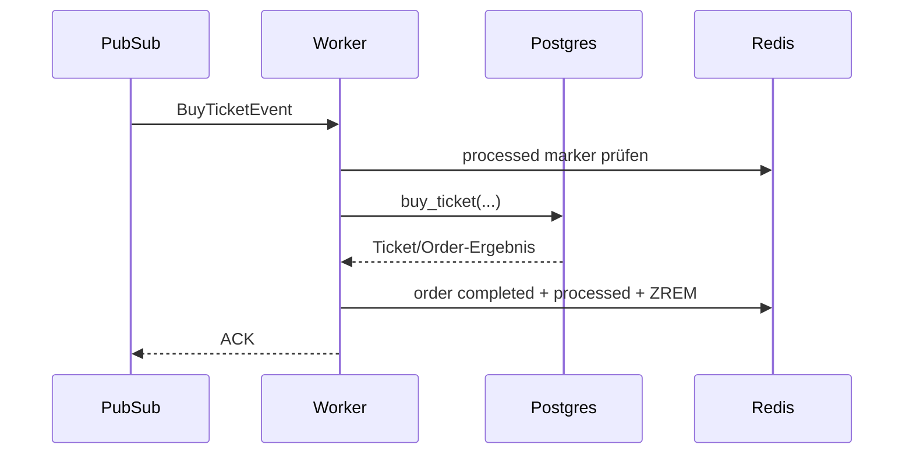

# Systemarchitektur

Diese Datei beschreibt den **aktuellen Ist-Zustand** am Repository-HEAD:
Komponenten, Datenflüsse, Zuständigkeiten, Invarianten und Skalierungsgrenzen.
Geplante Änderungen stehen in `docs/TODO.md`, Entscheidungen und historische
Begründungen im ADR-Index `docs/DECISIONS.md`.

## Systemgrenzen


```mermaid
flowchart LR
    Browser["Browser"]
    Web["Next.js Web"]
    API["Fastify API"]
    Redis[("Redis\nLive-Inventar + Read-Models")]
    PubSub[("Google Cloud Pub/Sub")]
    Worker["Fastify Worker"]
    Postgres[("PostgreSQL\nDurable Orders + Tickets")]
    Prometheus[("Prometheus")]
    Grafana["Grafana"]

    Browser --> Web
    Web --> API
    API --> Redis
    API --> PubSub
    PubSub --> Worker
    Worker --> Postgres
    Worker --> Redis
    API --> Prometheus
    Worker --> Prometheus
    Prometheus --> Grafana
```

| Komponente    | Verantwortung                                                                             | Darf nicht                                  |
| ------------- | ----------------------------------------------------------------------------------------- | ------------------------------------------- |
| `apps/web`    | Checkout-UX, simulierte 3DS-Verzögerung, Status-Polling                                   | Inventar oder Kaufstatus selbst entscheiden |
| `apps/api`    | HTTP-Verträge, Redis-Reservierung/Reads, Publish nach Pub/Sub                             | direkt PostgreSQL lesen oder schreiben      |
| Redis         | Live-Verfügbarkeit, Reservierungs-Ledger, Order-Read-Modelle, kurzlebige Idempotenzmarker | dauerhafte Ticket-Historie ersetzen         |
| Pub/Sub       | bezahlte Kauf-Intents puffern und mindestens einmal zustellen                             | fachliche Idempotenz garantieren            |
| `apps/worker` | Events validieren, DB-Write ausführen, Redis finalisieren oder kompensieren               | API-Request synchron blockieren             |
| PostgreSQL    | dauerhafte Wahrheit für Events, Orders und verkaufte Tickets                              | den API-Read-Hot-Path bedienen              |

## Datenbesitz und Invarianten

### Live-Inventar

Während eines Verkaufs entscheidet Redis über neue Reservierungen. Das atomare
Reserve-Script verändert drei zusammengehörige Strukturen:

```text
available DECR
reservations ZADD(orderId)
orders:{orderId} = pending
```

Nur ein erfolgreich entfernter Ledger-Anspruch darf `available` wieder erhöhen.
Cancel, Publish-Rollback und Worker-Kompensation nutzen deshalb idempotente
Lua-Gegenskripte mit `ZREM` als Guard.

### Dauerhafter Verkauf

PostgreSQL enthält für jeden erfolgreichen Kauf genau eine Order und ein Ticket.
Die Function `buy_ticket(event_id, order_id, first_name, last_name)` kapselt den
atomaren Write. `order_id` trägt die DB-Idempotenz bei Pub/Sub-Redelivery.

`events.sold_count` ist ein periodisch materialisiertes Read-Model aus
`COUNT(tickets)`. Es liegt nicht im Kauf-Hot-Path und trägt nicht den
Oversell-Schutz.

### Read-Modelle

Die API liest Verfügbarkeit und Order-Status ausschließlich aus Redis.
PostgreSQL ist deshalb unabhängig von HTTP-Read-Spikes skalierbar. Der Worker
überschreibt das Pending-Read-Model nach Verarbeitung mit `completed` oder
`failed`.

## Checkout-Datenfluss

### 1. Verfügbarkeit


```mermaid
sequenceDiagram
    participant Web
    participant API
    participant Redis

    Web->>API: GET /api/tickets/:eventId/availability
    API->>Redis: MGET available, total, opensAt
    Redis-->>API: aktuelles Read-Model
    API-->>Web: 200 availability
```

Dieser Pfad berührt PostgreSQL und Pub/Sub nicht.

### 2. Reservieren


```mermaid
sequenceDiagram
    participant Web
    participant API
    participant Redis

    Web->>API: POST /api/tickets/:eventId/buy
    API->>Redis: reserveTicket Lua
    alt Verkauf noch gesperrt
        Redis-->>API: -2
        API-->>Web: 425 Too Early
    else ausverkauft
        Redis-->>API: -1
        API-->>Web: 409 Conflict
    else reserviert
        Redis-->>API: remaining
        API-->>Web: 202 orderId
    end
```

Das Script prüft `opensAt` und `available`, dekrementiert den Counter, trägt
`orderId` mit Zeitstempel in das ZSet-Ledger ein und schreibt das Pending-
Read-Model. `/buy` publiziert noch kein Event.

### 3. Bezahlen und publizieren


```mermaid
sequenceDiagram
    participant Web
    participant API
    participant Redis
    participant PubSub

    Web->>API: POST /api/orders/:orderId/pay
    API->>Redis: pending order lesen
    API->>PubSub: BuyTicketEvent publizieren
    alt Publish erfolgreich
        PubSub-->>API: messageId
        API-->>Web: 200 confirmed
    else Publish fehlgeschlagen
        API->>Redis: ZREM + INCR + DEL atomar
        API-->>Web: Fehler
    end
```

Die simulierte Payment-/3DS-Latenz lebt im Frontend. `queuedAt` wird unmittelbar
vor dem Publish gesetzt; die E2E-Metrik misst damit Publish bis
Worker-Finalisierung und nicht die Checkout-Denkzeit.

### 4. Persistieren und finalisieren


```mermaid
sequenceDiagram
    participant PubSub
    participant Worker
    participant Postgres
    participant Redis

    PubSub->>Worker: BuyTicketEvent
    Worker->>Redis: processed marker prüfen
    Worker->>Postgres: buy_ticket(...)
    Postgres-->>Worker: Ticket/Order-Ergebnis
    Worker->>Redis: order completed + processed + ZREM
    Worker-->>PubSub: ACK
```

Bei terminalem DB-Fachfehler markiert der Worker die Order als fehlgeschlagen
und kompensiert den noch vorhandenen Ledger-Anspruch. Transiente Fehler und
fehlgeschlagene Kompensation führen zu NACK und Redelivery.

### 5. Abbrechen und Status lesen

- `POST /api/orders/:orderId/cancel` gibt ausschließlich ein noch als
  `pending` lesbares Checkout idempotent frei.
- `GET /api/orders/:orderId` liest `pending`, `completed` oder `failed` aus
  `orders:{orderId}` in Redis.
- Das Frontend pollt bis zu einem terminalen Zustand; es gibt keinen
  WebSocket- oder SSE-Kanal.

## Redis-Schlüssel

Alle Keys sind event- oder order-spezifisch und werden zentral in
`packages/types/src/redis-keys.ts` erzeugt.

| Muster                                        | Inhalt                                 | Lebenszyklus                                                     |
| --------------------------------------------- | -------------------------------------- | ---------------------------------------------------------------- |
| `tickets:event:{eventId}:available`           | freie, reservierbare Tickets           | Seed/Reset; Reserve und Release verändern atomar                 |
| `tickets:event:{eventId}:total`               | Event-Kapazität                        | Seed und aktueller Reconcile                                     |
| `tickets:event:{eventId}:opensAt`             | Sale-Unlock in Epoch-ms                | Seed/Reset                                                       |
| `tickets:event:{eventId}:reservations`        | ZSet `orderId → Zeitstempel`           | bis Finalisierung oder Kompensation; keine automatische Freigabe |
| `tickets:event:{eventId}:processed:{orderId}` | Worker-Idempotenzmarker                | TTL-basiertes technisches Cleanup                                |
| `orders:{orderId}`                            | Pending- oder finales Order-Read-Model | Statusabhängige TTL                                              |

Ein TTL-Ablauf ist technisches Cleanup und keine fachliche Berechtigung,
Inventar freizugeben. Das Ledger hat deshalb keine TTL.

## Worker-Outcome-Policy

`buyTicketOutcomePolicy` in
`apps/worker/src/routes/pubsub-listener.ts` bildet die ACK/NACK-Entscheidung
exhaustiv ab:

| Outcome               | ACK/NACK | Wirkung                                                   |
| --------------------- | -------- | --------------------------------------------------------- |
| `completed`           | ACK      | Verkauf, E2E-Latenz und Abschluss zählen                  |
| `duplicate`           | ACK      | bereits verarbeitet; Idempotenz-Hit zählen                |
| `duplicate-absorbed`  | ACK      | DB absorbierte parallele Redelivery; kein zweiter Verkauf |
| `invalid-payload`     | NACK     | Nachricht bleibt sichtbar statt still verworfen           |
| `terminal-failed`     | ACK      | fachlich beendet und Reservierung kompensiert             |
| `compensation-failed` | NACK     | erneute Zustellung nötig                                  |
| `transient-error`     | NACK     | Infrastrukturfehler erneut versuchen                      |

## Aktueller Inventory-Reconcile

Der Worker führt vor Start des Subscribers und danach periodisch einen
schreibenden Reconcile aus:

1. Reservierungs-Ledger lesen.
2. Event-Inventar aus PostgreSQL aggregieren.
3. Erwartetes `available = capacity - sold - active` berechnen.
4. Redis-`total` aktualisieren und `available` per Delta korrigieren.
5. aggregierten Ticket-Count nach `events.sold_count` projizieren.

Self-scheduling `setTimeout` verhindert überlappende Läufe. Die Intervalle
kommen aus `WORKER_RECONCILE_MODE` und den zugehörigen Env-Werten. Wegen dieses
schreibenden Prozesses ist der aktuelle Worker als Singleton modelliert.

Dieser Ist-Pfad ist als unsicher unter parallelen Cross-System-Mutationen
erkannt und wird laut
[ADR-031](decisions/ADR-031-redis-authoritatives-inventory-auditor-und-reaper-statt-schreibendem-reconcile.md)
in Phase 4.9 ersetzt. Das Zielbild bleibt im ADR und in der verlinkten
Arbeitsnotiz; es ist noch nicht Teil dieser Ist-Architektur.

## Skalierung und Backpressure

- **Web und API:** zustandslos; horizontal skalierbar, solange alle Instanzen
  dieselben Redis- und Pub/Sub-Ressourcen nutzen.
- **Redis:** serialisiert die kurzen Lua-Inventarübergänge atomar. Es ist der
  Admission-Hot-Path und benötigt niedrige Latenz.
- **Pub/Sub:** entkoppelt bestätigte Zahlungen von der DB-Write-Kapazität.
  Queue-Depth und E2E-Latenz zeigen Backpressure.
- **Worker:** Parallelität wird durch Subscriber-Flow-Control und
  PostgreSQL-Poolgröße begrenzt. Die DB-Function vermeidet den früheren
  `events.sold_count`-Hot-Row-Write.
- **PostgreSQL:** skaliert mit unabhängigen Ticket-/Order-Inserts; periodische
  `COUNT(tickets)`-Aggregation bleibt off-Hot-Path.

Konkrete Defaults leben in `packages/env/src/index.ts`, nicht in dieser Datei.

## Observability

API, Worker, Redis Exporter und k6 liefern Metriken an Prometheus; Grafana
visualisiert sie. Die wichtigsten Systemsignale sind:

- Request-Rate, Status und Latenz pro Route;
- Reservation-, Payment-, Cancel- und Publish-Rollback-Counter;
- Worker-Completion, Redelivery, Idempotenz und Kompensation;
- Publish-bis-Persist-E2E-Latenz;
- Redis-Ledger und Redis-/DB-Drift;
- DB-Pool-Wait, Query-Latenz, Locks, CPU und Event-Loop-Lag;
- k6 dropped iterations und Zielraten-Erfüllung.

Lasttest-Aufbau und Bedienung stehen in `load-tests/README.md`,
`scripts/load-test/README.md` und `docs/RUNBOOK.md`. Messergebnisse gehören unter
`docs/reports/`.
