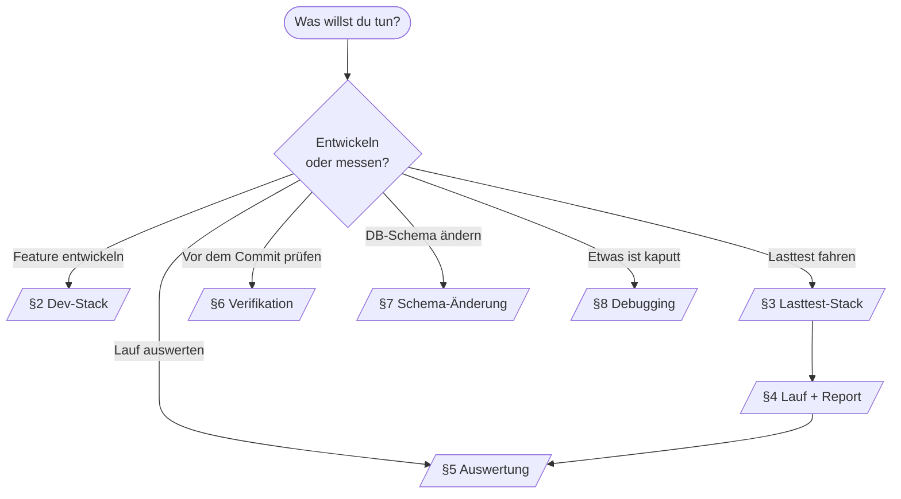
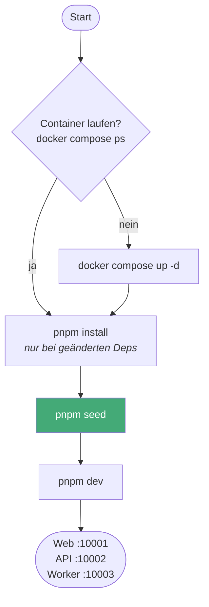
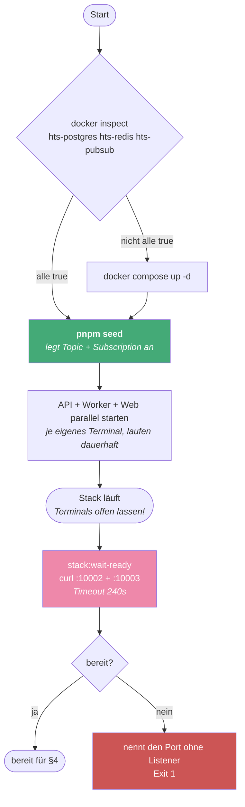
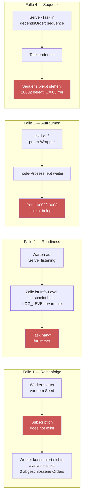
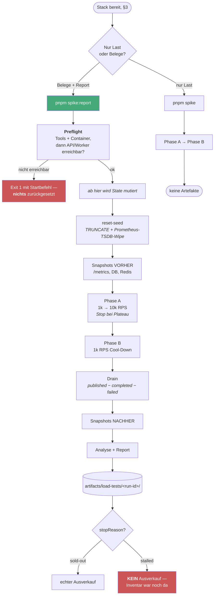
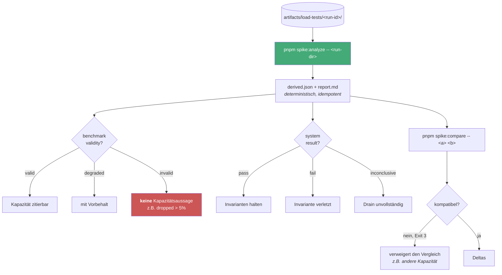
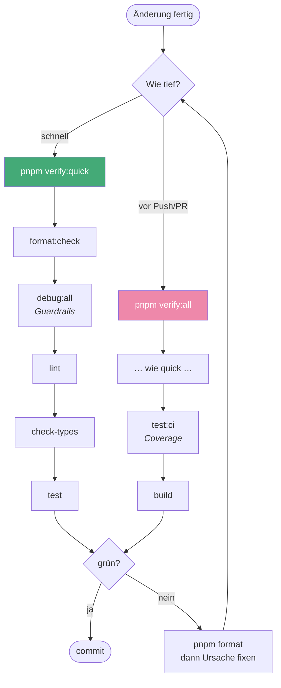
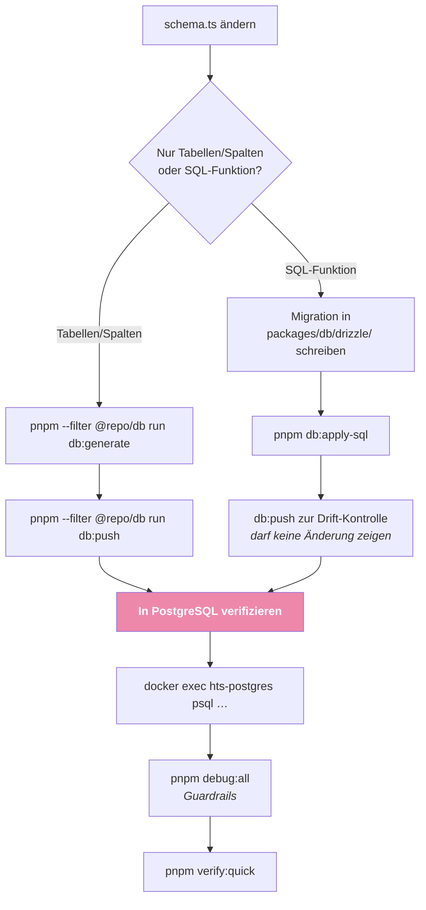
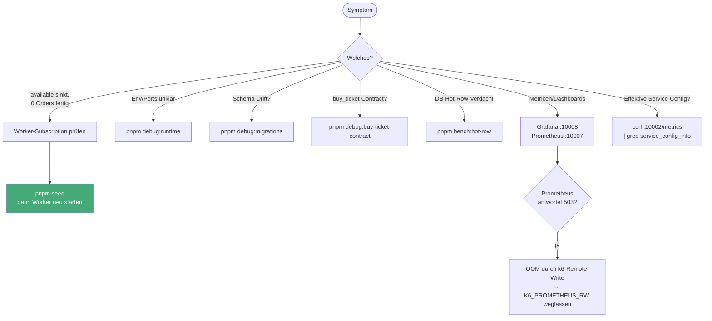

# Runbook — welcher Befehl, in welcher Reihenfolge

Nachschlagewerk für wiederkehrende Entwicklungs-, Test-, Betriebs- und
Diagnoseabläufe mit kopierbaren Befehlen.

Fast alles hat auch einen VS-Code-Task (`.vscode/tasks.json`) und einen Button in der Statusleiste (`.vscode/settings.json` → `actionButtons`). Task-Namen stehen unter jedem Diagramm.

## Standardports

Der lokale Block `10001`–`10009` wird in `packages/env/src/index.ts`,
`docker-compose.yml` und den jeweiligen Service-Skripten konfiguriert:

| 10001 | 10002 | 10003  | 10004 | 10005   | 10006    | 10007      | 10008   | 10009          |
| ----- | ----- | ------ | ----- | ------- | -------- | ---------- | ------- | -------------- |
| Web   | API   | Worker | Redis | Pub/Sub | Postgres | Prometheus | Grafana | Redis-Exporter |

---

## 1. Überblick: welcher Flow ist gemeint?



---

## 2. Dev-Stack (Feature-Entwicklung)

Der Alltagsfall. `pnpm dev` fährt Web, API und Worker parallel mit Hot-Reload.

**Wichtig:** Der Seed muss vor dem Worker laufen — Details in §3, die Falle ist dieselbe.



```bash
docker compose up -d          # Infrastruktur (postgres, redis, pubsub, prometheus, grafana)
pnpm seed                     # Schema + Test-Event + Redis-Counter + Pub/Sub-Ressourcen
pnpm dev                      # Web + API + Worker parallel (Turbo)
```

> `pnpm dev` fährt `fastify start -P` (pino-pretty) plus `tsc-watch`. Für Lasttests ist das **ungeeignet** — siehe §3.

**Task:** `dev:stack up` · **Button:** `Dev Stack`

---

## 3. Lasttest-Stack hochfahren (gebauter Stand)

Für belastbare Messungen dürfen API und Worker **nicht** im Dev-Modus laufen: `-P` schaltet pino-pretty ein (synchroner, Event-Loop-blockierender Log-Transform), und der `tsc-watch`-Watcher konkurriert um dieselben Cores wie k6, Postgres und Redis. Ein FS-Event mitten im Lauf triggert sogar einen Rebuild.

`start:loadtest` baut einmal und startet `fastify start` ohne `-P`, mit `NODE_ENV=production`, `LOG_LEVEL=warn` und `DISABLE_REQUEST_LOGGING=true`.

Das **Web** startet dagegen bewusst im Dev-Modus (`next dev`, :10001): es liegt nicht im Lastpfad — k6 spricht ausschließlich die API an — und dient nur zur Beobachtung während des Laufs, wo Hot-Reload nützlicher ist als ein Produktions-Build.



```bash
pnpm seed                                   # ZUERST — sonst scheitert der Worker
pnpm --filter api    run start:loadtest     # :10002 — eigenes Terminal, offen lassen
pnpm --filter worker run start:loadtest     # :10003 — eigenes Terminal, offen lassen
pnpm --filter web    run dev                # :10001 — Dev-Modus, nur zur Beobachtung

# in einem weiteren Terminal:
until curl -sf -o /dev/null localhost:10002/metrics \
   && curl -sf -o /dev/null localhost:10003/metrics; do sleep 2; done
```

**Tasks:** `loadtest:stack up`, danach `stack:wait-ready` · **Button:** `LT Stack` (für `stack:wait-ready` gibt es keinen eigenen Button mehr — der `Spike Report`-Button prüft die Bereitschaft selbst; einzeln über die Task-Liste aufrufbar)

### Warum der Readiness-Check ein eigener Schritt ist (Falle 4)

Die Services **besitzen ihre Terminals** und laufen dauerhaft. Daraus folgt zweierlei:

- `dependsOrder: "sequence"` wartet, bis jeder Task **beendet** ist. Ein Server endet nie, also darf er nur der **letzte** Schritt einer Sequenz sein — sonst startet nichts danach mehr. Symptom eines solchen Fehlers: Port 10002 belegt, 10003 frei.
- `isBackground: true` ändert das **nicht**. VS Code hält einen Hintergrund-Task erst dann für „fertig genug", wenn ein `problemMatcher` mit `background.endsPattern` eine Bereitschafts-Zeile erkennt — und genau die gibt es hier nicht (Falle 2: `LOG_LEVEL=warn` unterdrückt sie).

Deshalb endet `loadtest:stack up` mit den Services, und die Bereitschaft prüft ein separater Schritt. `loadtest:run+report` hat ihn als ersten Schritt eingebaut — ein Klick auf `Spike Report` scheitert damit sofort und verständlich, statt erst die Datenbank zurückzusetzen (§4).

> **Nicht per `nohup` abkoppeln.** Naheliegend wäre, die Services via `( nohup … & )` zu starten, damit die Sequenz weiterläuft. Das funktioniert hier **nicht**: VS Code beendet beim Wiederverwenden des Terminals die **Prozessgruppe** des Task-Shells, und `nohup` schützt nur gegen `SIGHUP`, nicht gegen ein `kill` an die Gruppe. Beobachtet: beide Logdateien blieben 0 Byte — die Prozesse starben, bevor sie das erste pnpm-Banner schreiben konnten.

Wer nur **einen** Service braucht, startet `loadtest:api`, `loadtest:worker` bzw. `loadtest:web` direkt.

### Vier Fallen, die hier real aufgetreten sind



1. **Seed vor dem Worker.** Der Pub/Sub-Emulator verliert Topic und Subscription beim Container-Neustart, und die Plugins sind seit #9/ADR-028 reine Runtime-Clients — der Worker scheitert hart mit `Subscription does not exist (resource=buy-ticket-worker)`. Reseed _im Betrieb_ ist inzwischen idempotent (Todo #242), die Boot-Reihenfolge bleibt trotzdem Pflicht.
2. **Readiness per HTTP-Poll, nicht per Log-Pattern.** Ein `problemMatcher.background.endsPattern` auf „Server listening" greift nicht: die Zeile ist Info-Level und erscheint bei `LOG_LEVEL=warn` gar nicht.
3. **Beim Aufräumen den Port killen, nicht das Prozessmuster.** `pkill` auf das pnpm-Wrapper-Pattern beendet nur den Wrapper; der `node`-Prozess hält den Port weiter. Und: **einmal killen genügt nicht** — es können mehrere Listener bzw. ein Wrapper mit Kind auf demselben Port hängen. Deshalb alle PIDs, mit Wiederholung, `SIGKILL`-Eskalation und Endkontrolle.
4. **Kein blockierender Task in einer Sequenz** — siehe Abschnitt oben.

### Herunterfahren

```bash
for p in 10001 10002 10003; do
  for attempt in 1 2 3; do
    PIDS=$(lsof -nP -tiTCP:$p -sTCP:LISTEN 2>/dev/null)
    [ -z "$PIDS" ] && break
    kill $PIDS 2>/dev/null; sleep 2
  done
  PIDS=$(lsof -nP -tiTCP:$p -sTCP:LISTEN 2>/dev/null)
  [ -n "$PIDS" ] && kill -9 $PIDS 2>/dev/null      # Eskalation
  lsof -nP -iTCP:$p -sTCP:LISTEN >/dev/null 2>&1 \
    && echo "Port $p NOCH belegt" || echo "Port $p frei"
done
```

**Task:** `loadtest:stack down` · **Button:** `LT Stop`

---

## 4. Lasttest fahren

Zwei Varianten. `spike` fährt nur die Last, `spike:report` sammelt zusätzlich alle Belege und erzeugt den Report — das ist der Standard für jede Messung, die man später zitieren will.



> **`reset-seed` ist destruktiv:** es macht `TRUNCATE`, setzt die Redis-Counter zurück und löscht die Prometheus-TSDB. Deshalb prüft der Preflight **vorher**, ob API und Worker antworten — laufende Container beweisen das nicht, denn beide sind Host-Prozesse. Ohne diese Prüfung setzte ein Lauf gegen einen nicht laufenden Stack erst alles zurück und brach dann mit einem nackten `fetch failed` ab.

```bash
pnpm spike                    # nur Last (kein Report)
pnpm spike:report             # Standard: Last + alle Belege + Report

# Varianten
SALE_OPENS_IN_SECONDS=0 pnpm spike:report    # sofort offen statt 60s Vorlauf
LOAD_PROFILE=realism pnpm spike:report       # mit Denkzeit (2–8s) statt back-to-back
LOAD_PROFILE=checkout pnpm spike:report      # nur buy→pay, keine Availability-Reads
K6_PROMETHEUS_RW=true pnpm spike             # k6-Metriken live in Grafana (s. u.)
```

> **k6-Remote-Write ist standardmäßig aus.** Der Report liest keine k6-Serien aus Prometheus — alle Queries gehen gegen `job="api"`/`job="worker"`. Das Remote-Write diente nur dem Live-Blick, trieb Prometheus aber auf 5,5 GiB bis zum `503` und nahm dabei genau die Daten mit, die der Report braucht.

**Task:** `loadtest:run+report` — fragt das Lastprofil ab (`capacity` / `realism` / `checkout`, s. [load-tests/README.md](../load-tests/README.md#lastprofile-load_profile)) und prüft vorher die Bereitschaft · **Button:** `Spike Report`. Die Auswertung aus §5 läuft am Ende des Laufs automatisch mit.

---

## 5. Auswertung (braucht keinen laufenden Stack)

Die Pipeline trennt Erhebung und Analyse: `spike:report` schreibt Rohartefakte, `spike:analyze` ist **rein** — kein Netz, keine DB. **Die Artefakte sind die Schnittstelle, nicht der Prozess.** Ein Lauf lässt sich also auch später und von jemand anderem interpretieren, und nach einer Änderung an der Analyse-Logik jederzeit neu auswerten.



```bash
pnpm spike:analyze -- artifacts/load-tests/<run-id>          # rein, offline
pnpm spike:compare -- <baseline-dir> <candidate-dir>         # Exit 3 = unvergleichbar
pnpm spike:report:test                                       # Unit-/Golden-Tests der Pipeline
```

Bestehende Baselines: `docs/reports/baseline-a-2026-07-14/`, `docs/reports/baseline-b-2026-07-26/`

**Tasks:** `loadtest:analyze` und `loadtest:compare` (fragen nach den Verzeichnissen) · **kein Button** — `spike:report` wertet am Ende jedes Laufs selbst aus; diese Tasks sind für nachträgliche Re-Analysen und Vergleiche da

### Grafana-Panels als PNG exportieren (statt Screenshots)

Grafana rendert Panels serverseitig — der Container `hts-grafana-renderer` liefert `GET /render/d-solo/<uid>/<slug>?panelId=…` als PNG. `spike:report` ruft das am Ende jedes Laufs automatisch auf: **alle** Panels **aller** Dashboards, jeweils mit Titel und Legende, für das Fenster `workloadStartedAt − 60 s … drainEndedAt + 30 s`, nach `artifacts/load-tests/<run-id>/grafana/` plus `index.md` als Galerie (ADR-030).

```bash
pnpm spike:graphs                       # letzter Run, Fenster aus dessen manifest.json
pnpm spike:graphs -- --run <run-id>      # anderer Run, ebenfalls aus dem Manifest
pnpm spike:graphs -- --range '{"from":"2026-07-27 16:19:00","to":"2026-07-27 16:31:00"}'
pnpm spike:graphs -- --from now-30m --to now --out /tmp/graphs
EXPORT_GRAPHS=0 pnpm spike:report        # Export im Lauf abschalten
```

- **Zeitangaben ohne Zone** werden in `--tz` gelesen (Default `Europe/Vienna`) — genau das Format, das die Grafana-Zeitauswahl ausgibt. Sie als UTC zu lesen hätte jedes Bild still um den lokalen Offset verschoben.
- **`--range`** nimmt den JSON-Block der Zeitauswahl unverändert; `now-…` und Epoch-Millisekunden gehen ebenfalls.
- Weitere Knöpfe: `--width` (1200), `--height` (500), `--scale` (2), `--theme` (`dark`), `--concurrency` (3), `--url` (`http://localhost:10008`). Gauges bekommen automatisch eine schmalere, flachere Fläche — sie haben keine Zeitachse und keine Legende.
- Der Export im Lauf ist **best effort**: fehlt der Renderer, warnt `spike:report` und der Lauf bleibt gültig — die Zahlen liegen ohnehin als Rohartefakte auf der Platte. Nachholen: `pnpm spike:graphs`.

**Task:** `loadtest:export-graphs` (fragt nach dem Zeitraum)

---

## 6. Verifikation vor dem Commit



```bash
pnpm verify:quick   # format:check + debug:all + lint + check-types + test
pnpm verify:all     # + test:ci (Coverage) + build
pnpm format         # Prettier schreiben (bei format:check-Fehlern)
```

> `pnpm test` braucht laufende Container (`hts-postgres`, `hts-redis`, `hts-pubsub`) — der Preflight prüft das und bricht sonst mit klarer Meldung ab.

**Tasks:** `workspace:verify:quick`, `workspace:verify:all` · **Buttons:** `Verify Quick`, `Verify All` (derzeit in `settings.json` auskommentiert)

---

## 7. DB-Schema ändern

**Regel aus `AGENTS.md`:** Bei jeder Schema-Änderung in `packages/db` nicht nur generieren, sondern auch gegen die Ziel-DB anwenden **und** den Effekt in PostgreSQL verifizieren.



```bash
pnpm --filter @repo/db run db:generate    # Migration aus dem Drizzle-Schema
pnpm --filter @repo/db run db:push        # gegen die Ziel-DB anwenden
pnpm db:apply-sql                         # handgeschriebenes SQL (z.B. buy_ticket)

# Verifizieren
docker exec hts-postgres psql -U postgres -d high_frequency_tickets -c '\d tickets'
docker exec hts-postgres psql -U postgres -d high_frequency_tickets \
  -tAc "select prosrc from pg_proc where proname='buy_ticket'"
pnpm debug:all
```

**Task:** `db:schema apply` · **Button:** `DB Apply`

---

## 8. Debugging



```bash
pnpm debug:all                    # Runtime, Migrationen, Verträge und Doku
pnpm debug:runtime                # aufgelöste Env + Ports
pnpm debug:migrations             # Schema-Drift
pnpm debug:buy-ticket-contract    # Direkt-completed-Insert, kein sold_count-Increment
pnpm bench:hot-row                # Publish-Micro-Bench: Drain-Durchsatz + Lock-Wait
pnpm debug:db:ticket-order-fk     # Live-FK in PostgreSQL prüfen
pnpm debug:db:buy-ticket-function # Live-SQL-Function prüfen

# Effektive Konfiguration der laufenden Services (nicht die des Terminals!)
curl -s localhost:10002/metrics | grep '^service_config_info'
curl -s localhost:10003/metrics | grep '^service_config_info'

# Live-Zustand
docker exec hts-redis redis-cli GET 'tickets:event:00000000-0000-4000-8000-000000000000:available'
docker exec hts-redis redis-cli ZCARD 'tickets:event:00000000-0000-4000-8000-000000000000:reservations'
docker exec hts-postgres psql -U postgres -d high_frequency_tickets \
  -tAc 'select count(*) from orders'
```

Bei Laufzeitmessungen können Turbo-Cache-Hits alte Paketlogs wiedergeben.
Für eine echte Testdauer den Cache umgehen:

```bash
env CI=1 pnpm exec turbo run test --ui=stream --force
/usr/bin/time -p pnpm test
```

Das Repository unterstützt Node 22 und 24; Node 24 ist die primäre Test-Runtime.

**Task:** `debug:all` · **Button:** `Debug All`

---
