# Local Spike Load-Test Report — 2026-07-14

## Dashboard evidence

The following unedited Grafana screenshots are the visual evidence captured during and after Baseline A. They support the metrics and interpretation below, but the written values and persisted raw data remain authoritative. The overview is collapsed by default to keep the report readable.

Show 11 Grafana dashboard screenshots and their interpretation

### 1. API latency by route

Shows p50 and p95 latency for `/availability`, `/buy`, and `/metrics` during the spike. It is intended to compare the fast Redis read path with the slower admission path; the elevated `/buy` p95 shows API-side saturation under local whole-host contention.

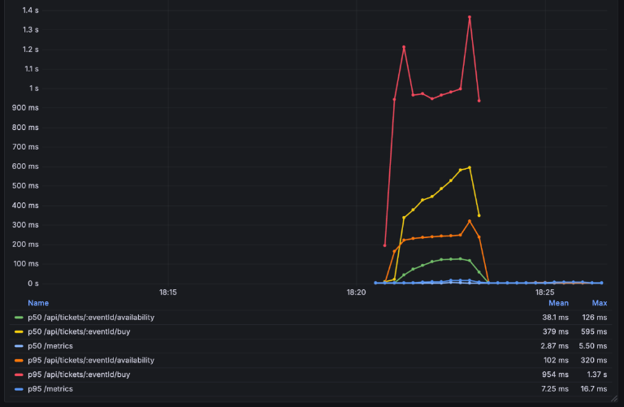

### 2. API performance overview

Combines total/route RPS with route latency and application errors. It is intended to show the approximately 11.7k RPS local peak and the different latency profiles; `No data` for errors means the zero-valued status series was absent, not that the panel independently proves no errors occurred.

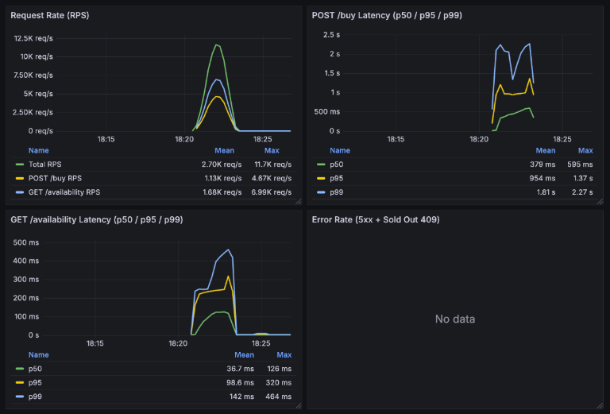

### 3. End-to-end completion latency

Shows time from `POST /buy` acceptance until worker completion. It is intended to reveal queue delay, but every quantile reaches the largest finite histogram bucket at 30 seconds; the flat 30-second values are clipping, not measured 30-second end-to-end latency.

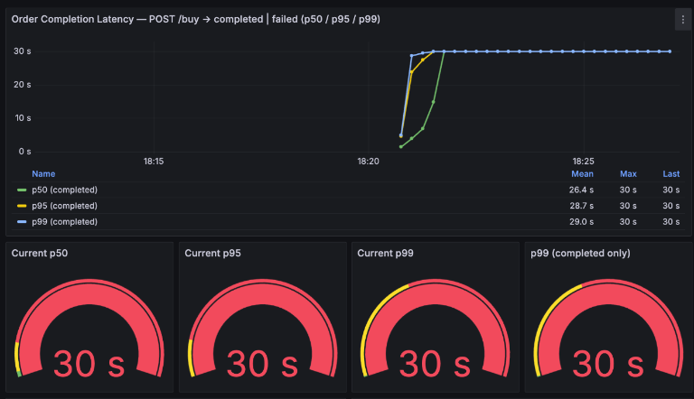

### 4. Worker throughput and per-event p95

Shows the worker's completed-order rate beside the per-event p95 completion latency. It is intended to compare consumer capacity with producer admission; the roughly 500 orders/s plateau matches the configured 500-message flow-control ceiling.

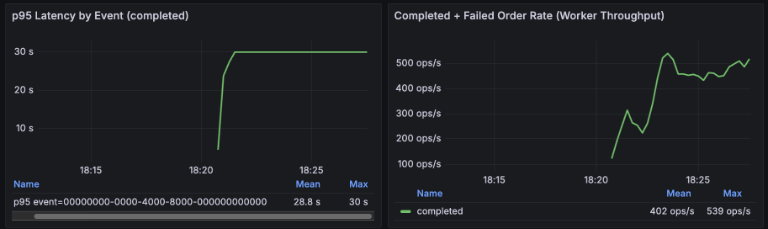

### 5. Order lifecycle throughput

Compares accepted orders with completed orders and is intended to make the producer/consumer gap visible. The missing pending/failure panels and the 960% ratio are query artifacts from absent zero-value series and mismatched rolling windows, not a 960% completion probability.

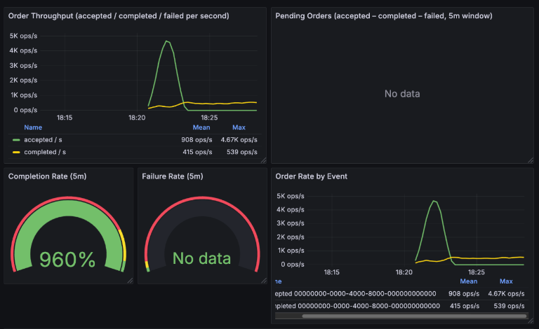

### 6. Cumulative accepted versus completed orders

Shows accepted orders rapidly reaching about 425k while worker completions continue to climb afterward, visualizing the backlog. The plotted `Last` values are useful; the legend's `Total` values sum overlapping rolling increases and must not be treated as order counts.

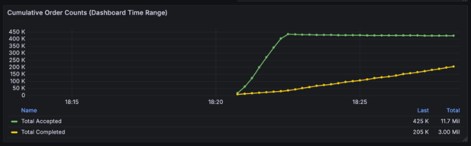

### 7. Queue proxy, publish rate, and E2E pressure

Shows API admission rate and E2E latency as indirect queue-pressure signals. It is intended to surface a producer/consumer mismatch, but the missing consumer and queue-depth series expose the zero-fill bug; this is not an authoritative Pub/Sub queue-depth measurement.

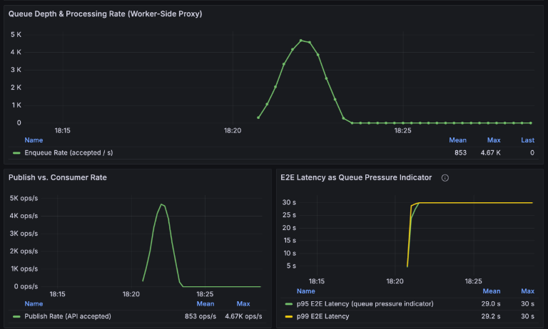

### 8. Redis performance coverage

Shows the expected Redis hit/miss, memory, key-count, and client panels. All are empty because `redis_exporter` was not present for this capture, documenting an observability gap rather than a healthy Redis result.

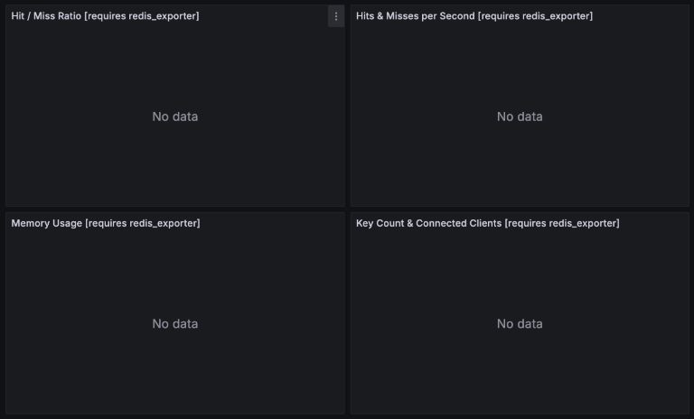

### 9. Reservation flow and Redis/DB drift

Shows reservation creation, rollback/compensation panels, and the consistency formula `redis_available - (capacity - sold_count - active_reservations)`. It is intended to detect inventory-accounting errors; the approximately -314k drift is the key correctness finding of this baseline.

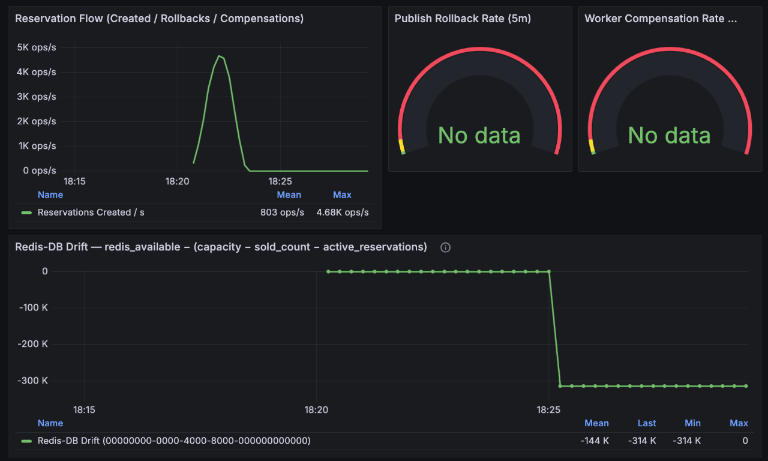

### 10. Absolute drift severity

Shows the same consistency problem as a single severity gauge next to reservations by event. It is intended for rapid operational triage: a 314k absolute drift signals that many accepted but unfinished orders were absent from the reservation accounting at that moment.

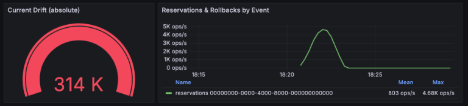

### 11. Worker reliability events

Shows redeliveries, idempotency short-circuits, locks, and compensations. It is intended to expose failure-path activity; `No data` represents absent zero-event series, so the final Prometheus/PostgreSQL/Redis reconciliation below is needed to establish the eventual zero-event outcome.

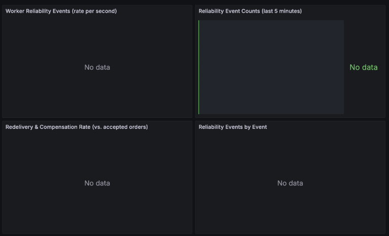

## Executive summary

The run demonstrated **good eventual correctness for accepted orders**, but it did **not demonstrate 50,000 RPS capacity**.

- k6 completed **1,054,370 requests in 120 seconds** at an average of **8,785 RPS**.
- The API dashboard reached approximately **11.7k RPS** at peak.
- The configured arrival curve called for approximately **3.32 million iterations**, but k6 dropped **2,265,628 (68.24%)** because all 5,000 VUs were occupied. Only **31.76%** of the requested iterations ran.
- The global HTTP p95 was **886.73 ms**, so the `p(95)<500ms` threshold failed.
- The infrastructure-error threshold passed: **0.28%** of k6 requests failed, below the configured 5% threshold.
- The API accepted **420,951 purchases**. PostgreSQL, Redis, and Prometheus later agreed that **all 420,951 accepted orders completed**, with no terminal failures, redeliveries, compensations, or lost accepted orders.
- The single worker drained those orders at roughly **481 completions/s** over about **14m34s**. The 2-minute producer spike therefore created a large queue backlog.
- Recorded order E2E latency averaged approximately **406 seconds**. Only **14,117 of 420,951 completions (3.35%)** fell into the histogram's largest finite bucket (`<=30s`), so **96.65% took more than 30 seconds**. The dashboard's flat `30s` quantiles are histogram saturation, not real 30-second values.
- Redis/DB drift temporarily reached approximately **-314k**, then recovered to zero. This exposed a correctness risk: the 120-second reservation TTL is shorter than queue latency, so accepted but unfinished orders disappear from the reconcile calculation while still queued.

**Verdict:** reliability after drain is strong; latency, admission capacity, queue control, reservation accounting, and several dashboard queries require work before this can be presented as a successful 50k-RPS test.

## Test configuration

The executed script uses a compressed 120-second `ramping-arrival-rate` profile:

| Stage     | Duration |   Target transition |
| --------- | -------: | ------------------: |
| Warm-up   |      10s |       0 → 1,000 RPS |
| Hype      |      20s |  1,000 → 10,000 RPS |
| Opening   |      30s | 10,000 → 50,000 RPS |
| Sustained |      30s |          50,000 RPS |
| Decline   |      20s | 50,000 → 20,000 RPS |
| Cool-down |      10s |  20,000 → 1,000 RPS |

The traffic mix was 60% availability reads and 40% buy attempts. k6 was limited to 5,000 VUs. The worker used:

- `PUBSUB_FLOW_CONTROL_MAX_MESSAGES=500`
- `DATABASE_POOL_MAX=20`
- a non-blocking 1-second payment simulation
- `REDIS_RESERVATION_TTL_SECONDS=120`
- normal reconcile mode, whose default interval is 60 seconds

The API, worker, k6, Redis, PostgreSQL, Pub/Sub emulator, Prometheus, and Grafana all ran on the same local machine. The result is therefore a local system test, not an isolated production-capacity benchmark.

## k6 result interpretation

### Offered load versus executed load

Integrating the configured arrival-rate stages yields approximately **3,320,000 intended iterations**. The observed accounting is almost exact:

- completed: 1,054,370
- dropped: 2,265,628
- total scheduled: 3,319,998

Therefore:

$$
\text{executed share} = \frac{1{,}054{,}370}{3{,}319{,}998} = 31.76\%
$$

$$
\text{dropped share} = \frac{2{,}265{,}628}{3{,}319{,}998} = 68.24\%
$$

This is not backend rejection. With `ramping-arrival-rate`, k6 drops an iteration when no VU is available to start it. At the observed 379.93 ms average duration, 50k RPS would require roughly 19,000 concurrently occupied VUs on average:

$$
50{,}000 \times 0.380 \approx 19{,}000
$$

The 5,000-VU ceiling mathematically limits achievable throughput to roughly 13k RPS at that latency, close to the observed 11.7k API peak. Backend latency and load-generator capacity therefore interact: the VU limit is the immediate reason for drops, while slower responses increase the VUs required.

The run must not be described as “the backend sustained 50k RPS.” It demonstrated a local peak of roughly 11.7k RPS while the generator discarded most of the requested work.

### HTTP success and failure

k6 reported:

- 99.71% successful checks
- 0.28% failed checks (2,954)
- availability: 630,465 successful / 1,789 failed
- buy: 420,951 successful / 1,165 failed

Application metrics recorded 420,951 HTTP 202 buy responses and no 409 or 5xx series. They also recorded 630,584 availability 200 responses; the small surplus over k6's successful availability checks is consistent with non-k6 polling during the run.

This means the 2,954 k6 failures were overwhelmingly requests that did not produce a recorded application response, rather than application 5xx or sold-out responses. Likely local causes include client/socket pressure, connection establishment failures, or whole-host contention. The current test does not preserve an error-code breakdown, so the exact transport error cannot be proven from the available metrics.

No sold-out response was expected in this run: 420,951 of 1,000,000 tickets were accepted, leaving 579,049.

## API performance

### Route results

The dashboard showed approximately:

| Route               | Rolling p50 mean | Rolling p95 mean | Rolling p99 mean | Observed peak RPS |
| ------------------- | ---------------: | ---------------: | ---------------: | ----------------: |
| `POST /buy`         |           379 ms |           954 ms |           1.81 s |             4.67k |
| `GET /availability` |          36.7 ms |          98.6 ms |           142 ms |             6.99k |
| Total               |                — |                — |                — |             11.7k |

These legend values are means of rolling Prometheus quantiles over the selected dashboard range, not whole-run k6 quantiles. Application histogram sums give whole-process averages of approximately 482 ms for buy and 101 ms for availability during the retained process lifetime.

The global k6 p95 of 886.73 ms is consistent with a 60/40 mix in which availability is fast and buy is much slower. Since the fastest 60% are mostly availability calls, the global 95th percentile falls deep into the buy distribution.

### What is actually slow

The 1-second payment mock is in the worker and happens **after** the API has returned HTTP 202. It does not directly explain `POST /buy` HTTP latency. The buy request only performs one Redis reservation script and waits for Pub/Sub publish before returning.

The likely local hot path is therefore API → Redis → Pub/Sub emulator, combined with CPU/event-loop/socket contention from running every component and k6 on one host. Availability also rose from its expected Redis-fast behavior to tens or hundreds of milliseconds, which confirms whole-host or API event-loop pressure rather than a buy-only code path.

The failed `p(95)<500ms` threshold is valid for this run. It should not be relaxed merely because payment takes one second; API acceptance is intentionally asynchronous. Future thresholds should be route-specific so a fast availability SLO and an admission/publish SLO can be diagnosed independently.

## Worker, queue, and completion latency

### Throughput ceiling

The worker is configured for 500 in-flight Pub/Sub messages, and every new message sleeps for one second before its DB write. Its first-order ceiling is therefore:

$$
\frac{500\ \text{messages}}{1\ \text{second}} \approx 500\ \text{new orders/s}
$$

Post-run database timestamps span approximately 874.42 seconds for 420,951 persisted orders, yielding:

$$
\frac{420{,}951}{874.42} \approx 481.4\ \text{completed orders/s}
$$

This is close to the configured 500/s ceiling. The dashboard showed roughly 402/s mean and 539/s max over its selected time range. The producer peaked near 4.67k accepted purchases/s, so backlog formation was expected and substantial.

The captured lifecycle panel showed about 425k accepted versus 205k completed at that point in the drain, implying roughly 220k unfinished accepted orders. The worker continued after k6 stopped and completed the final order around 18:34:57 local time, roughly 12.5 minutes after the 2-minute test ended.

### E2E latency panel saturation

The worker histogram's largest finite bucket is 30 seconds. Final counter values were:

- count: 420,951
- sum: 170,887,715.65 seconds
- `<=30s`: 14,117
- `+Inf`: 420,951

Thus:

$$
\text{mean E2E} = \frac{170{,}887{,}715.65}{420{,}951} \approx 406.0\ \text{seconds}
$$

Prometheus returns the last finite boundary when a requested quantile falls into the `+Inf` bucket. Consequently the dashboard's p50, p95, and p99 all flattening at 30 seconds means “this quantile is above the measurable range,” not “this quantile equals 30 seconds.” Exact p50/p95/p99 cannot be reconstructed from the current buckets.

Recommended buckets for the local spike are at least 30, 60, 120, 300, 600, 900, and 1,200 seconds. A separate low-latency histogram or denser early buckets can retain detail for healthy runs.

### Final delivery outcome

After drain:

- Prometheus accepted: 420,951
- Prometheus completed: 420,951
- PostgreSQL orders: 420,951, all completed
- PostgreSQL tickets: 420,951
- Redis available: 579,049
- terminal failures: 0 observed
- worker redeliveries: 0 observed
- idempotency short-circuits: 0 observed
- compensations: 0 observed
- current drift: 0

This is the strongest result from the run: once HTTP 202 was returned, the local async flow eventually persisted every accepted order exactly once and converged its inventory.

## Reservation and Redis/DB drift

### Why drift reached -314k

The reconcile metric is:

$$
\text{drift} = \text{redisAvailable} - (\text{capacity} - \text{soldCount} - \text{activeReservations})
$$

With initial capacity and Redis availability aligned, this can be rewritten during the run as:

$$
\text{drift} = \text{completed} + \text{activeReservations} - \text{accepted}
$$

A value near -314k therefore means approximately 314k accepted orders were neither completed nor represented by a still-live reservation key when reconcile measured them.

The reason is the lifecycle mismatch:

1. API accepts an order and creates a reservation with a 120-second TTL.
2. Queue latency grows far beyond 120 seconds; average E2E was 406 seconds.
3. The reservation expires while its published order is still pending.
4. Redis `available` remains decremented, but reconcile no longer counts that reservation.
5. Reconcile reports a large negative drift and applies a positive delta, temporarily making those pending claims available again.
6. Later, as the worker completes orders and `sold_count` catches up, subsequent reconcile passes converge the counter back down.

The final state is correct because load had stopped and the worker eventually drained. During continued sales, however, this temporary release can permit more accepted orders than capacity. This is a correctness risk, not merely a cosmetic metric.

### Implication for planned measure #5

The run validates the scalability concern behind replacing keyspace `SCAN`: Redis retained **841,904 keys** after completion (roughly one final order key and one processed marker per order), and consumed approximately **226 MiB**. A reconcile scan must traverse this whole keyspace even when no reservation keys remain.

However, the -314k drift does **not by itself prove that SCAN duration caused the drift**. The primary demonstrated cause is reservation expiry before queue completion. A sorted set makes counting efficient, but a score-based expiry must not blindly return inventory while an accepted Pub/Sub order is still pending.

Measure #5 should therefore be refined:

- maintain an explicit accepted-but-not-finalized reservation ledger per event;
- remove an entry on worker success or terminal compensation;
- treat expiry as a stale candidate requiring order/queue recovery logic, not immediate inventory release;
- use a TTL/lease longer than the maximum supported queue age, or refresh ownership while pending;
- add a reaper/DLQ policy before reclaiming abandoned reservations.

This fixes both the O(keyspace) scan and the newly demonstrated queue-latency correctness problem.

## Does the run validate planned measure #7?

The `buy_ticket` function updated the same event `sold_count` row 420,951 times, so the potential hot-row design concern is real at this scale. But this run does not isolate it:

- flow control plus the one-second payment mock already predicts a 500/s ceiling;
- observed sustained completion was approximately 481/s;
- no DB query-duration, pool-wait, lock-wait, or event-loop utilization metric was captured.

Therefore measure #7 remains technically well motivated, but **is not proven as the active limiter by this run**. Validate it with a focused worker/DB benchmark that disables or parameterizes the payment delay, raises flow control above 1,000, and records PostgreSQL lock waits plus pool wait time. Compare the current function with a version that removes the hot-row update and inserts the order directly as completed.

## Dashboard interpretation and defects

### Panels that show real system behavior

- **API RPS and route latency:** real API load and saturation.
- **Accepted versus completed throughput:** real producer/consumer mismatch.
- **E2E latency:** real queue pressure, but numerically clipped by histogram buckets.
- **Redis/DB drift:** real transient accounting mismatch.
- **Reservation creation:** real admission rate.

### `No data` that actually means zero events

Prometheus labeled counters do not create a series until a label value is incremented. With no 5xx, 409, failed orders, rollbacks, compensations, redeliveries, or idempotency hits, expressions over those absent series return no vector. This explains:

- API Error Rate: `No data`
- Failure Rate: `No data`
- rollback and compensation gauges: `No data`
- all Worker Reliability panels: `No data`

Because worker completion and E2E metrics were present, these panels do not indicate a broken worker scrape. Queries should use zero-filling such as `... or vector(0)`, or counters should be initialized for the seeded event, so healthy zero becomes visible and distinguishable from scrape failure.

### Pending and queue panels are accidentally hidden

The pending formula subtracts `orders_failed_total`. Since no failed-order series exists, the entire PromQL expression becomes empty. The queue proxy similarly adds an absent failed series to completed, causing queue depth and consumer rate to disappear. This is why the queue dashboards showed only enqueue/publish lines even while a large backlog clearly existed.

Zero-fill every component before arithmetic. This is a dashboard bug that hid the most important symptom of the run.

### The `960% Completion Rate` is not a completion probability

The gauge divides completions in the last five minutes by accepts in the last five minutes. During drain, completions belong largely to orders accepted in an earlier window while current accepts have fallen toward zero. The ratio can legitimately exceed 100%; 960% means the worker was draining about 9.6 times as many old orders as the API was currently accepting.

Rename this panel to `Worker/API Throughput Ratio`, or replace it with a backlog/drain panel. A true cohort completion rate requires tracking accepted cohorts or final outcomes by order age; two independent rolling counter windows cannot provide it.

### Cumulative totals are double-counted in the legend

The cumulative panel evaluates `increase(counter[$__range])` at every plotted timestamp. Its `Last` value is useful as a rolling-range increase, but Grafana's legend `Total` sums every plotted rolling value and produces nonsense such as 11.7 million accepted and 3 million completed. Those are not backend counts.

Render the range increase as an instant stat/bar value, or remove the legend `sum` calculation. The authoritative final count for this run is 420,951 accepted and completed.

### Missing exporters

- Redis panels correctly show `No data` because `redis_exporter` is not deployed or scraped.
- Exact Pub/Sub queue depth is unavailable because the emulator exports no Prometheus metrics. Application counters can provide a proxy once the zero-series query bug is fixed.
- The root `pnpm spike` command already enables k6 Prometheus remote write; the TODO claiming output is unconfigured is stale. A dedicated k6 dashboard and retained error-code metrics are still needed.

## Storage footprint after the run

After all reservations expired and the worker drained:

| Store                       | Measured footprint |
| --------------------------- | -----------------: |
| Redis keys                  |            841,904 |
| Redis used memory           |         226.05 MiB |
| Redis peak memory           |         226.07 MiB |
| PostgreSQL database         |            122 MiB |
| PostgreSQL orders relation  |             53 MiB |
| PostgreSQL tickets relation |             61 MiB |

Redis retained 841,902 expiring keys: final order read models and processed markers. At one million completed purchases, this design will approach two million retained keys before TTL expiry, matching the earlier keyspace-scan warning.

## Prioritized actions

### P0 — correctness before another sustained sale

1. Redesign reservation lifetime/accounting so an accepted queued order remains an inventory claim until completion or explicit terminal recovery.
2. Refine measure #5 to use a ZSet/ledger without reclaiming inventory solely because wall-clock TTL elapsed.
3. Add a test where queue latency exceeds reservation TTL and assert that reconcile cannot make pending accepted inventory sellable again.

### P1 — make the next benchmark trustworthy

1. Fix zero-series PromQL in pending, queue, error, failure, rollback, compensation, and reliability panels.
2. Extend E2E histogram buckets beyond 30 seconds.
3. Rename the rolling completion ratio and fix cumulative legend aggregation.
4. Add endpoint-specific k6 counters for response status and transport error code.
5. Add `redis_exporter`; add process CPU, event-loop lag, PostgreSQL pool wait, query latency, and lock-wait metrics.
6. Run k6 on a separate host or distributed runner. Size for at least ~20k active VUs at the current latency if the target remains 50k RPS.

### P2 — staged capacity experiments

1. Rerun a low/medium profile that the generator can fully deliver; require zero dropped iterations.
2. Benchmark worker capacity separately from API admission.
3. Test flow-control values above 500 together with DB pool sizing; do not tune either in isolation.
4. Run the focused DB comparison for measure #7.
5. Only then rerun the full 15-minute documented sale lifecycle.

## Documentation inconsistencies found

- Requirements and the load-test README describe a 15-minute lifecycle; the executable script is a compressed 2-minute profile.
- The load-test README says the default event ID is `freq-2025`; the script actually defaults to `00000000-0000-4000-8000-000000000000`.
- The TODO says k6 Prometheus output is not configured, but the root `pnpm spike` command already uses `experimental-prometheus-rw`.
- The requirements target 50k RPS but do not document load-generator sizing or the requirement for zero dropped iterations.

## Baseline for comparison

Use this run as **Baseline A: post measures #1/#2/#3/#4/#6/#8/#10, before refined #5 and #7**.

| KPI                         |         Baseline A |
| --------------------------- | -----------------: |
| Intended iterations         |             ~3.32M |
| Executed iterations         | 1,054,370 (31.76%) |
| Dropped iterations          | 2,265,628 (68.24%) |
| Average executed RPS        |              8,785 |
| Peak API RPS                |             ~11.7k |
| k6 global p95               |          886.73 ms |
| k6 request failures         |              0.28% |
| Accepted purchases          |            420,951 |
| Eventually completed        |            420,951 |
| Worker sustained completion |             ~481/s |
| Mean order E2E              |             ~406 s |
| Orders completed within 30s |              3.35% |
| Worst observed drift        |             ~-314k |
| Final drift                 |                  0 |
| Final Redis memory          |         226.05 MiB |
| Final Redis keys            |            841,904 |
