# Grafana-Panel-Guide — Run `2026-08-03T17-19-20-741Z-080bc92`

Alle 57 gerenderten Panels mit Bild: was die Query misst, was im Bild konkret zu
sehen ist, und welches Systemverhalten daraus folgt.

- **Bilder:** `images/` — Kopien aus
  `artifacts/load-tests/2026-08-03T17-19-20-741Z-080bc92/grafana/`. Kopiert,
  weil `artifacts/` gitignoriert ist und der Report selbsttragend bleiben soll.
- **Dashboard-Quellen:** `monitoring/grafana/provisioning/dashboards/*.json`
- **Render-Zeitraum:** 2026-08-03 17:18:22–17:27:37 UTC. **Alle Achsen zeigen
  Europe/Vienna**, also 19:18–19:27 — beim Vergleich mit `manifest.json`
  (UTC) zwei Stunden abziehen.
- Die Dashboards haben 60 Panels; drei sind Text-Panels (`Setup Required`,
  `Production Metrics Reference`) und werden nicht gerendert. Daher 57 PNGs, und
  daher beginnen die Dateinamen in `pub-sub-queue-worker-processing/` und
  `redis-performance/` bei `02`.

**Zeitmarken zum Lesen der Bilder:**

| Uhrzeit (Achse)   | Was passiert                                   |
| ----------------- | ---------------------------------------------- |
| 19:19:22          | Workload-Start, Sale-Gate noch zu (10 s)       |
| ~19:20:00         | Gate offen, Hochlauf beginnt                   |
| 19:21–19:23       | Plateau bei ~3,5–4 K Orders/s                  |
| ~19:25:51         | **Ausverkauft**, Phase A endet                 |
| 19:25:51–19:26:52 | Phase B (Cool-down, 1 000 rps Sold-out-Probes) |
| 19:27:07          | Drain fertig                                   |

## 1. Was dieser Run war

`LOAD_PROFILE=checkout` — das Profil ohne Denkzeit und ohne Availability-Reads:
jede Iteration geht direkt `buy`→`pay`. Es isoliert bewusst den Schreibpfad
(Reserve + Publish + Worker-Persistenz).

| Größe                              | Wert                                                      |
| ---------------------------------- | --------------------------------------------------------- |
| Kapazität / Ergebnis               | 1 000 000 / ausverkauft (`stopReason: sold-out`)          |
| Phase A                            | 17:19:22.783 → 17:25:51.933 UTC (389 s)                   |
| Reserviert / bezahlt / persistiert | 1 000 000 / 999 925 / 999 925                             |
| Offene Reservierungen am Ende      | 75                                                        |
| E2E-Latenz (Publish→Persist)       | mean 1,156 s · p50 1,0 s · p95 5,0 s · p99 10,0 s         |
| k6 dropped iterations              | 57,9 % → Benchmark `invalid`                              |
| k6-Requests                        | 2 329 452 @ 6 038 req/s, davon 6,8 % failed               |
| Korrektheit                        | alle 5 Invarianten ✅, Capacity-Delta final 0, Drain 15 s |

Beide k6-Thresholds wurden gerissen (`p(95)<500` bei p95 = 1 928 ms,
`rate<0.05` bei 6,8 %). Die 6,8 % sind **keine** Applikationsfehler: die
5xx-Rate war über den ganzen Run 0 % (Panel 4.1.04). Es sind Requests ohne
App-Response — Timeouts bis zum k6-Default von 60 s.

Die 75 offenen Reservierungen sind lastseitig erklärbar: `reservations_created`
= 1 000 000, aber k6 zählte nur 999 925 `funnel_reserved`. Für 75 Reservierungen
kam die 202-Response nie beim VU an, der Checkout wurde also nie bezahlt.
Generator-Timeouts, keine Systemfehler.

## 2. Deine Frage: welches Panel zeigt, dass die API den Worker abhängt?

Drei Panels zeigen es, ein viertes sieht danach aus und ist es nicht.

### Der eindeutige Beweis

**Pub/Sub → `E2E Latency as Queue Pressure Indicator`**

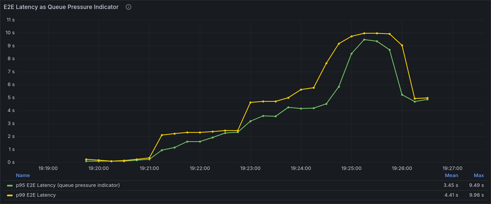

Im Bild: zwei Kurven, die von 19:20 bis 19:25:30 **monoton** klettern — p95
(grün) von ~0,1 s über eine Stufe bei 19:21 (~1 s), ein Plateau um 19:22
(~1,6 s), einen Sprung bei 19:23 (~3,2 s) bis auf **9,49 s** um 19:25:15. p99
(gelb) läuft 0,5–1 s darüber und läuft ab 19:24:45 in eine sichtbare Decke bei
**9,98 s** — das ist der größte endliche Histogramm-Bucket (10 s), die Kurve
liegt dort flach. Erst nach Lastende bricht beides innerhalb einer Minute auf
~4,9 s ein.

Warum das der Beweis ist: monoton steigende Wartezeit bei konstanter
Enqueue-Rate heißt zwingend, dass die Warteschlange wächst — es gehen mehr
Nachrichten rein als raus. Die Rate-Differenz betrug dabei nur Bruchteile eines
Prozents und ist in keinem Rate-Panel sichtbar; über fünf Minuten integriert
sind es aber mehrere Tausend Nachrichten, und genau die sieht man hier als
Latenz.

### Das Panel mit der absoluten Zahl

**Pub/Sub → `Queue Depth & Processing Rate (Worker-Side Proxy)`**

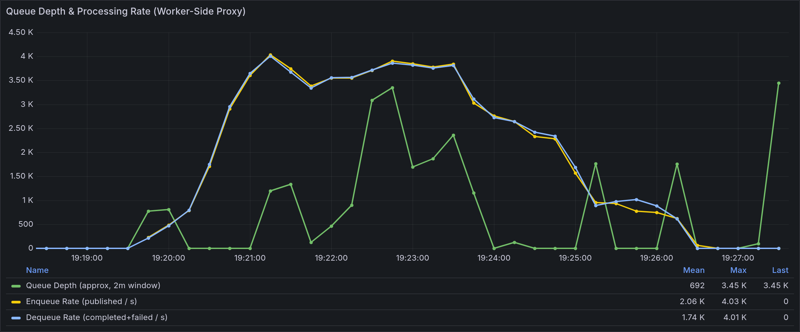

Im Bild: gelb (Enqueue) und blau (Dequeue) liegen als Trapez fast deckungsgleich
übereinander, Peak ~4 K/s zwischen 19:21 und 19:23. Die grüne Queue-Depth
zappelt darunter zwischen 0 und **3,45 K** — sichtbar in drei Wellen (19:19:40,
19:21–19:22, 19:22:30–19:23:30 mit dem Maximum bei ~3,35 K). Legende: Enqueue
mean **2,06 K/s**, Dequeue mean **1,74 K/s**, Depth mean **692**.

Der Mittelwert-Abstand Enqueue über Dequeue _ist_ der gesuchte Rückstand. Das
Zurückfallen der grünen Kurve auf 0 zwischen den Wellen ist Fenster-Artefakt
zweier unabhängig gescrapter Zähler, nicht ein wirklich geleerter Puffer.

Der Ausschlag auf 3,45 K am rechten Rand (19:27), während beide Raten schon 0
sind, ist ein `increase()`-Randartefakt — `drain.json` weist `pending = 0` aus.

### Die Ursache — und das eigentlich interessanteste Panel

**DB & Runtime → `DB Pool Connections (node-postgres)`**

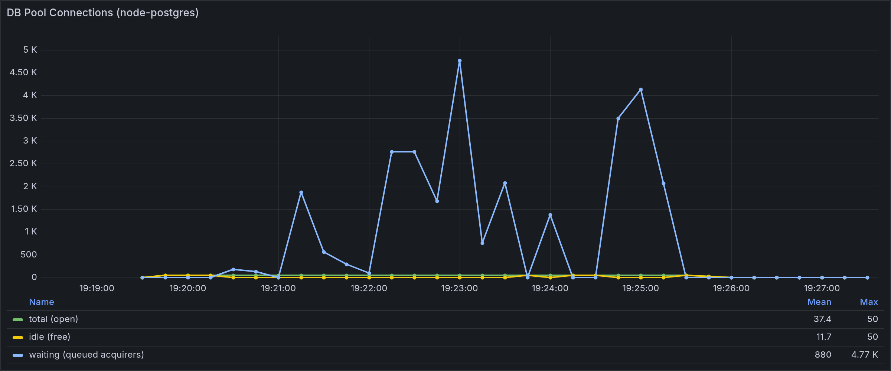

Im Bild: grün (`total`) und gelb (`idle`) kleben optisch auf der Nulllinie, weil
die blaue `waiting`-Kurve die Achse auf 5 K streckt. Blau spikt vier Mal massiv:
~1,9 K (19:21), **2,75 K** (19:22–19:22:30), **4,77 K** (19:23) und **4,1 K**
(19:25) — jeweils mit Rückfall auf 0 dazwischen. Legende: `total` mean 37,4 /
max **50**, `idle` mean 11,7, `waiting` mean **880** / max **4,77 K**.

`total` max 50 ist exakt `DATABASE_POOL_MAX` des Workers — der Pool ist am
Anschlag. Bis zu 4 770 Handler warteten gleichzeitig auf eine Verbindung. Das
zugehörige Gauge zeigt über die nativen 5-s-Samples sogar **6,53 K** (4.2.02).
Der Rückstand sitzt also nicht in Pub/Sub und nicht in der CPU, sondern im
Connection-Pool.

### Die Falle

**Order Lifecycle → `Order Throughput (accepted / completed / failed)`** sieht
aus wie das Panel für diese Frage — `accepted` gegen `completed` — ist es aber
nicht. Seit dem Reserve/Pay-Split (ADR-028) reserviert `/buy` nur; publiziert
wird erst in `/pay`. Der Worker bekommt also nie die reservierten, sondern nur
die bezahlten Orders. `accepted − completed` ist damit eine **strukturelle**
Lücke (Cancel + Abandon), kein Worker-Rückstand. Genau diese Verwechslung hat
Baseline B einen „Backlog" von 92 539 Orders gemeldet, als die Queue leer war
(dokumentiert in `scripts/load-test/lib/drain.mjs`).

Die belastbare Backlog-Identität ist immer
`payments_confirmed − completed − failed`, nie `accepted − completed`.

### Wichtige Einordnung

Der Worker war **nicht dauerhaft abgehängt**: `Worker/Published Throughput
Ratio` liegt bei **99,8 %**, der Drain war nach 15 s fertig, `pendingOrders` am
Ende 0. Was der Run zeigt, ist ein _stehender_ Rückstand von ~2–5 K Nachrichten,
der mit der Last mitwächst und danach sofort abgebaut wird. Bezahlt wird er in
Latenz, nicht in verlorenen Orders.

## 3. Die Kausalkette dieses Runs

```
k6 (10 000 VUs, 58 % dropped)
  └─ API: 8,13 K req/s Peak, Event-Loop-Lag p99 bis 1,72 s, 0,80 Cores
       ├─ POST /buy   p50 140 ms  (Redis-only, billig)
       └─ POST /pay   p50 817 ms → p99 9,75 s   (publizierender Pfad)
            └─ Pub/Sub → Worker
                 └─ DB-Pool (max 50) mit bis zu 6,53 K Wartenden
                      └─ buy_ticket-Query p95 1,62 s (max 4,54 s)
                           └─ E2E Publish→Persist p99 → 10 s
```

Zwei unabhängige Sättigungspunkte, beide **nicht** CPU:

1. **API-Prozess:** Event-Loop-Lag p99 mean 503 ms bei nur 0,80 von 1,0
   möglichen Cores. Ein einzelner Node-Prozess ist bei ~8 K req/s am Ende.
   Indirekt belegt durch `GET /availability`: ein reiner Redis-Read mit p99
   9,10 s kann seine Zeit nur im Event-Loop verbracht haben.
2. **Worker-DB-Pool:** 50 Verbindungen, bis 6 530 Wartende, aber
   `db_locks_waiting = 0` und Worker-Event-Loop-Lag nur 11,7 ms. Der Worker
   wartet, er rechnet nicht.

Auf der Maschine (11 CPUs) waren zusammen ~1,3 Cores in Benutzung. Der Rest ging
an k6 — was die 57,9 % dropped iterations erklärt.

## 4. Die Panels im Detail

### 4.1 API Performance

#### 01 · Request Rate (RPS)


**Query:** `sum(rate(http_request_duration_seconds_count{job="api"}[1m]))`,
zusätzlich je `route`.

**Im Bild:** grün (total) steigt ab 19:19:40 steil auf **8,13 K req/s** (19:21),
hält ein zackiges Plateau um 7–8 K bis 19:23:20, fällt dann in Stufen ab. Gelb
(`/buy`) und orange (`/pay`) liegen zwischen 19:20 und 19:25 fast deckungsgleich
bei ~4 K — im `checkout`-Profil folgt auf jedes `buy` genau ein `pay`. Ab
19:25:30 trennen sie sich: `/pay` läuft aus, `/buy` steigt noch einmal auf
3,6 K. Die blaue `/availability`- und die rote `/cancel`-Linie liegen flach auf 0. Legende: total mean 4,58 K, buy 2,52 K/4,09 K, pay 1,73 K/4,03 K,
availability 0,296/s, cancel 0.

**Ableitbar:** Lastform, Verkehrsmix und ob der Generator überhaupt ankommt.
`availability` ≈ 0 und `cancel` = 0 bestätigen die Profilwahl (keine Reads,
`CANCEL_RATE=0`). Der zweite `/buy`-Buckel bei 19:26 ist Phase B plus der
Rückstau von Requests, die die API erst nach Phase-A-Ende fertig verarbeitet —
der Zähler inkrementiert bei _Abschluss_, nicht bei Ankunft.

#### 02 · POST /buy Latency (p50 / p95 / p99)

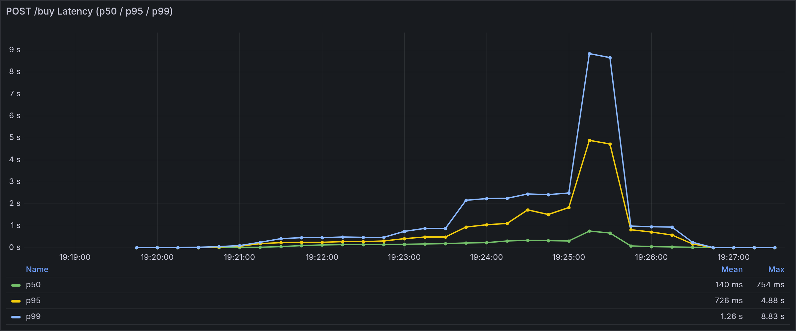

**Query:** `histogram_quantile(…, rate(http_request_duration_seconds_bucket{route="/api/tickets/:eventId/buy"}[1m]))`

**Im Bild:** alle drei Kurven bleiben bis 19:23 unter 1 s, p50 (grün) sogar bis
zum Ende praktisch flach unter 300 ms. Ab 19:23:20 steigt p99 (blau) auf ~2,4 s,
dann ein einzelner scharfer Spike auf **8,83 s** bei 19:25:15–19:25:30, an dem
p95 (gelb) auf 4,88 s mitgeht — danach Absturz auf ~1 s. Legende: p50 mean
140 ms / max 754 ms, p95 726 ms / 4,88 s, p99 1,26 s / 8,83 s.

**Ableitbar:** Kosten des reinen Redis-Reservepfads (Lua: `DECR` + `ZADD`) — der
billigste Schreibpfad im System. Der isolierte Spike sitzt genau im
Ausverkaufsmoment, nicht im Dauerbetrieb: die Reservierung selbst skaliert, der
Engpass liegt woanders.

#### 03 · GET /availability Latency (p50 / p95 / p99)

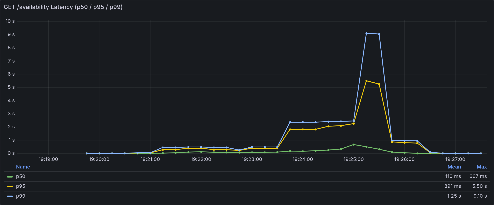

**Im Bild:** flache Kurven unter 500 ms bis 19:23:20, dann ein Plateau um
2,3 s (p99) und ein Spike auf **9,10 s** bei 19:25:15–19:25:30. p50 (grün)
bleibt durchweg unter 700 ms. Legende: p50 mean 110 ms, p95 891 ms / 5,50 s,
p99 1,25 s / 9,10 s.

**Ableitbar:** normalerweise die Gesundheit des Redis-Read-Modells — **in diesem
Profil statistisch bedeutungslos**, weil nur ~0,3 req/s anfielen (die
Percentile stammen aus einer Handvoll Samples). Dafür ist es ein sehr guter
_indirekter_ Messwert für API-Event-Loop-Verzug: ein einzelner Redis-`GET`
braucht keine 9 s, diese Zeit wurde im Event-Loop verbracht.

#### 04 · Error Rate (5xx / 409 / 425)


**Im Bild:** die grüne 5xx-Linie ist über die **gesamte Breite** flach auf 0 %.
Blau (425) startet bei 9,2 %, fällt in drei Schritten bis 19:20:30 auf 0 und
bleibt dort. Gelb (409) liegt bis 19:25:30 auf 0 und springt dann fast senkrecht
über 59 % → 65 % → 73 % auf **99,9 %**. Legende: 5xx 0 %/0 %, 409 mean 21,8 % /
max 99,9 %, 425 mean 0,495 % / max 9,20 %.

**Ableitbar:** trennt echte Fehler von fachlichen Antworten. 425 = Sale-Unlock-
Gate (ADR-024), nur im 10-s-Warm-up. 409 = Sold-out, ab dem Ausverkauf korrekt
für praktisch jede Anfrage. **Die durchgehende 5xx-Null ist der wichtigste
Einzelbefund dieses Panels:** die 6,8 % k6-Failures sind damit als Transport-
und Timeout-Fehler entlastet, nicht als Applikationsfehler.

#### 05 · Latency by Route (p50 / p95)

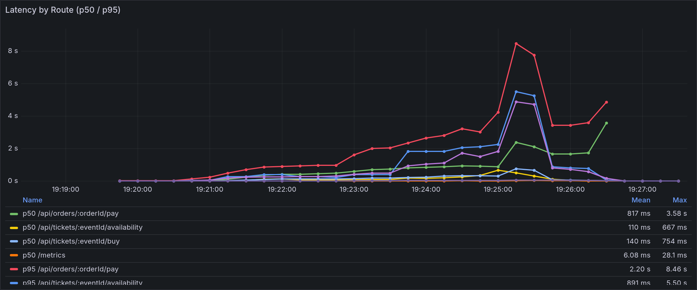

**Im Bild:** ein Bündel Kurven; die rote (`p95 /pay`) liegt durchgehend oben und
steigt monoton bis auf **8,46 s**. Darunter grün (`p50 /pay`), dann die
`/buy`- und `/availability`-Kurven, die erst im Ausverkaufsspike hochschießen.
Die orange `/metrics`-Linie liegt sichtbar auf 0. Legende (Auszug): p50 `/pay`
817 ms / 3,58 s, p50 `/buy` 140 ms / 754 ms, p50 `/availability` 110 ms /
667 ms, p50 `/metrics` 6,08 ms / 28,1 ms, p95 `/pay` 2,20 s / 8,46 s.

**Ableitbar:** die Rangfolge ist eindeutig — `/pay` ≫ `/buy` ≈ `/availability` ≫
`/metrics`. Der Publish-Pfad kostet rund das Sechsfache des Reserve-Pfads. Der
Prometheus-Scrape selbst (`/metrics`, 6 ms) ist kein Störfaktor.

#### 06 · POST /pay Latency (p50 / p95 / p99)

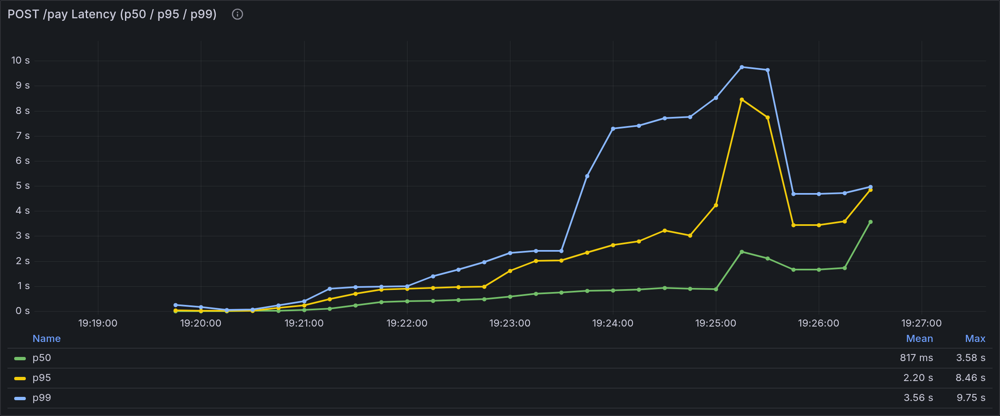

**Im Bild:** anders als bei `/buy` steigen hier **alle drei** Kurven monoton.
p99 (blau) erreicht bereits um 19:24 7,3 s und läuft auf **9,75 s**; p95 (gelb)
folgt auf 8,46 s; selbst p50 (grün) liegt ab 19:23 dauerhaft über 700 ms und
endet bei 3,58 s. Kein isolierter Spike, sondern ein Trend. Legende: p50 mean
817 ms / max 3,58 s, p95 2,20 s / 8,46 s, p99 3,56 s / 9,75 s.

**Ableitbar:** `/pay` validiert das Payment-DTO **und publiziert** den
`BuyTicketEvent`. Der monotone Anstieg ist Publish-seitige Backpressure — die
Stelle, an der die API selbst gebremst wird. Der Kontrast zu `/buy` (flaches
p50) lokalisiert die Kosten präzise im Publish, nicht in der HTTP-Schicht oder
der Validierung.

### 4.2 DB & Runtime

`db_query_duration_seconds` wird in `apps/worker/src/lib/metrics.ts:282`
(`timeDbQuery`) **um den gesamten Aufruf** gelegt — die Wartezeit auf eine
Pool-Verbindung ist enthalten. Die Panels 04/05 messen also „Verbindung bekommen
ausführen", nicht die reine Server-Query-Zeit. Bei `db_locks_waiting = 0` ist
der Anstieg dort fast vollständig Pool-Warteschlange.

#### 01 · DB Pool Connections (node-postgres)

Siehe §2 — Bild und Beschreibung stehen dort.

#### 02 · Pool Wait (max queued acquirers im Zeitraum)

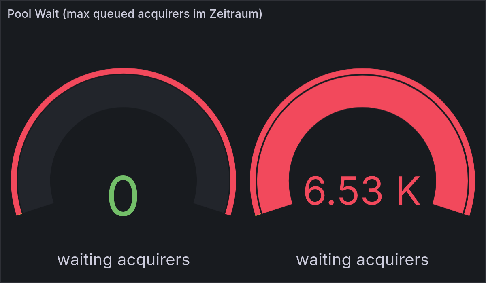

**Query:** `max_over_time(db_pool_connections{job="worker",state="waiting"}[$__range]) or vector(0)`

**Im Bild:** **zwei** Halbkreis-Gauges. Links „0" in Grün, rechts **„6.53 K"** in
Rot mit voll ausgefülltem Bogen.

**Ableitbar:** der Worst-Case-Rückstand als eine Zahl, ohne den
Downsampling-Verlust des Zeitreihen-Panels — deshalb 6,53 K statt der 4,77 K aus
Panel 01. Das linke Gauge ist **kein Messwert**, sondern die Phantom-Serie aus
`or vector(0)` (§5.1). Genau deshalb ist der Defekt heikel: eine grüne „0"
neben dem echten Wert liest sich wie ein zweiter, unbedenklicher Messpunkt.

#### 03 · Lock Waits (max im Zeitraum, hot-row contention)

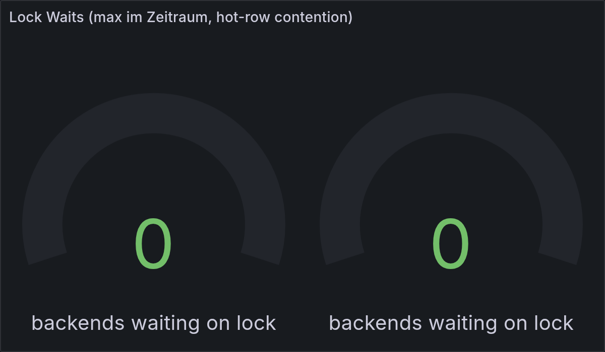

**Im Bild:** zwei Gauges, beide „0" in Grün, beide Bögen leer.

**Ableitbar:** `pg_stat_activity`-Backends im `Lock`-Wait. Über den ganzen Run
**null Hot-Row-Contention** — die Serialisierung aus ADR-011 ist wirklich weg.
Zusammen mit Panel 04 ist das der Beweis, dass der Rückstand Pool-, nicht
Lock-bedingt ist. Auch hier ist eins der beiden Gauges die Phantom-Serie.

#### 04 · DB Query Latency (p50 / p95 / p99, all queries)

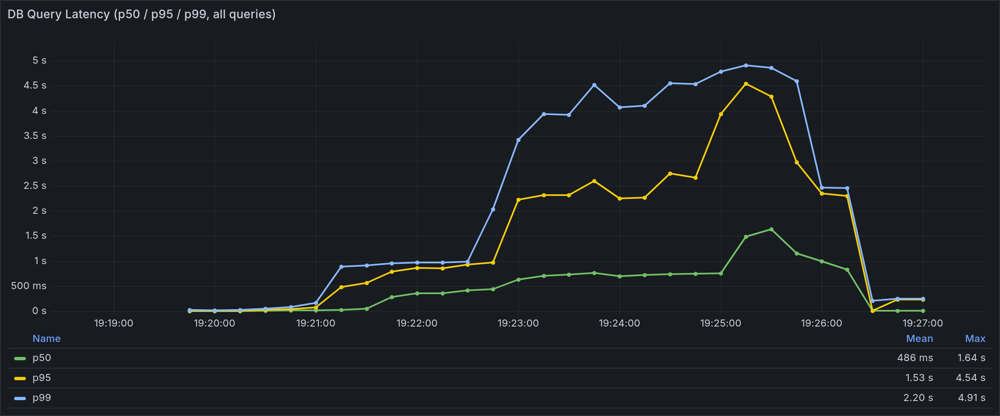

**Im Bild:** drei gestaffelte Kurven mit einem klaren Knick bei 19:22:40: davor
p99 (blau) unter 1 s, danach Sprung auf 3,4 s und weiter in Stufen auf **4,91 s**
(19:25:15). p95 (gelb) macht denselben Sprung auf 2,2 s und endet bei 4,54 s.
p50 (grün) steigt von ~50 ms auf 1,64 s. Nach 19:26:10 fallen alle drei
senkrecht auf ~200 ms. Legende: p50 mean 486 ms / max 1,64 s, p95 1,53 s /
4,54 s, p99 2,20 s / 4,91 s.

**Ableitbar:** ein Insert braucht keine 486 ms Median. Zusammen mit
`Lock Waits = 0` ist der Aufschlag eindeutig Wartezeit auf eine Verbindung, nicht
Arbeit in PostgreSQL. Der Knick bei 19:22:40 markiert den Punkt, ab dem der Pool
dauerhaft überbucht war.

#### 05 · DB Query Latency p95 by Query

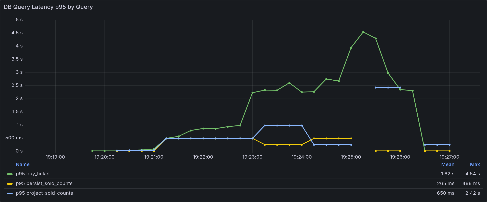

**Im Bild:** grün (`buy_ticket`) dominiert und steigt stufig auf **4,54 s**
(19:25:15). Blau (`project_sold_counts`) läuft in flachen Plateaus — 500 ms,
dann 1 s zwischen 19:23 und 19:24, dann 250 ms — und hat Lücken, weil die Query
nur alle 60 s läuft. Gelb (`persist_sold_counts`) liegt darunter bei 250–490 ms,
ebenfalls mit Lücken. Legende: `buy_ticket` mean 1,62 s / max 4,54 s,
`project_sold_counts` 650 ms / 2,42 s, `persist_sold_counts` 265 ms / 488 ms.

**Ableitbar:** welche Query den Pool blockiert — eindeutig `buy_ticket`, die
Order-plus-Ticket-Transaktion des Workers. Die Lücken in den Projector-Serien
sind normal (ein Lauf pro Minute), keine fehlenden Daten.

#### 06 · DB Query Throughput by Query

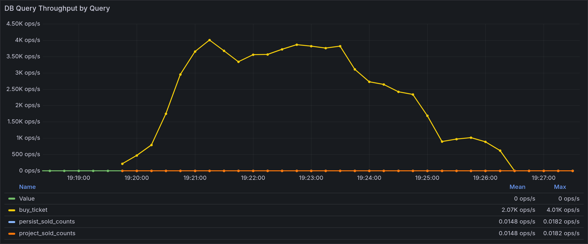

**Im Bild:** eine einzige sichtbare gelbe Kurve (`buy_ticket`) als Trapez mit
Peak **4,01 K ops/s**. Alle anderen Legendeneinträge liegen optisch auf 0.
Legende: `buy_ticket` mean 2,07 K / max 4,01 K ops/s, `persist_sold_counts` und
`project_sold_counts` je 0,0148 ops/s — plus ein Eintrag **„Value" bei 0**.

**Ableitbar:** die Wartungsarbeit (Projector) ist mit 0,0148/s ≈ ein Lauf pro
67 s rund 0,0007 % der DB-Operationen. Sie kann den Pool also nicht durch Volumen
belasten, höchstens durch Haltedauer — was Panel 12 prüft. Die Zeile „Value"
ist wieder die Phantom-Serie aus `or vector(0)`.

#### 07 · Event Loop Lag (p99 / mean)

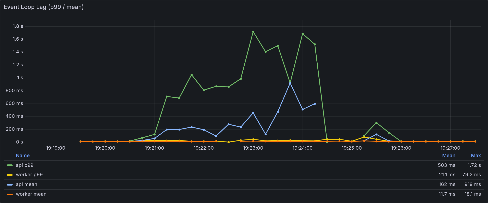

**Im Bild:** grün (`api p99`) springt ab 19:20:40 auf 700 ms, dann in Zacken auf
**1,72 s** (19:23) und noch einmal 1,67 s (19:24) — bricht bei 19:24:30
senkrecht auf ~0 ein. Blau (`api mean`) folgt gedämpft bis 919 ms. Die beiden
Worker-Kurven (gelb/orange) sind vom Nullband kaum zu unterscheiden. Legende:
api p99 mean 503 ms / max 1,72 s, api mean 162 ms / 919 ms, worker p99 21,1 ms /
79,2 ms, worker mean 11,7 ms / 18,1 ms.

**Ableitbar:** **das Sättigungspanel für Node-Prozesse** — und der klarste
Beleg, wer hier überlastet ist. Der API-Prozess kommt mit seinen Callbacks um
mehr als eine Sekunde nicht nach, der Worker liegt bei 21 ms. Das ordnet auch
die 159 431 k6-Timeouts ein: sie entstehen vor der Applikationslogik, in der
Accept-Queue.

#### 08 · Process CPU (cores, rate)

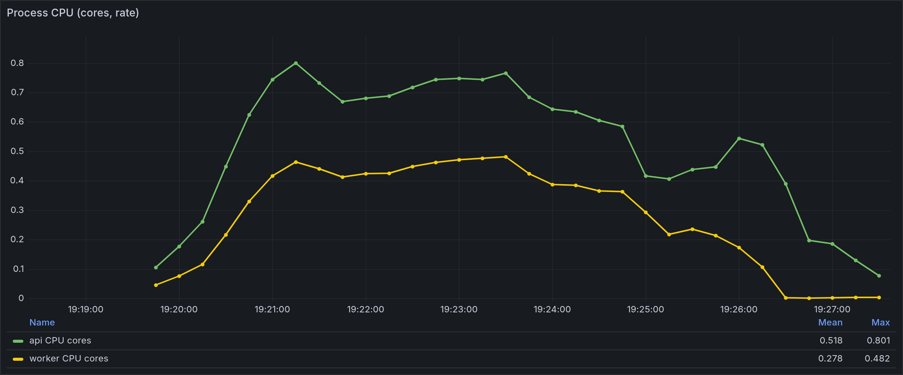

**Im Bild:** zwei glatte Kurven ohne Zacken. Grün (api) steigt auf **0,80
Cores** (19:21) und hält 0,6–0,8 bis 19:24. Gelb (worker) läuft parallel
darunter mit Maximum **0,48**. Legende: api mean 0,518 / max 0,801, worker
0,278 / 0,482.

**Ableitbar:** der Abstand zur Single-Thread-Grenze von 1,0 Cores pro
Node-Prozess. Die API liegt bei 80 % ihrer eigenen Decke — Clustering oder mehr
Instanzen sind der nächste Schritt. Der Worker bei 0,28 mean bestätigt: er
wartet auf I/O, er rechnet nicht. Und: die Maschine als Ganzes (11 CPUs) ist mit
~1,3 Cores weit von Auslastung entfernt — den Rest verbraucht k6, was die
dropped iterations erklärt.

#### 09 · Sold-count Projector Query Duration

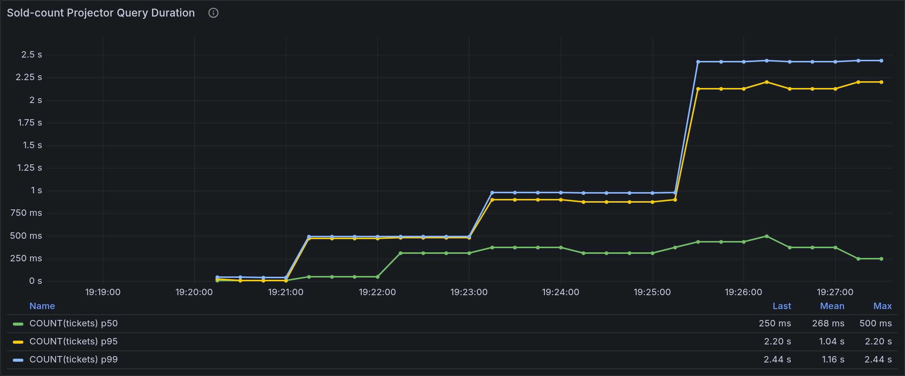

**Im Bild:** eine sehr saubere **Treppe** in p95/p99 — bis 19:21 nahe 0, dann
Plateau ~490 ms (19:21–19:22:40), dann ~950 ms (19:23–19:25:15), dann Sprung auf
**2,44 s** und dort flach bis zum Ende. p50 (grün) steigt viel langsamer von
50 ms auf 500 ms. Legende: p50 mean 268 ms / max 500 ms, p95 1,04 s / 2,20 s,
p99 1,16 s / 2,44 s.

**Ableitbar:** die Laufzeit der einen gruppierten `COUNT(tickets)`-Aggregation.
Die Treppenstufen fallen mit dem Tabellenwachstum zusammen (grob ¼ Mio → ½ Mio
→ 1 Mio Zeilen) — **die Kosten wachsen etwa linear mit der Zeilenzahl**, wie bei
einem Seq Scan. Das ist der offene Messpunkt aus ADR-031 Ziffer 4: bei einem
Lauf pro 60 s unkritisch, aber bei größeren Events wird die Aggregation zum
Thema.

#### 10 · Sold-count Projector Write-back Duration

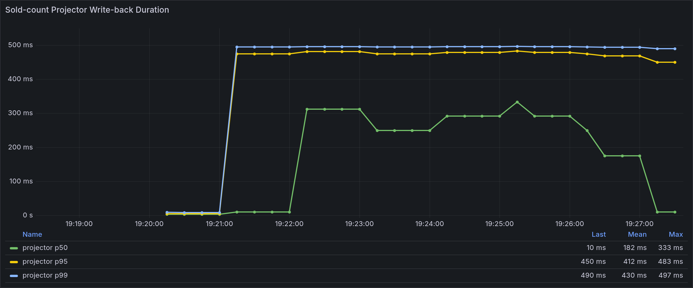

**Im Bild:** p95 (gelb) und p99 (blau) springen bei 19:21 auf ~480 ms und
bleiben dann **bemerkenswert flach** bis zum Ende — keine Treppe. p50 (grün)
schwankt zwischen 170 und 333 ms. Legende: p50 mean 182 ms / max 333 ms, p95
412 ms / 483 ms, p99 430 ms / 497 ms.

**Ableitbar:** der Kontrast zu Panel 09 ist die Aussage — das Zurückschreiben
nach `events.sold_count` ist ein einzelnes `UPDATE` und wächst **nicht** mit der
Tabelle. Nur die Aggregation skaliert mit der Zeilenzahl. Die auffällig flachen
p95/p99-Linien knapp unter 500 ms sind Bucket-Kanten des Histogramms, keine
echte Konstanz.

#### 11 · Sold-count Projector Health

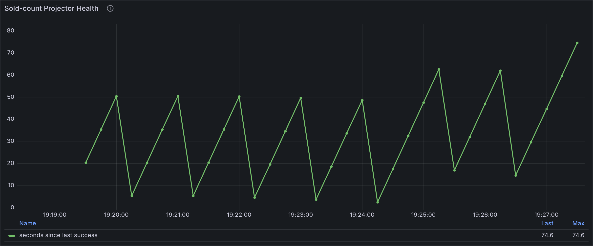

**Im Bild:** ein regelmäßiger **Sägezahn** — Anstieg auf ~50 s, Reset auf ~5 s,
acht Zähne. Ab 19:24:30 werden die Zähne höher: 62 s, 62 s, zuletzt **74,6 s**.
Die Fehlerlinie (`errors / 15m`) ist gar nicht sichtbar. Legende: last 74,6,
max 74,6.

**Ableitbar:** Sägezahn = gesund (jeder Reset ist ein erfolgreicher Lauf); eine
monoton steigende Linie würde bedeuten, dass der Projector hängt. Die Panel-
Beschreibung nennt ~120 s als Erwartungsgrenze, 74,6 s liegt darunter. Das
Höherwerden der Zähne unter Spitzenlast ist der Effekt aus Panel 09 — der Zyklus
wird langsamer, reißt aber nicht.

#### 12 · Pool Wait during Projector Activity

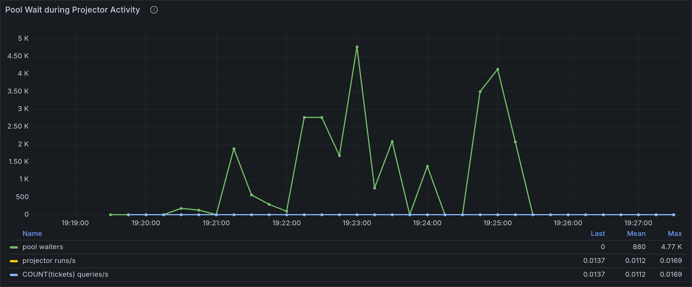

**Im Bild:** nur die grüne `pool waiters`-Kurve ist zu sehen, mit denselben
Spikes wie in Panel 01 (Maximum 4,77 K bei 19:23). Die beiden Projector-Serien
liegen als flache Linie auf der Nullachse. Legende: pool waiters mean 880 / max
4,77 K, projector runs/s 0,0112 / 0,0169, COUNT-Queries/s identisch.

**Ableitbar:** der Korrelationstest. Die Pool-Spikes treten bei 19:21, 19:23 und
19:25 auf und stehen in **keinem** Zusammenhang mit den gleichmäßig verteilten
Projector-Zyklen. **Keine messbare Projector-Interferenz** — damit ist der zweite
offene Punkt aus ADR-031 beantwortet. Einschränkung: das Panel kann in dieser
Skalierung nur „keine Korrelation" zeigen, niemals eine (§5.5).

### 4.3 Inventory Integrity

#### 01 · Reservation Flow (Created / Rollbacks / Compensations)

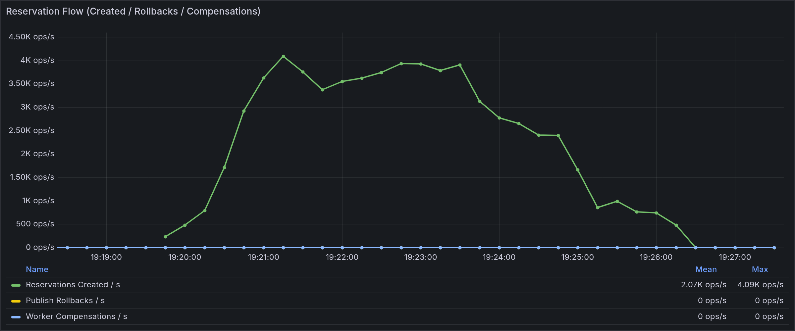

**Im Bild:** eine grüne Trapezkurve (Reservierungen) mit Peak **4,09 K ops/s**
bei 19:21; gelb (Rollbacks) und blau (Kompensationen) liegen exakt auf 0 und
sind nur als eine Linie erkennbar. Legende: Reservations mean 2,07 K / max
4,09 K, Rollbacks 0/0, Compensations 0/0.

**Ableitbar:** die drei schreibenden Redis-Pfade nebeneinander. Rollbacks oder
Kompensationen > 0 hießen: eine Reservierung musste zurückgenommen werden. Beide
durchgehend 0 → **kein Publish ist nach erfolgreicher Reservierung
fehlgeschlagen**, und der Worker musste nie einen Anspruch zurückgeben.

#### 02 · Publish Rollback Rate (5m)

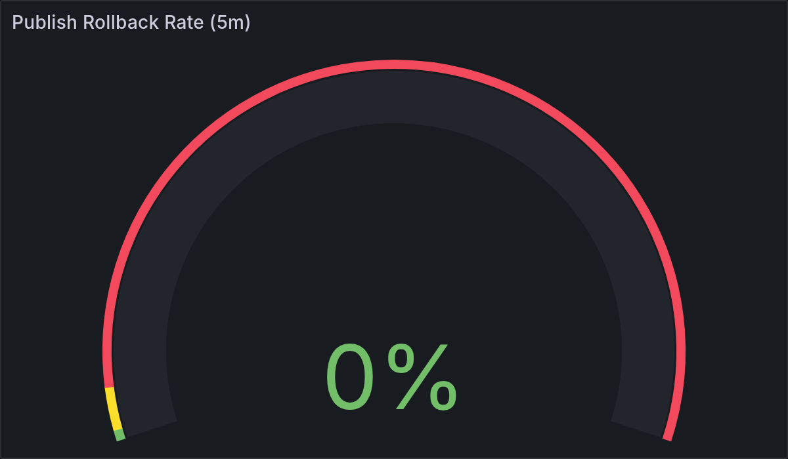

**Im Bild:** ein einzelnes Gauge, **„0 %"** in Grün, Bogen leer, mit rotem
Schwellenring am äußeren Rand.

**Ableitbar:** Zuverlässigkeit von `/pay` — Anteil der Reservierungen, deren
Publish scheiterte und zurückgerollt wurde. Hier nur ein Gauge (kein Phantom),
weil `or vector(0)` in eine Division eingebettet ist und beim Vector-Matching
wegfällt (§5.1).

#### 03 · Worker Compensation Rate (5m)

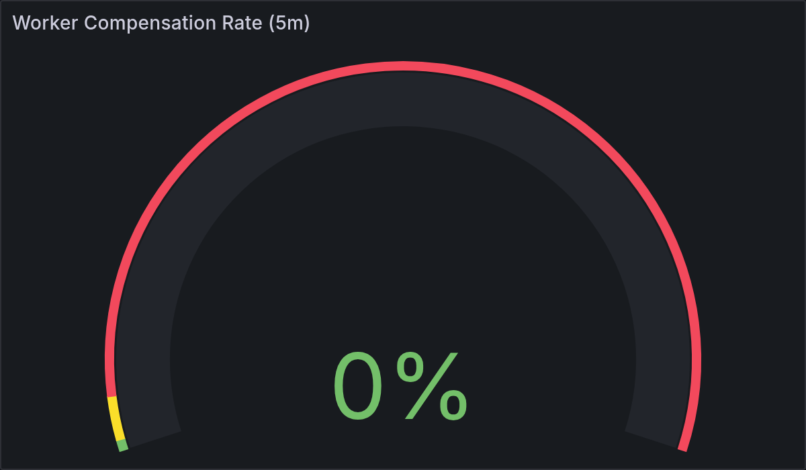

**Im Bild:** ebenfalls ein einzelnes Gauge, **„0 %"** in Grün.

**Ableitbar:** Anteil der Fälle, in denen der Worker einen Anspruch kompensieren
musste. 0 bei 999 925 verarbeiteten Nachrichten.

#### 04 · Capacity Delta over time

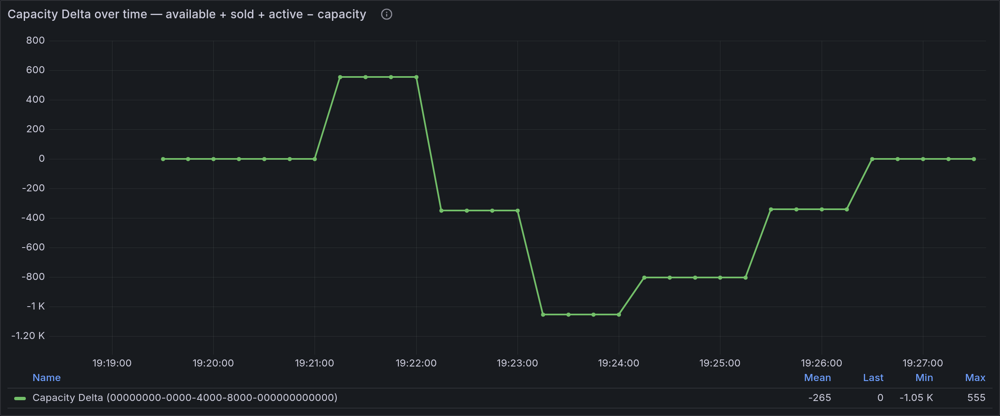

**Query:** `inventory_capacity_delta_tickets{job="worker"}` — also
`available + sold + active − capacity`.

**Im Bild:** eine **Stufenkurve** um die Nulllinie. Start bei 0 bis 19:21, dann
Plateau bei **+555** (19:21–19:22), Abfall auf −350, dann auf **−1 050**
(19:23), zurück auf −800, −350 und ab 19:26:40 exakt **0** bis zum Ende.
Legende: mean −265, **min −1,05 K, max +555, last 0**.

**Ableitbar:** **das zentrale Cross-System-Diagnosepanel** (ADR-031). Positiv =
mehr Ansprüche als Sitze (Oversell-Signal), negativ = Sitze fehlen in der
Buchführung. Genau das erwartete Bild: reale transiente Ausschläge unter
Parallelität, nach dem Drain exakt 0. Ohne schreibenden Reconcile können diese
Ausschläge nichts mehr beschädigen — vor ADR-031 hätte eine positive Korrektur
hier Ansprüche freigegeben, die noch gehalten wurden.

Die Stufenform mit ~60-s-Plateaus ist der Auditor-Zyklus: jedes Plateau ist ein
Sample, das bis zum nächsten Lauf gehalten wird. Und: **dieses Panel liefert
genau die Min/Max-Information, die `derived.json` nicht enthält** — dort ist
`drift.min` nur ein Duplikat des Endwerts.

#### 05 · Final Capacity Invariant |delta| (after drain = 0)

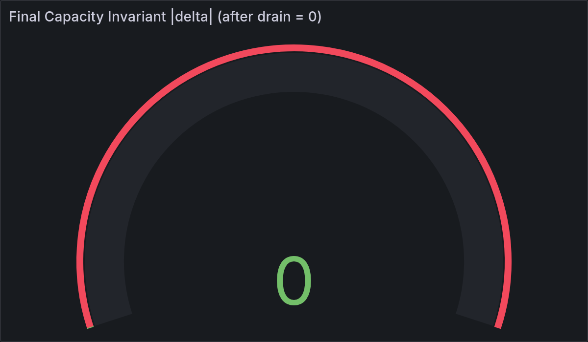

**Im Bild:** ein einzelnes Gauge, **„0"** in Grün, Bogen leer, roter
Schwellenring außen.

**Ableitbar:** das Quality Gate aus ADR-031 Ziffer 5 — ≠ 0 nach abgeschlossenem
Drain setzt den Lasttest auf `system=fail`. Hier erfüllt. Ein Gauge statt zwei,
weil diese Query kein `or vector(0)` hat.

#### 06 · Reservations & Rollbacks by Event

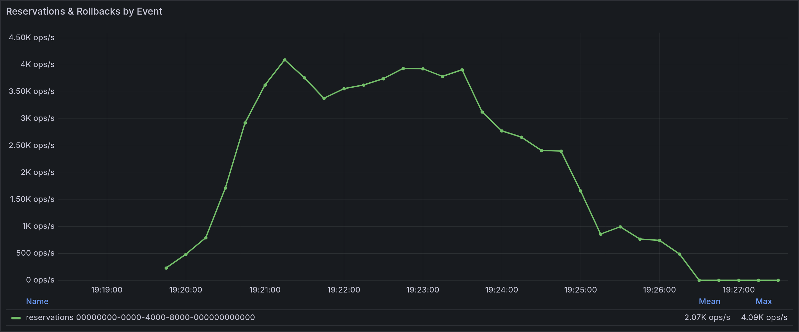

**Im Bild:** nur **eine** grüne Kurve (Reservierungen für
`00000000-0000-4000-8000-000000000000`), Peak 4,09 K ops/s. Eine
Rollback-Serie erscheint überhaupt nicht in der Legende. Legende: mean 2,07 K /
max 4,09 K.

**Ableitbar:** dient bei mehreren gleichzeitigen Events der Frage, welches Event
Ansprüche verliert. Hier nur ein Event. Die **fehlende** Rollback-Serie ist kein
Datenproblem, sondern §5.2: diese Query hat kein `or vector(0)`, und der Zähler
wurde nie inkrementiert.

#### 07 · Reservation Ledger (active / due)

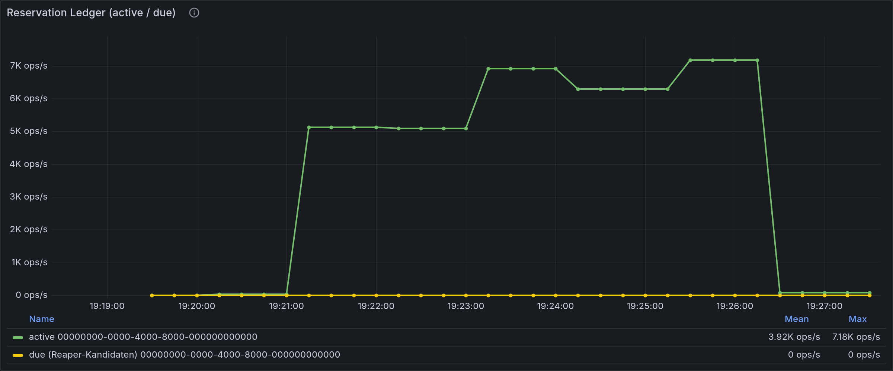

**Im Bild:** grün (`active`) springt bei 19:21 auf 5,1 K, hält ein Plateau,
steigt auf 6,95 K (19:23), 6,3 K, dann **7,18 K** (19:25:30–19:26:10) und fällt
senkrecht auf ~0. Gelb (`due`) liegt über die gesamte Breite auf 0. Legende:
active mean 3,92 K / max 7,18 K, due 0/0.

**Ableitbar:** gleichzeitig gehaltene Ansprüche im ZSet-Ledger. `due > 0` hieße:
Eligibility Deadline erreicht, der Pending-Reaper darf konkrete Ansprüche
freigeben. Bei `CHECKOUT_PENDING_TIMEOUT_SECONDS=900` und 6,5 min Laufzeit
konnte nichts fällig werden — der Reaper-Pfad ist in diesem Run also
**ungetestet**, nicht bestätigt. Die Achseneinheit „ops/s" ist falsch, das sind
Bestände (§5.4).

#### 08 · Inventory Components (capacity / available / sold / active)

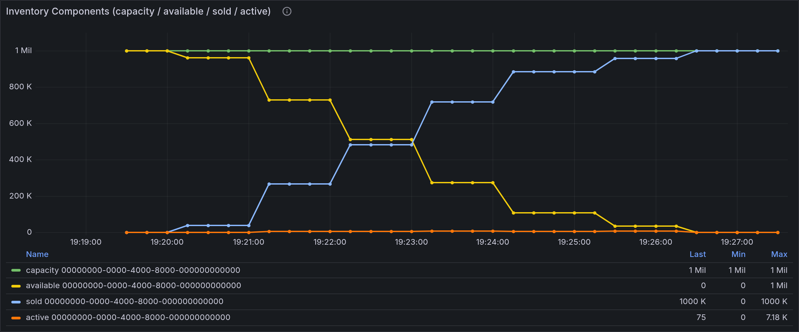

**Im Bild:** die klarste Darstellung des Verkaufs. Grün (`capacity`) flach bei
1 Mio. Gelb (`available`) fällt in 60-s-Stufen von 1 Mio über 730 K, 510 K,
275 K, 110 K auf 0. Blau (`sold`) steigt spiegelbildlich von 0 über 265 K,
480 K, 715 K, 880 K auf 1 Mio. Orange (`active`) bleibt optisch auf der
Nulllinie. Legende: capacity 1 Mio konstant, available last 0 / max 1 Mio, sold
last 1000 K, active last **75** / max 7,18 K.

**Ableitbar:** die Rohoperanden der Capacity-Invariante aus demselben
read-only-Audit-Zyklus — die Summe der drei unteren muss die obere Linie
treffen. Die Stufen sind wieder der 60-s-Zyklus. `active` max 7,18 K gegen
43,6 K im `realism`-Profil desselben Tages zeigt direkt den Effekt der fehlenden
Denkzeit: ohne Wartezeit zwischen Reserve und Pay hält das System nur ein Sechstel
so viele Ansprüche gleichzeitig.

#### 09 · Inventory Auditor Duration

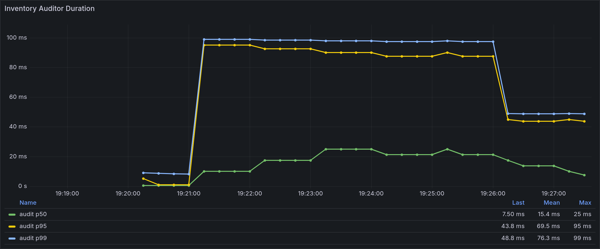

**Im Bild:** p95 (gelb) und p99 (blau) springen bei 19:21 von ~5 ms auf ~95 ms
und laufen dann fast waagerecht mit leichtem Abwärtstrend, bis sie bei 19:26:10
auf ~45 ms fallen. p50 (grün) steigt in kleinen Stufen von 0 auf 25 ms. Legende:
p50 mean 15,4 ms / max 25 ms, p95 69,5 ms / 95 ms, p99 76,3 ms / 99 ms.

**Ableitbar:** die Kosten des read-only Audit-Zyklus auf der Redis-Seite —
zweistellige Millisekunden, vernachlässigbar. Wichtig zur Abgrenzung: die teure
`COUNT(tickets)`-Seite steckt **nicht** hier, sondern in `db_query_duration`
(Panel 4.2.09).

#### 10 · Auditor Freshness

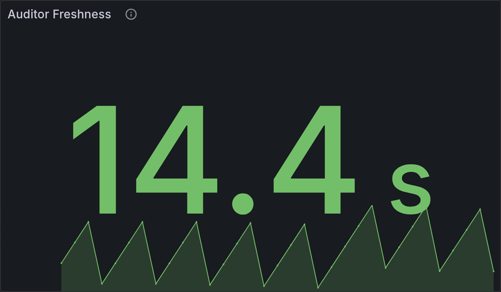

**Im Bild:** ein großes Stat-Panel, **„14.4 s"** in Grün, mit einem
Sägezahn-Sparkline im Hintergrund (acht Zähne, gleichmäßig, die letzten drei
etwas höher).

**Ableitbar:** `time() − inventory_audit_last_success_timestamp_seconds` —
ob der Auditor überhaupt noch läuft. Erwartung: unter zwei 60-s-Zyklen. 14,4 s
am Ende, Sägezahn ohne Aussetzer, 8 erfolgreiche Läufe und 0 Fehler.

#### 11 · Oldest Pending Reservation (beyond deadline)

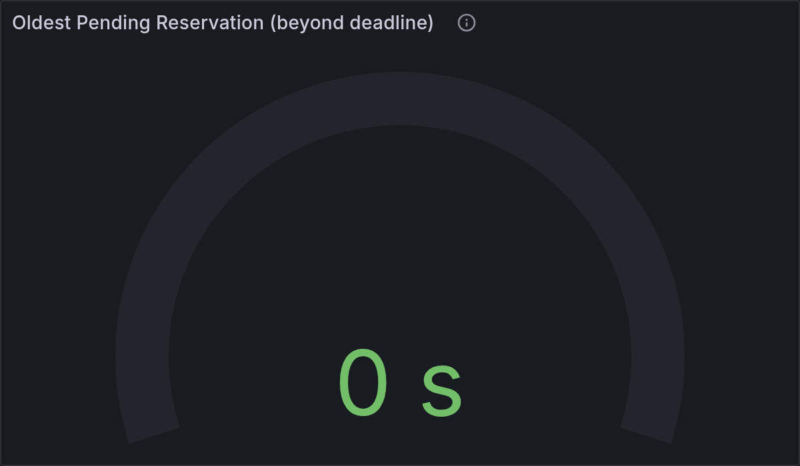

**Im Bild:** ein Gauge, **„0 s"** in Grün, Bogen vollständig leer.

**Ableitbar:** das Alter **jenseits** der Deadline des ältesten pending-Anspruchs
aus dem letzten Reaper-Lauf. 0 heißt: kein fälliger Anspruch wurde freigegeben —
konsistent mit `due = 0` in Panel 07. Auch dieses Panel bestätigt den
Reaper-Pfad nicht, es zeigt nur, dass er nichts zu tun hatte.

#### 12 · Reaper Activity & Auditor Errors

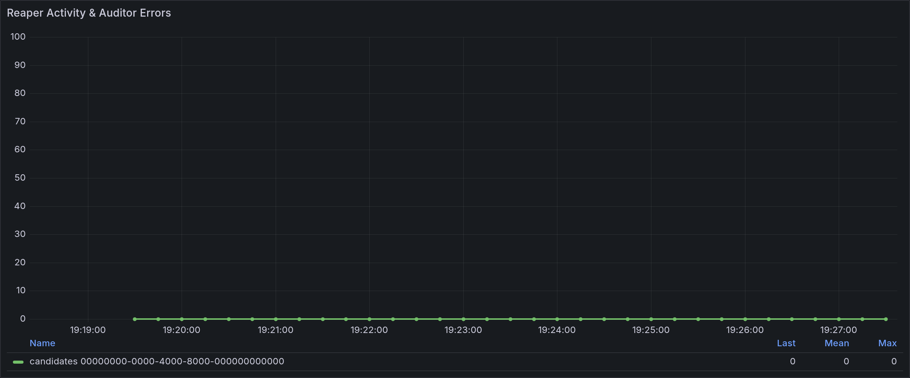

**Im Bild:** eine einzige grüne Linie (`candidates`) flach auf 0, Y-Achse
automatisch auf 0–100 gestreckt. Die Serien für Releases, Skips, Fehler und
Audit-Fehler fehlen in der Legende vollständig. Legende: candidates last/mean/
max = 0.

**Ableitbar:** der identitätsbasierte Reaper-Pfad (ADR-031 Ziffer 6) — Skips
nach Grund würden zeigen, ob er korrekt `publishing`/`paid` verschont. In diesem
Run: 8 Läufe, alle ohne Arbeit. Die fehlenden Serien sind §5.2 (Zähler nie
inkrementiert, kein `or vector(0)`) und **nicht** von einem kaputten
Metrik-Pfad zu unterscheiden — genau die Ambiguität, die das Panel wertlos macht,
wenn man wissen will, ob der Reaper läuft.

### 4.4 Order Completion Latency

Alle Panels lesen `order_e2e_latency_seconds` — **Publish → Persist**. Der
`queuedAt`-Zeitstempel wird seit ADR-028 in der Pay-Route beim Publish gesetzt;
die Checkout-Denkzeit ist **nicht** enthalten.

#### 01 · Order Completion Latency — Publish (POST /pay) → completed | failed

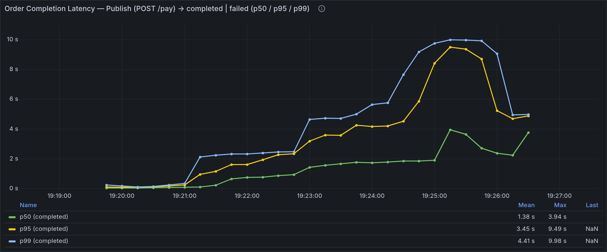

**Im Bild:** drei monoton steigende Kurven. p99 (blau) erreicht bei 19:25 die
Decke bei **9,98 s** und läuft dort drei Datenpunkte flach; p95 (gelb) folgt auf
9,49 s; p50 (grün) steigt von ~50 ms auf 3,94 s. Ab 19:25:30 brechen alle drei
ein. Alle Legendeneinträge tragen `(completed)` — es gibt **keine**
`failed`-Serie. Legende: p50 mean 1,38 s / max 3,94 s, p95 3,45 s / 9,49 s, p99
4,41 s / 9,98 s, „Last: NaN" für p95 und p99.

**Ableitbar:** der Kern-SLO des asynchronen Pfads. Das Fehlen einer
`failed`-Serie bestätigt `ordersFailed = 0` — kein systematischer
Persistenzfehler. Die flache p99-Decke bei 10 s ist Histogramm-Sättigung, nicht
ein echtes Plateau: 0,04 % der Beobachtungen lagen darüber, der wahre Wert ist
unbekannt und größer. „Last: NaN" ist ein Randartefakt (§5.7).

#### 02 · Current p50

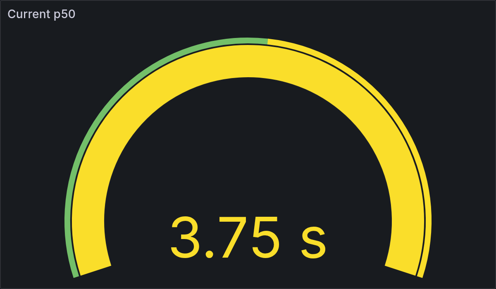

**Im Bild:** Gauge, **„3.75 s"** in Gelb, Bogen zu etwa zwei Drittel gefüllt.

**Ableitbar:** p50 über die letzten 2 Minuten des Render-Zeitraums — also über
den Zeitraum, in dem die Warteschlange abfloss. Deshalb deutlich über dem
Run-p50 von 1,0 s aus `report.md`. Momentaufnahme, nicht Run-Kennzahl.

#### 03 · Current p95

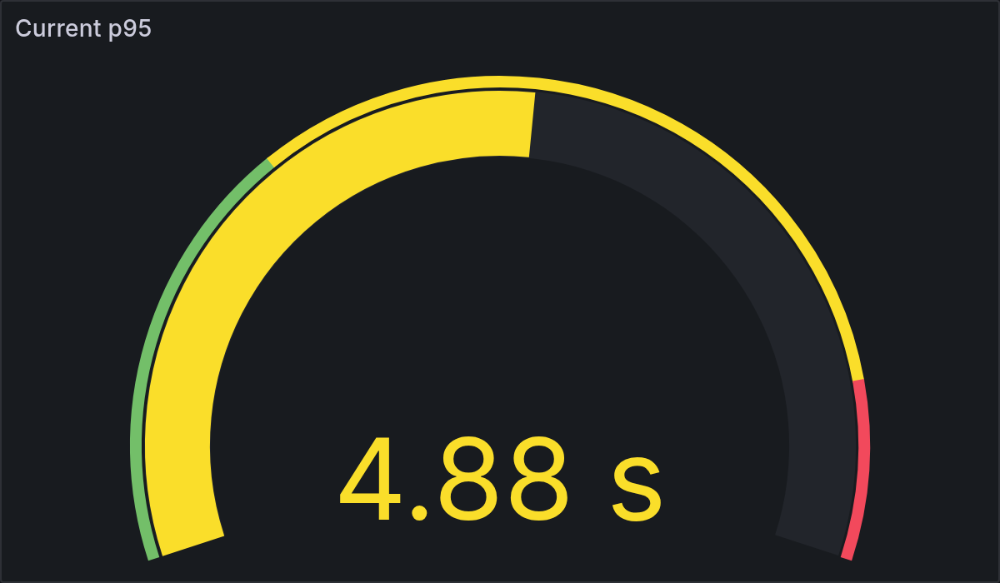

**Im Bild:** Gauge, **„4.88 s"** in Gelb, Bogen etwa zur Hälfte gefüllt.

**Ableitbar:** dito für p95.

#### 04 · Current p99

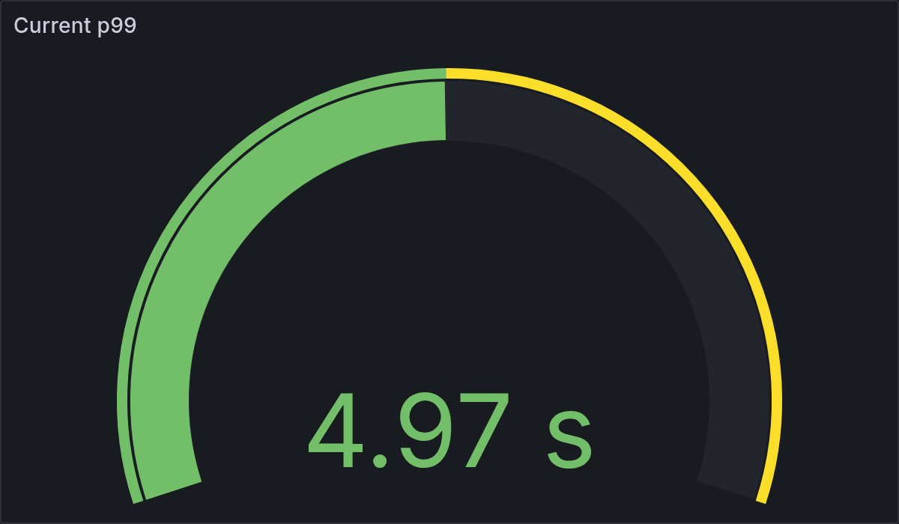

**Im Bild:** Gauge, **„4.97 s"** — auffällig in **Grün**, obwohl der Wert höher
ist als der gelb dargestellte p50 von 3,75 s.

**Ableitbar:** dito für p99. Die Farben der vier Gauges sind **nicht
vergleichbar**, weil jedes Panel eigene Schwellen trägt: derselbe Sekundenwert
ist im p99-Panel grün und im p50-Panel gelb. Nur die Zahlen lesen, nicht die
Farben.

#### 05 · p99 (completed only)


**Im Bild:** Gauge, **„4.97 s"** in Grün — identisch zu Panel 04.

**Ableitbar:** normalerweise der Zweck: fehlgeschlagene Verarbeitungen
ausschließen, damit der SLO nicht durch Fehlerfälle verzerrt wird. Dass beide
Panels denselben Wert zeigen, ist hier die Aussage — es gab keine `failed`.

#### 06 · p95 Latency by Event (completed)

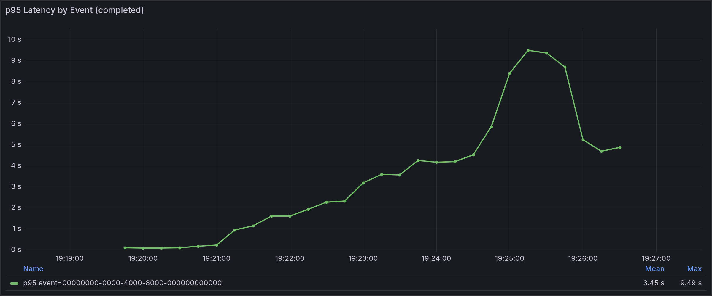

**Im Bild:** eine einzige grüne Kurve, identisch geformt zu Panel 01: monotoner
Anstieg mit Maximum **9,49 s** bei 19:25:15, dann Absturz auf ~4,7 s. Legende:
`p95 event=00000000-…` mean 3,45 s / max 9,49 s.

**Ableitbar:** Noisy-Neighbour-Erkennung bei mehreren gleichzeitigen Events.
Hier nur ein Event, deshalb deckungsgleich mit Panel 01.

#### 07 · Completed + Failed Order Rate (Worker Throughput)

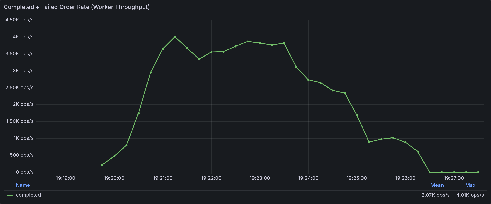

**Im Bild:** eine grüne Trapezkurve mit Peak **4,01 K ops/s** bei 19:21:10 und
einem zweiten Hoch um 19:22:40–19:23:20. Nur eine Serie (`completed`). Legende:
mean 2,07 K / max 4,01 K ops/s.

**Ableitbar:** **der echte Worker-Durchsatz** — gezählt beim Abschluss der
Verarbeitung, nicht bei der Annahme. Das ist die Zahl, gegen die man die
Enqueue-Rate stellen muss, wenn man wissen will, ob der Worker Schritt hält.

### 4.5 Order Lifecycle

#### 01 · Order Throughput (accepted / completed / failed per second)

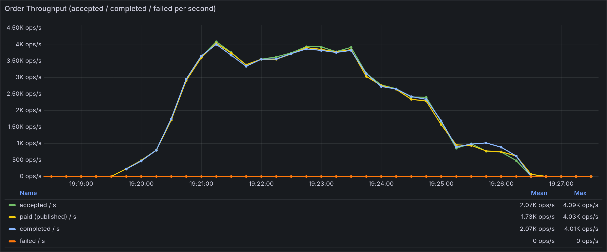

**Im Bild:** grün (accepted), gelb (paid) und blau (completed) liegen so dicht
übereinander, dass sie als eine Trapezkurve erscheinen — Peak ~4,09 K ops/s bei
19:21:10. Orange (failed) liegt flach auf 0. Erst im Auslauf ab 19:25:30
trennen sich die Linien um wenige hundert ops/s. Legende: accepted mean 2,07 K /
max 4,09 K, paid **1,73 K** / 4,03 K, completed 2,07 K / 4,01 K, failed 0.

**Ableitbar:** die vier Lebenszyklus-Raten auf einem Blatt. **Zwei Fallen:**
(a) `accepted − completed` ist strukturell, kein Backlog (§2); (b) die
Mean-Spalte ist zwischen den Serien nicht vergleichbar — paid mean 1,73 K gegen
completed 2,07 K, obwohl beide Zähler auf demselben Endwert landen (§5.3). Für
Summen gehört Panel 06 gelesen.

#### 02 · Pending Orders (paid – completed – failed, 5m window)

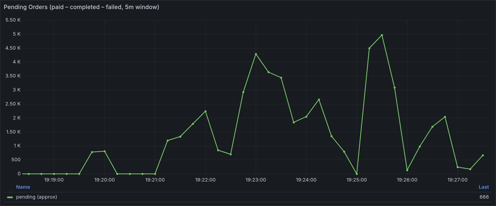

**Im Bild:** ein ausgeprägter **Sägezahn** zwischen 0 und **~5 K**. Vier große
Zacken: ~800 (19:19:40), 2,25 K (19:22), 4,3 K (19:23), und der höchste kurz
nach 19:25 mit **~4,95 K**. Zwischen den Zacken fällt die Kurve auf 0 zurück.
Legende: last 666.

**Ableitbar:** der Backlog-Schätzer nach der belastbaren Identität
`paid − completed − failed`. Anhaltend > 0 = der Worker liegt zurück. Das
Zurückfallen auf 0 ist Fenster-Artefakt (zwei unabhängig gescrapte Zähler in
einem `increase()`-Fenster), das **Niveau** von 1–5 K ist echt. Für den Verlauf
ist das Latenz-Panel 4.6.04 aussagekräftiger, für die Größenordnung dieses.

#### 03 · Worker/Published Throughput Ratio (5m)

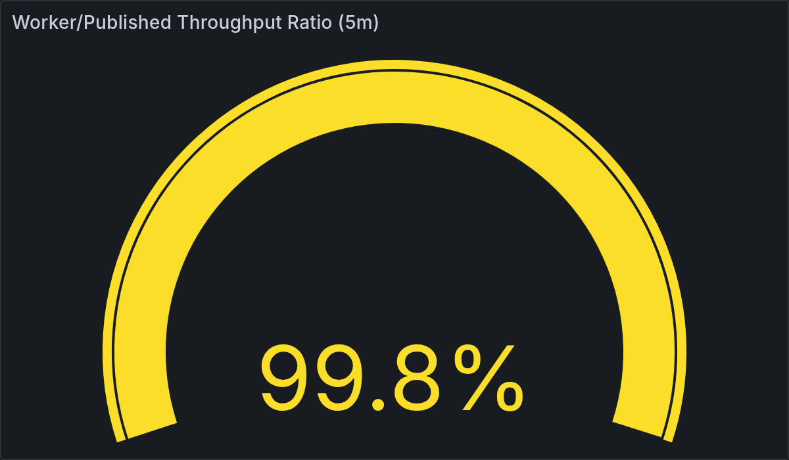

**Im Bild:** ein Gauge, **„99.8 %"** in Gelb, Bogen fast vollständig gefüllt.

**Ableitbar:** eine Zahl für „hält der Worker Schritt". Dauerhaft < 1 hieße
echtes Auseinanderlaufen. 99,8 % zusammen mit dem 1–5 K-Backlog aus Panel 02
ergibt die richtige Diagnose: **stehende Queue, kein Auseinanderlaufen**. Die
gelbe Färbung ist Schwellenwert-Kosmetik, kein Alarm.

#### 04 · Failure Rate (5m)

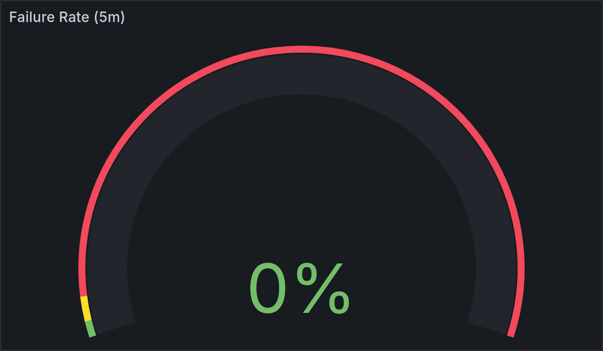

**Im Bild:** ein Gauge, **„0 %"** in Grün, Bogen leer.

**Ableitbar:** Anteil dauerhaft fehlgeschlagener Persistierungen an den
publizierten Orders. 0 bei 999 925 Nachrichten.

#### 05 · Order Rate by Event

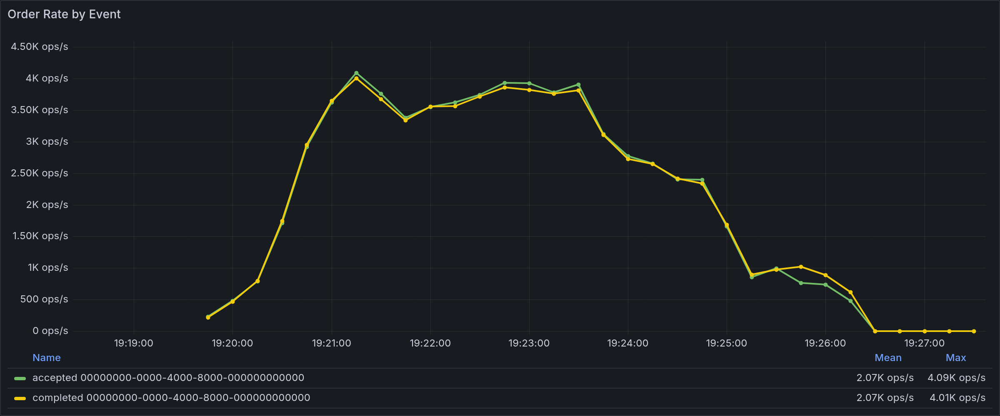

**Im Bild:** grün (accepted) und gelb (completed) für dasselbe Event, praktisch
deckungsgleich, Peak 4,09 K bzw. 4,01 K ops/s. Keine `failed`-Serie. Legende:
beide mean 2,07 K ops/s.

**Ableitbar:** Verteilung über gleichzeitige Events. Hier nur eines. Dass
accepted und completed hier denselben Mittelwert zeigen (anders als in Panel 01),
ist der Beleg für die Mean-Verzerrung in Panel 01: dort verwendet die
paid-Serie `or vector(0)`, hier nicht.

#### 06 · Cumulative Order Counts (Dashboard Time Range)

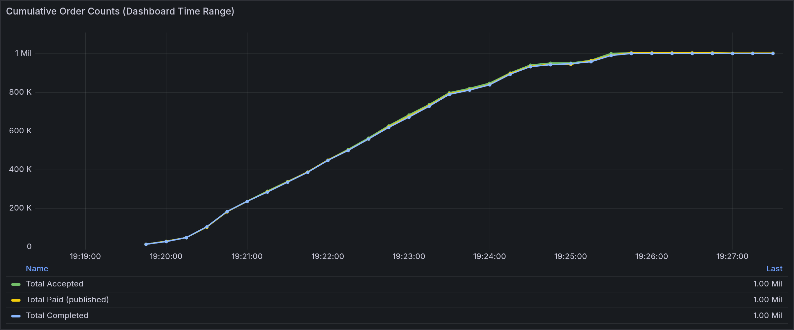

**Im Bild:** eine S-Kurve, die von 0 auf **1,00 Mil** läuft und ab 19:25:30 in
die Waagerechte übergeht. Die drei Serien (Accepted, Paid, Completed) sind
visuell **nicht trennbar**. Ein Knick um 19:24:45–19:25 markiert den Übergang in
den Ausverkauf. Legende: alle drei last = 1,00 Mil, keine `failed`-Serie.

**Ableitbar:** die Endsummen als Kontrolle gegen `report.md`. Und ein
Lehrbeispiel: bei 1-Mio-Skala verschwinden die 75 offenen Reservierungen und der
2–5 K-Backlog vollständig. Gut für Totals, **blind für Rückstand** — dafür
braucht es die Raten- und Tiefen-Panels.

#### 07 · Checkout Funnel (reserved / paid / cancelled per second)

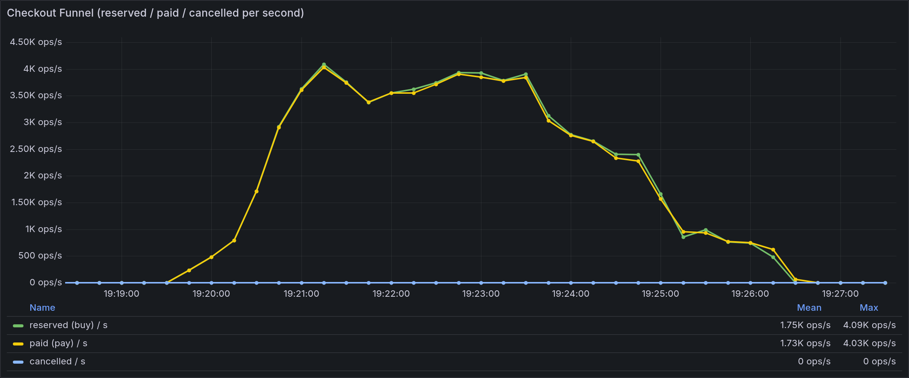

**Im Bild:** grün (reserved) und gelb (paid) laufen als ein Trapez fast
deckungsgleich, Peak 4,09 K / 4,03 K ops/s. Blau (cancelled) liegt exakt auf 0
über die ganze Breite. Legende: reserved mean 1,75 K, paid 1,73 K, cancelled 0.

**Ableitbar:** die fachliche Trichterform; die Abbruchrate ist
`1 − paid/reserved`. Im `checkout`-Profil sind `PAY_RATE=1` und `CANCEL_RATE=0`,
der Trichter kollabiert also bewusst zu 1:1. Für Aussagen über realistisches
Abbruchverhalten ist dieses Panel nur im `realism`-Profil sinnvoll.

#### 08 · Checkout Abandon Rate (1 – paid/reserved, Zeitraum)

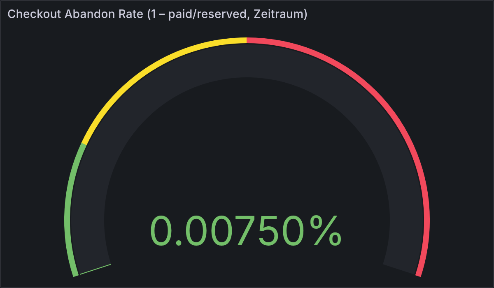

**Im Bild:** ein Gauge, **„0.00750 %"** in Grün, Bogen praktisch leer, mit
gelbem und rotem Schwellensegment im oberen Bereich.

**Ableitbar:** wie viele Reservierungen nie bezahlt werden → treibt
Redis-Memory und Reaper-Last. 0,0075 % = 75 von 1 000 000, und diese 75 sind
Generator-Timeouts, kein modelliertes Abbruchverhalten.

### 4.6 Pub/Sub Queue & Worker Processing

Die beiden Text-Panels erklären, dass es ohne GCP-Monitoring-Datasource keine
echte Subscription-Backlog-Metrik gibt. Alle drei gerenderten Panels sind daher
**worker-seitige Proxys** aus API- und Worker-Zählern.

#### 02 · Queue Depth & Processing Rate (Worker-Side Proxy)

Siehe §2 — Bild und Beschreibung stehen dort.

#### 03 · Publish vs. Consumer Rate


**Im Bild:** grün (Publish) und gelb (Consumer) liegen als ein Trapez so dicht
übereinander, dass sie stellenweise nur als eine Kurve erkennbar sind, Peak
~4,03 K ops/s. Blau (Redelivery) und orange (absorbierte Duplikate) liegen exakt
auf 0. Legende: Publish mean 1,73 K, Consumer mean **1,74 K**, Redelivery 0,
Duplikate 0.

**Ableitbar:** ob Nachrichten NACK-en (Redelivery) oder per ON-CONFLICT
geschluckt werden (Duplikate ohne NACK). **Beide 0 ist der bemerkenswerteste
Befund:** trotz p99 von 10 s wurde nie eine Ack-Deadline überschritten, und
jede der 999 925 Nachrichten kam genau einmal an. Zugleich zeigt dieses Panel,
warum es für die Backlog-Frage untauglich ist: auf 1-min-Auflösung ist der
Rückstand _nicht_ sichtbar, die Consumer-Rate liegt im Mittel sogar minimal
über der Publish-Rate.

#### 04 · E2E Latency as Queue Pressure Indicator

Siehe §2 — Bild und Beschreibung stehen dort.

### 4.7 Redis Performance

Der `redis_exporter` lief in diesem Run; alle vier Panels haben Daten.

#### 02 · Hit / Miss Ratio

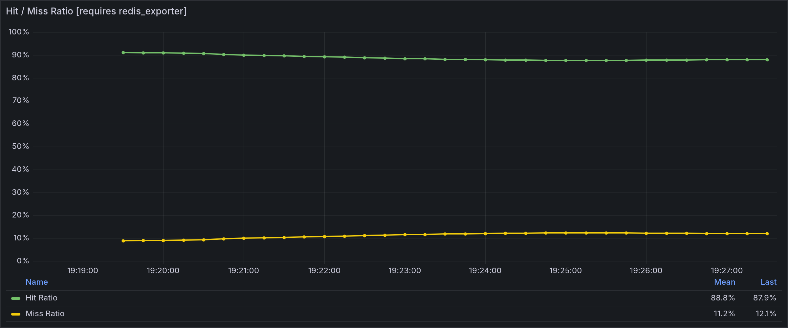

**Im Bild:** zwei fast waagerechte Linien mit minimaler Drift — grün (Hit Ratio)
von 91 % langsam auf 87,9 %, gelb (Miss Ratio) spiegelbildlich von 9 % auf
12,1 %. Keine Spikes, keine Reaktion auf den Lastverlauf. Legende: Hit mean
88,8 % / last 87,9 %, Miss 11,2 % / 12,1 %.

**Ableitbar:** zwei Dinge. Erstens: die Query rechnet **ohne `rate()`** auf den
rohen Zählern, ist also die Ratio _seit Redis-Start_. Sie kann darum nie einen
Ausschlag zeigen — die glatte Drift ist ein Artefakt der Kumulation, kein
Systemverhalten. Zweitens: die Ratio ist in diesem System ohnehin **kein
Health-Signal**, weil jede Reservierung zwangsläufig auf einen noch nicht
existierenden Key trifft und damit einen Miss erzeugt.

#### 03 · Hits & Misses per Second

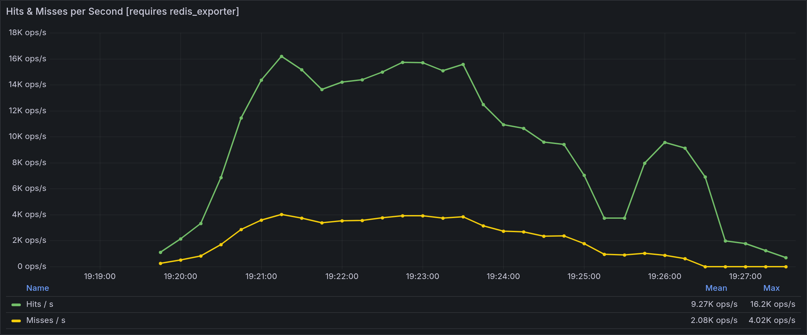

**Im Bild:** grün (Hits) als hohes Trapez mit Peak **16,2 K ops/s** (19:21),
Plateau um 14–16 K bis 19:23:20, dann Abfall mit einem Wiederanstieg auf 9,6 K
um 19:26. Gelb (Misses) verläuft formgleich, aber viel niedriger, Peak
**4,02 K ops/s**. Legende: Hits mean 9,27 K / max 16,2 K, Misses mean 2,08 K /
max 4,02 K.

**Ableitbar:** die absolute Redis-Last. ~20 K ops/s in der Spitze, ohne
Anzeichen von Sättigung — Redis war in diesem Run **nicht** der Engpass. Und
der Beweis für die Interpretation aus Panel 02: die Miss-Kurve folgt exakt der
`buy`-Rate (4,02 K gegen 4,09 K aus 4.1.01) — ein garantierter Miss pro
Reservierung.

#### 04 · Memory Usage

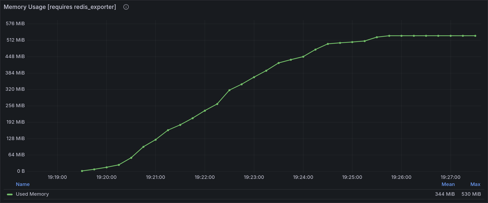

**Im Bild:** eine sehr glatte, fast lineare Rampe von 0 auf **530 MiB**, die bei
19:25:40 in ein exaktes Plateau übergeht und bis zum Ende flach bleibt.

**Ableitbar:** Speicher pro verkauftem Ticket → Kapazitätsplanung. Deckt sich
mit `state/after.json` (555 500 312 B). Bei 1 999 929 Keys sind das ~555 B pro
Order über zwei Keys. Das Plateau exakt beim Ausverkauf bestätigt, dass nach dem
letzten Ticket keine Keys mehr entstehen. Bewusst **kein** `maxmemory` gesetzt:
Eviction würde Order- und Ledger-Keys still verwerfen.

#### 05 · Key Count & Connected Clients

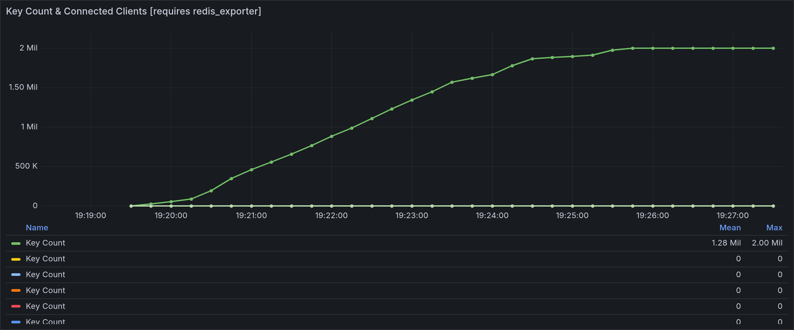

**Im Bild:** eine grüne Rampe von 0 auf **2,00 Mil**, formgleich zum
Speicherverlauf, Plateau ab 19:25:40. Die Legende listet **sechs Einträge, alle
mit demselben Namen „Key Count"** — der erste mit 1,28 Mil / 2,00 Mil, die
anderen fünf mit 0. „Connected Clients" ist aus dem sichtbaren Bereich
verdrängt.

**Ableitbar:** Key-Wachstum gegen TTL-Aufräumung. 2,00 Mio Keys bei 999 925
Orders = zwei Keys pro Order, konsistent mit dem Report (1 999 929). Der
Legendendefekt ist §5.6 — `redis_db_keys` liefert eine Serie pro `db`, alle mit
identischem `legendFormat`.

### 4.8 Worker Reliability

Alle vier Zuverlässigkeitszähler (`worker_redeliveries_total`,
`worker_idempotency_hits_total`, `worker_compensations_total`,
`worker_duplicate_deliveries_total`) fehlen im Scrape **vollständig** —
prom-client registriert eine gelabelte Serie erst beim ersten Inkrement.
Fachlich heißt das: null Vorkommen.

#### 01 · Worker Reliability Events (rate per second)

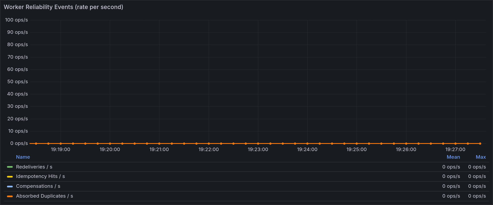

**Im Bild:** alle vier Serien liegen exakt auf 0 und überlagern sich zu einer
einzigen orangen Linie. Y-Achse automatisch auf 0–100 ops/s. Legende: alle vier
mean 0 / max 0.

**Ableitbar:** die vier Ausnahmepfade der At-least-once-Verarbeitung —
Redeliveries (NACK/Timeout), Idempotency-Hits (derselbe Event erneut, erkannt),
Kompensationen (Anspruch zurückgegeben), absorbierte Duplikate (ON-CONFLICT).
Alle 0 bei 999 925 Nachrichten: jede kam genau einmal an und wurde genau einmal
verarbeitet, auch bei einer E2E-p99 von 10 s. Dieses Panel zeigt korrekt 0,
weil alle vier Queries `or vector(0)` verwenden.

#### 02 · Reliability Event Counts (last 5 minutes)

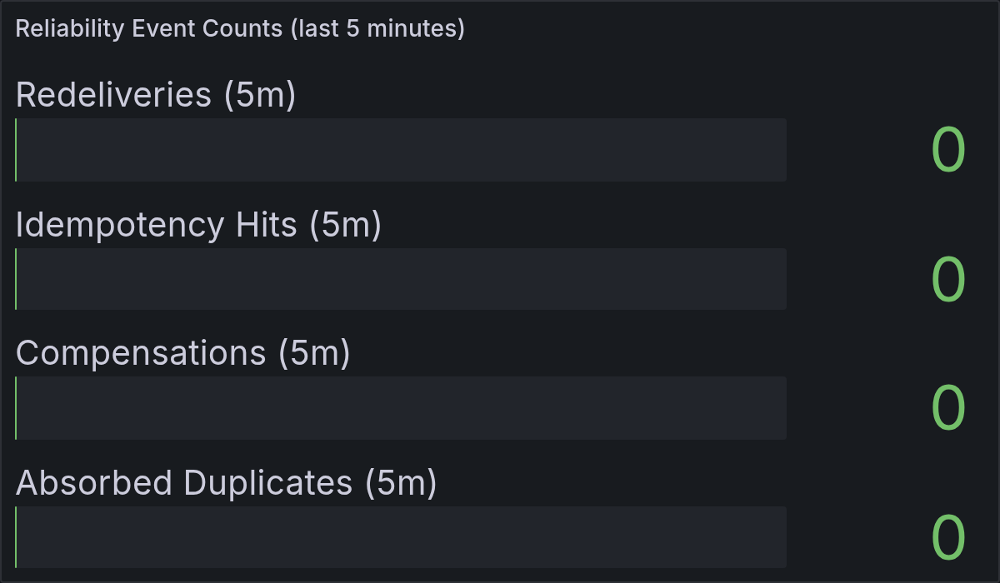

**Im Bild:** vier Balken-Zeilen (Redeliveries, Idempotency Hits, Compensations,
Absorbed Duplicates), alle Balken leer, jeweils **„0"** in Grün am rechten Rand.

**Ableitbar:** dieselben Zähler als Absolutzahlen über 5 Minuten. Für kleine
Vorkommen besser lesbar als Raten — eine einzelne Redelivery wäre hier als „1"
sichtbar, in Panel 01 nur als kaum wahrnehmbarer Ausschlag.

#### 03 · Redelivery & Compensation Rate (vs. published orders)

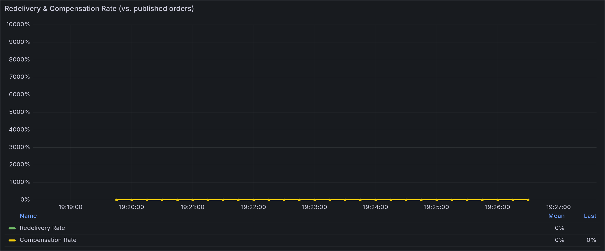

**Im Bild:** eine gelbe Linie auf 0 %. Die Y-Achse ist automatisch auf
**0–10000 %** gestreckt, was das Panel bei reinen Nullwerten grotesk aussehen
lässt. Legende: Redelivery Rate mean 0 % (ohne Last-Wert), Compensation Rate
mean 0 % / last 0 %.

**Ableitbar:** beide Zähler normiert auf die Last — 100 Redeliveries bei 1 Mio
Orders sind anders zu bewerten als bei 1 000. Die Achsenskalierung ist harmlos,
aber ein Hinweis, dass für dieses Panel kein `max` gesetzt ist.

#### 04 · Reliability Events by Event

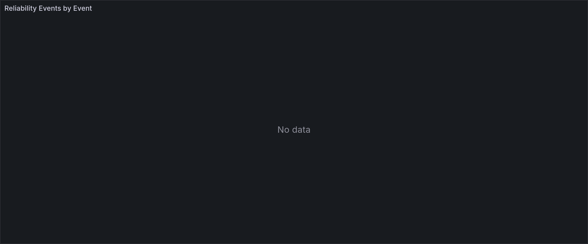

**Im Bild:** vollflächig **„No data"**.

**Ableitbar:** eigentlich die Frage, ob ein bestimmter Event
Zuverlässigkeitsprobleme erzeugt. Faktisch unbrauchbar: die Query hat kein
`or vector(0)`, deshalb steht hier „No data" statt 0 — dieselben Fakten, die
Panel 01 als saubere Nulllinie zeigt (§5.2).

#### 05 · Cumulative Reliability Events (Dashboard Time Range)

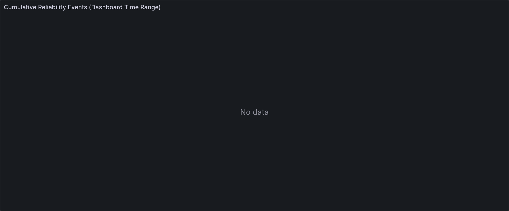

**Im Bild:** ebenfalls vollflächig **„No data"**.

**Ableitbar:** gedacht als Endkontrolle gegen den Report-Abschnitt „Order
Counters". Dass im selben Dashboard Panel 01 eine saubere 0 und Panel 05
„No data" für **denselben Sachverhalt** zeigt, ist der Kern des Problems in
§5.2.

## 5. Panel-Defekte

Nichts davon betrifft das System — es sind Darstellungsfehler in den
Dashboard-Definitionen.

1. **`or vector(0)` erzeugt eine Phantom-Serie, wenn es außen steht.**
   `vector(0)` hat ein leeres Label-Set, das links (mit `job`/`state`/`instance`)
   nie vorkommt — `or` fügt es daher _immer zusätzlich_ hinzu. Sichtbar in
   `Pool Wait` und `Lock Waits` als **zweites Gauge** und in
   `DB Query Throughput by Query` als Legendenzeile „Value". In den
   Raten-Gauges (`Publish Rollback Rate`, `Failure Rate`) passiert es **nicht**,
   weil das `or vector(0)` dort in einer Division steckt und beim
   Vector-Matching wegfällt. Fix: Labels vor dem `or` wegaggregieren, z. B.
   `sum(max_over_time(...)) or vector(0)`. Heikel ist es, weil ein grünes „0"
   neben dem echten Wert wie ein zweiter Messpunkt aussieht.
2. **„No data" ist zweideutig.** Panels ohne `or vector(0)` zeigen bei nie
   inkrementierten Zählern „No data" statt 0. Im Worker-Reliability-Dashboard
   steht Panel 01 auf sauberer 0, während Panel 04 und 05 „No data" schreiben —
   für identische Fakten. Ein Betrachter kann „gesunde Null" nicht von
   „Metrik-Pipeline kaputt" unterscheiden. Betroffen: `Reliability Events by
Event`, `Cumulative Reliability Events`, die Rollback-Serie in
   `Reservations & Rollbacks by Event`, die Release-/Skip-/Fehler-Serien in
   `Reaper Activity`. Der Report löst das über `hasBaseline`, die Dashboards
   nicht.
3. **Mean-Spalten sind zwischen Serien nicht vergleichbar**, wenn nur ein Teil
   der Queries `or vector(0)` benutzt — die zusätzlichen 0-Datenpunkte drücken
   den Mittelwert. In `Order Throughput` steht paid bei mean 1,73 K und
   completed bei 2,07 K, obwohl beide Zähler denselben Endwert erreichen.
   `Order Rate by Event` zeigt für dieselben Größen 2,07 K und 2,07 K. Für
   Summen `Cumulative Order Counts` lesen, nicht die Mean-Spalte.
4. **`Reservation Ledger (active / due)` hat die falsche Einheit** („ops/s").
   Beide Serien sind Bestände (Anzahl gehaltener Ansprüche), keine Raten. Im
   `Checkout Funnel` ist „ops/s" korrekt — die Verwechslung fällt nur im
   Ledger-Panel auf, wo 7,18 K gehaltene Reservierungen als „7K ops/s" gelesen
   werden.
5. **`Pool Wait during Projector Activity` ist unlesbar skaliert.** 0,01
   Läufe/s gegen 4 770 Wartende auf einer linearen Achse — die Projector-Serien
   liegen optisch auf der Nulllinie. Der Korrelationstest kann in dieser Form
   nur „keine Korrelation" zeigen, niemals eine. Braucht eine zweite Y-Achse.
6. **`Key Count & Connected Clients` hat eine kaputte Legende.**
   `redis_db_keys` liefert eine Serie pro `db`; alle nutzen dasselbe
   `legendFormat` „Key Count", die fünf leeren Serien verdrängen „Connected
   Clients" aus dem Sichtbereich. Fix: `{{db}}` ins `legendFormat`.
7. **Randartefakte an den Fenstergrenzen.** `Queue Depth` springt am rechten
   Rand auf 3,45 K, während beide Raten 0 sind; `Order Completion Latency` zeigt
   „Last: NaN" für p95/p99. Beides sind `increase()`- bzw.
   `histogram_quantile()`-Effekte am Rand des Render-Zeitraums, keine Messwerte.
8. **Gauge-Farben sind panelweise definiert und nicht vergleichbar.** In
   `Order Completion Latency` erscheint p99 = 4,97 s grün, p50 = 3,75 s
   dagegen gelb. Die Farbe sagt nichts über die relative Schwere aus, nur die
   Zahl.
9. **`Hit / Miss Ratio` rechnet ohne `rate()`** und zeigt damit die Ratio seit
   Redis-Start statt der aktuellen. Das Panel kann strukturell keinen Ausschlag
   darstellen.

## 6. Was der Run über das System sagt

**Korrektheit: nichts zu beanstanden.** 999 925 Orders publiziert, persistiert
und mit Tickets belegt, 0 fehlgeschlagen, 0 Redeliveries, 0 Kompensationen,
0 Rollbacks, keine Lock-Waits, alle fünf Invarianten erfüllt, Capacity-Delta
nach dem Drain exakt 0. Die transienten Ausschläge des Delta-Gauges (−1 050 bis
+555) sind genau die von ADR-031 vorhergesagten Diagnosewerte — ohne
schreibenden Reconcile können sie nichts mehr beschädigen.

**Kapazität: drei Decken, keine davon PostgreSQL selbst.**

1. Der **API-Prozess** bei ~8 K req/s (0,80 von 1,0 Cores, Event-Loop-Lag p99
   bis 1,72 s) — Ursache der 159 431 k6-Timeouts bei gleichzeitig 0 % 5xx.
2. Der **Worker-DB-Pool** bei 50 Verbindungen mit bis zu 6 530 Wartenden —
   Ursache der E2E-p99 von 10 s.
3. Der **Lastgenerator** mit 57,9 % dropped iterations — weshalb keine RPS-Zahl
   aus diesem Run als Backend-Kapazität zitiert werden darf.

**Was dieser Run nicht zeigt:** der Reaper-Pfad ist ungetestet. `due = 0` und
`oldest pending = 0` über die ganze Laufzeit bedeuten nur, dass bei 900 s
Timeout und 389 s Last nichts fällig werden konnte — nicht, dass die Freigabe
funktioniert.

**Der Vergleich zum `realism`-Profil desselben Tages** (Run
`2026-08-03T16-18-47-379Z-efb39c8`): dort E2E-mean 0,108 s und 43 623
gleichzeitig gehaltene Reservierungen, hier E2E-mean 1,156 s und nur 7 180. Die
Denkzeit verteilt die Schreiblast über die Zeit; ohne sie schlägt derselbe
Verkauf in einem Drittel der Zeit auf den Schreibpfad durch und die Queue steht.

**Konkret nächstliegend, falls die E2E-Latenz gedrückt werden soll:**
`DATABASE_POOL_MAX` des Workers über 50 hinaus messen (`DB Pool Connections`
sagt direkt, ob es hilft) und die API auf mehrere Prozesse legen
(`Event Loop Lag` sagt, ob es nötig war). Für eine belastbare Kapazitätszahl
braucht es davor verteilte k6-Runner.
